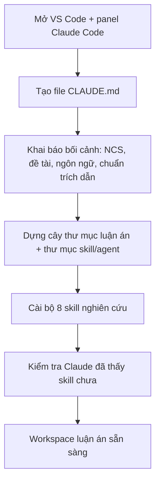
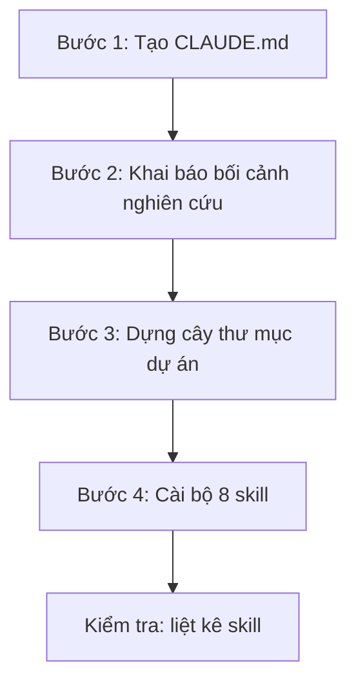

[⬅️ Về README](../README.md)

# 🛠️ Buổi 1 — Thiết Lập Dự Án Luận Án Với Claude Code

> Từ một thư mục trống đến một "văn phòng nghiên cứu" hoàn chỉnh: có file dặn dò `CLAUDE.md`, cây thư mục luận án, và bộ 8 skill AI đã cài sẵn — tất cả chỉ bằng cách gõ yêu cầu bằng tiếng Việt cho Claude Code.

| Thông tin | Chi tiết |
|---|---|
| **Chương trình** | Bộ kỹ năng AI cho nghiên cứu tiến sĩ |
| **Đối tượng** | Người mới, không cần biết lập trình |
| **Buổi học** | Buổi 1 / 4 |
| **Thời lượng** | ~90 phút tại lớp + 30–60 phút bài tập |
| **Phiên bản** | Cập nhật 18/08/2026 |

---

## 🎯 Mục tiêu & sản phẩm cuối buổi

| Mục tiêu buổi học | Sản phẩm cuối buổi |
|---|---|
| Hiểu Claude Code và file `CLAUDE.md` là gì | Mở được panel Claude Code và tạo được `CLAUDE.md` |
| Khai báo bối cảnh nghiên cứu cho AI | `CLAUDE.md` ghi rõ bối cảnh NCS + chuẩn trích dẫn (APA 7) |
| Dựng bộ khung một dự án luận án | Cây thư mục luận án + thư mục chứa skill/agent |
| Trang bị "kỹ năng" cho AI | Bộ 8 skill nghiên cứu đã cài trong `.claude/skills/` |

> 💡 Bạn **không cần biết lập trình**. Gần như toàn bộ việc là gõ yêu cầu bằng tiếng Việt rồi đọc kết quả và bấm **Allow** khi Claude xin phép tạo file/thư mục.

---

## 📌 Buổi 1 này bạn sẽ làm gì?

Buổi 1 biến một **thư mục trống** thành một **workspace luận án hoàn chỉnh** để bạn dùng xuyên suốt cả khóa. Bạn sẽ làm 4 việc, mỗi việc chỉ bằng một câu yêu cầu:

1. **Tạo file `CLAUDE.md`** — "tờ dặn dò" để mỗi lần mở dự án, Claude làm đúng chuẩn của bạn.
2. **Khai báo bối cảnh** — cho Claude biết bạn là ai, dự án này để làm gì.
3. **Dựng cây thư mục** — chỗ để mọi tài liệu luận án ngăn nắp theo giai đoạn.
4. **Cài bộ 8 skill** — trang bị sẵn "8 nghề" nghiên cứu cho Claude.

> ⚠️ **Quan trọng:** cứ làm tuần tự từ trên xuống. Mỗi bước có sẵn câu lệnh để chép — dán, kèm phần "Kết quả mong đợi" để bạn tự biết mình làm đúng chưa. Không cần hiểu hết mọi thứ ngay trong buổi đầu.

### 🧠 Tư duy cốt lõi

- `CLAUDE.md` là **bộ nhớ + nội quy** của dự án. Claude đọc nó TRƯỚC mỗi phiên làm việc, nhờ đó luôn nhớ bạn là ai, viết bằng tiếng gì, trích dẫn theo chuẩn nào và **không được bịa nguồn**.
- Một luận án kéo dài nhiều năm cần **chỗ để đồ ngăn nắp**. Cây thư mục theo giai đoạn giúp bạn (và Claude) luôn biết file nào để ở đâu.
- **Skill** là cách đóng gói một loại việc lặp lại thành hướng dẫn sẵn, để Claude làm đúng cách mỗi lần — thay vì bạn phải dặn lại từ đầu.

### Những điều cần nắm

- File `CLAUDE.md` dùng để làm gì và vì sao một dự án nghiêm túc nên có nó.
- Cây thư mục tối thiểu cho một luận án gồm những gì.
- Skill nằm ở đâu (`.claude/skills/`) và cách kiểm tra Claude đã "nhìn thấy" skill chưa.

### Sau buổi 1, bạn sẽ tự làm được

- Mở được Claude Code trong VS Code và trò chuyện với nó bằng tiếng Việt.
- Nhờ Claude tạo và điền `CLAUDE.md` cho đúng bối cảnh nghiên cứu của bạn.
- Dựng cây thư mục dự án và cài bộ skill vào máy.

### ✅ Bạn cần chuẩn bị gì trước

| Thứ cần có | Ghi chú |
|---|---|
| Máy tính đã cài VS Code | Chưa có thì tải miễn phí tại `code.visualstudio.com` |
| Claude Code trong VS Code | Biểu tượng tia sáng (Spark) ở thanh bên trái, đã đăng nhập gói Claude Pro hoặc Max |
| Một thư mục trống cho luận án | Ví dụ đặt tên `k3-research`, sẽ mở trong VS Code |
| (Tùy chọn) Git và Python | Chưa có cũng không sao — Phần 1 sẽ nhờ chính Claude Code cài hộ |

> 📎 Nếu chưa cài xong VS Code + Claude Code: mở tài liệu **"02 - Cài đặt & Hiểu AI Agent"** làm theo trước, hoặc đến lớp sớm 15 phút nhờ trợ giảng.

### 🗺️ Bản đồ quy trình thực hành



---

## 🖥️ Phần 1 — Chuẩn bị máy (khoảng 10 phút)

Mục tiêu: mở đúng chỗ làm việc và chắc chắn Claude Code đã chạy được. Làm xong 3 bước dưới đây là bạn sẵn sàng vào thực hành.

### Bước 1 — Mở thư mục dự án trong VS Code

1. Mở **VS Code**.
2. Tạo (hoặc chọn) một **thư mục trống** cho luận án, ví dụ `k3-research`.
3. Trên menu, chọn **File → Open Folder…** (Tệp → Mở thư mục), chọn thư mục vừa tạo, bấm **Open**.

> ✅ **Kết quả mong đợi:** bên trái VS Code hiện ra tên thư mục dự án (còn trống, chưa có file gì). Đây là nơi Claude Code sẽ làm việc.

### Bước 2 — Mở panel Claude Code

1. Nhìn thanh dọc bên trái VS Code, bấm vào **biểu tượng tia sáng (Spark)**.
2. Một khung trò chuyện (panel) hiện ra bên phải. Đây là nơi bạn gõ yêu cầu cho AI.
3. Nếu được hỏi đăng nhập, đăng nhập bằng tài khoản Claude Pro hoặc Max của bạn.

> 🔧 Nếu chưa thấy biểu tượng Spark: bấm `Cmd/Ctrl + Shift + X` để mở Extensions, gõ tìm "Claude Code" của Anthropic, kiểm tra đã cài và đăng nhập, rồi đóng và mở lại VS Code.

### Bước 3 — Nhờ Claude Code kiểm tra và cài Git, Python (nếu thiếu)

Bước này chỉ cần khi máy bạn chưa có Git/Python. Trong panel Claude Code, **chép câu dưới đây và dán vào**, nhớ sửa loại máy của bạn:

```text
Hãy giúp tôi kiểm tra trên máy này đã có git và python chưa. Nếu thiếu, hãy
hướng dẫn tôi cài từng cái một, từng bước, bằng tiếng Việt, cho người không
rành kỹ thuật. Máy tôi dùng [macOS / Windows — ghi đúng loại máy của bạn].
```

Khi Claude đề nghị chạy một lệnh cài, hãy đọc mô tả rồi bấm **Allow** (Đồng ý).

> ✅ **Kết quả mong đợi:** panel Claude Code mở được, trả lời bằng tiếng Việt, và (nếu cần) báo số phiên bản git/python. Hướng dẫn cài chi tiết nằm ở tài liệu **02 - Cài đặt & Hiểu AI Agent**.

---

## 🏗️ Phần 2 — Thực hành: dựng dự án luận án

Bốn bước dưới đây biến thư mục trống thành một workspace luận án có tổ chức. Mỗi bước là một câu yêu cầu — chép, dán, đọc kết quả rồi bấm **Allow** khi Claude xin tạo file/thư mục.



### Bước 1 — Tạo file `CLAUDE.md` (và hiểu nó là gì)

`CLAUDE.md` là **"tờ dặn dò"** đặt ở gốc dự án. Mỗi lần mở dự án, Claude đọc file này TRƯỚC rồi mới làm việc — nhờ đó nó luôn nhớ bối cảnh và nội quy của bạn. Ta sẽ để chính Claude tư vấn và tạo file này. Trong **Claude Code**, chép — dán:

```text
Tôi muốn bạn tạo cho tôi file claude.md trong thư mục này, tôi chưa biết file
claude.md dùng để làm gì, bạn hãy tư vấn và hỏi tôi các câu hỏi cần thiết để
tạo file cho tôi.
```

> ✅ **Kết quả mong đợi:** Claude giải thích ngắn gọn `CLAUDE.md` dùng để làm gì, rồi **hỏi lại bạn** vài câu để có đủ thông tin (ví dụ: bạn là ai, dự án để làm gì, viết bằng ngôn ngữ nào, trích dẫn theo chuẩn nào). Chưa cần trả lời vội — bước 2 sẽ trả lời.

### Bước 2 — Khai báo bối cảnh nghiên cứu

Trả lời câu hỏi của Claude bằng đúng bối cảnh của bạn. Nếu bạn là nghiên cứu sinh, chép — dán (sửa lại chuyên ngành cho đúng):

```text
tôi là nghiên cứu sinh tiến sĩ chuyên ngành quản trị học, tôi muốn dùng thư mục
này để viết luận án cho tôi.
```

Claude sẽ hỏi thêm để chốt vài lựa chọn (ngôn ngữ luận án, chuẩn trích dẫn APA 7, đề tài đã có hay chưa). Cứ trả lời tự nhiên bằng tiếng Việt.

> ✅ **Kết quả mong đợi:** Claude ghi bối cảnh vào `CLAUDE.md`: bạn là NCS ngành của bạn, luận án viết tiếng Việt, trích dẫn APA 7, kèm các **quy tắc liêm chính học thuật** (không bịa trích dẫn, không bịa số liệu). Mục "Đề tài" để trống dạng `[CHỜ ĐIỀN]` nếu bạn chưa chốt đề tài — hoàn toàn bình thường.

### Bước 3 — Dựng cây thư mục dự án

Giờ dựng chỗ để đồ. Trong **Claude Code**, chép — dán:

```text
tôi chưa có đề tài nghiên cứu cụ thể nhưng tôi muốn bạn tạo ra cây thư mục cho
dự án này bao gồm các thư mục cần thiết cho nghiên cứu sinh tiến sĩ, đồng thời
có các thư mục chứa skill và agent để sau này claude sử dụng.
```

> ✅ **Kết quả mong đợi:** Claude tạo một cây thư mục theo giai đoạn nghiên cứu, mỗi thư mục có sẵn một file `README.md` giải thích nó chứa gì. Thường gồm: `de-cuong/`, `tong-quan-tai-lieu/`, `chuong/`, `phuong-phap-nghien-cuu/`, `du-lieu/` (có `tho/` và `da-xu-ly/`), `phan-tich/`, `tai-lieu-tham-khao/`, `phu-luc/`, `cong-bo/`, `huong-dan-va-gop-y/`, `tien-do/`, `ban-nhap/`; cùng thư mục ẩn `.claude/` chứa `skills/`, `agents/`, `commands/`.

### Bước 4 — Cài bộ 8 skill nghiên cứu

Cuối cùng, trang bị "8 nghề" cho Claude bằng bộ skill có sẵn của khóa. Trong **Claude Code**, chép — dán:

```text
https://github.com/Peternguyen91/K2-AI-Agent-for-Research/tree/main

đọc repo này, lấy bộ skill sau đó cài đặt skill vào thư mục hiện tại cho tôi.
```

Claude sẽ tải nội dung repo và chép 8 thư mục skill vào `.claude/skills/` của dự án. Sau đó **kiểm tra** bằng cách chép — dán:

```text
Hãy liệt kê các skill bạn đang có và mô tả ngắn mỗi skill làm gì.
```

> ✅ **Kết quả mong đợi:** bạn thấy danh sách 8 skill nghiên cứu — `literature-review`, `research-framework`, `methodology-design`, `data-analysis`, `academic-writing`, `citation-manager`, `critical-review`, `defense-prep`.

> 🔧 **Nếu chưa thấy skill:** skill chưa được nạp. Đóng và mở lại VS Code, rồi thử lại câu "Hãy liệt kê các skill bạn đang có". Nếu vẫn thiếu, kiểm tra các thư mục skill có nằm trong `.claude/skills/` của dự án không.

---

## 📁 Phần 3 — Nhìn lại workspace vừa dựng

Đây là "văn phòng nghiên cứu" bạn vừa tạo. Từ nay mọi việc luận án đều đổ vào đây, đúng thư mục.

| Thư mục | Chứa gì |
|---|---|
| `CLAUDE.md` | Tờ dặn dò: bối cảnh + nội quy dự án (đề tài, ngôn ngữ, APA 7, liêm chính) |
| `.claude/skills/` | Bộ 8 skill nghiên cứu Claude sẽ dùng |
| `.claude/agents/`, `.claude/commands/` | Trợ lý con và lệnh tắt (dùng ở các buổi sau) |
| `de-cuong/` | Đề cương, câu hỏi và giả thuyết nghiên cứu |
| `tong-quan-tai-lieu/` | Ghi chú đọc, ma trận tổng hợp, khoảng trống nghiên cứu |
| `chuong/` | Nội dung các chương luận án |
| `phuong-phap-nghien-cuu/` | Thiết kế nghiên cứu, bảng hỏi, thang đo |
| `du-lieu/` | Dữ liệu thô (`tho/`) và đã xử lý (`da-xu-ly/`) |
| `phan-tich/` | Kết quả phân tích, output thống kê |
| `tai-lieu-tham-khao/` | Danh mục nguồn (APA 7), file PDF gốc |
| `phu-luc/`, `cong-bo/`, `huong-dan-va-gop-y/`, `tien-do/`, `ban-nhap/` | Phụ lục, bài công bố, góp ý GVHD, tiến độ, bản nháp |

> 💡 Cây thư mục có thể khác đôi chút tùy cách Claude tạo và tùy đề tài của bạn — điều đó bình thường. Quan trọng là có `CLAUDE.md`, có `.claude/skills/` đủ 8 skill, và các thư mục theo giai đoạn.

---

## 📝 Phần 4 — Bài tập về nhà

Mục tiêu: làm chủ workspace vừa dựng và bắt đầu gắn nó với đề tài của bạn. Thời lượng ước tính: 30–60 phút.

### Bài 1 — Điền đề tài vào `CLAUDE.md` (khoảng 15 phút)

Mở `CLAUDE.md`, tìm mục "Đề tài". Nếu đã có đề tài, nhờ Claude điền vào:

```text
Đề tài luận án của tôi là: [ghi 1–2 câu về đề tài]. Hãy cập nhật mục Đề tài
trong CLAUDE.md cho tôi.
```

Nếu chưa có đề tài, cứ để `[CHỜ ĐIỀN]` và ghi tạm 2–3 hướng bạn đang quan tâm vào file `ban-nhap/y-tuong-de-tai.md`.

> 📤 **Sản phẩm cần nộp:** ảnh chụp mục Đề tài trong `CLAUDE.md` (đã điền hoặc ghi 2–3 hướng quan tâm).

### Bài 2 — Làm quen bộ skill (khoảng 15 phút)

Mở 2–3 file `SKILL.md` bất kỳ trong `.claude/skills/` để xem một skill gồm những gì (phần khai báo `name`/`description` và phần hướng dẫn). Sau đó hỏi Claude:

```text
Skill literature-review dùng để làm gì, và khi nào tôi nên gọi nó?
```

> 📤 **Sản phẩm cần nộp:** 2–3 câu bạn tự viết, mô tả một skill bạn thấy sẽ dùng nhiều nhất cho đề tài của mình.

### Bài 3 — Tự kiểm workspace (khoảng 15 phút)

Nhờ Claude rà lại giúp bạn:

```text
Hãy kiểm tra dự án này đã có đủ CLAUDE.md, cây thư mục theo giai đoạn và bộ 8
skill chưa. Nếu thiếu gì, liệt kê ra cho tôi.
```

> 📤 **Sản phẩm cần nộp:** kết quả rà soát cho thấy workspace đã đủ 3 phần: `CLAUDE.md`, cây thư mục, 8 skill.

---

## 🏁 Phần 5 — Cuối buổi & chuẩn bị buổi sau

### Cuối buổi bạn nên có (tự đánh dấu)

- [ ] Mở được panel Claude Code và trò chuyện bằng tiếng Việt.
- [ ] File `CLAUDE.md` ghi rõ bối cảnh nghiên cứu (NCS, ngôn ngữ, APA 7, liêm chính).
- [ ] Cây thư mục luận án theo giai đoạn, mỗi thư mục có `README.md`.
- [ ] Bộ 8 skill nằm trong `.claude/skills/`, liệt kê ra thấy đủ.

> 💡 **Mẹo:** giữ nguyên thư mục dự án này. Cả bốn buổi của khóa đều làm việc ngay trong workspace bạn vừa dựng hôm nay.

### Chuẩn bị cho buổi sau

- Giữ nguyên **workspace luận án** (mở lại đúng thư mục này ở buổi 2).
- Đăng nhập thử **NotebookLM** bằng tài khoản Google để chắc chắn vào được.
- Nếu đã có, mang theo **đề tài và các hướng nghiên cứu** bạn quan tâm — buổi 2 sẽ bắt đầu từ đó để dựng tổng quan tài liệu.

---

➡️ Tiếp theo: [Buổi 2](buoi-02-lam-theo-tung-buoc.md)
