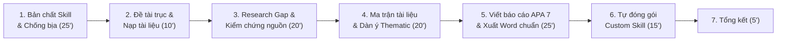
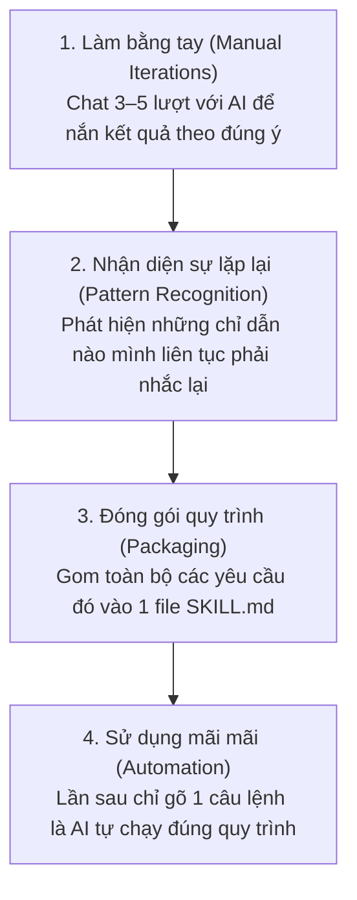

# Buổi 2: Làm Chủ Skill, Chống Bịa Số Liệu & Dựng Tổng Quan Tài Liệu Nghiên Cứu

> **Cách dùng file này:** Mỗi phần gồm hai khúc: Khúc **Lý thuyết** dùng để hiểu bản chất và nguyên lý (có ví von trực quan, dễ nhớ); Khúc **Thao tác** là các bước thực hành có sẵn prompt chính xác để copy – dán vào Claude Code.
>
> **Làm lần lượt, không nhảy cóc.** Bước sau kế thừa trực tiếp kết quả của bước trước.
>
> **Chuẩn bị trước khi bắt đầu:** Mở VS Code, mở đúng thư mục dự án luận án đã dựng ở Buổi 1 (ví dụ `k3-research`), mở panel Claude Code. Chuẩn bị sẵn 3–5 file tài liệu/bài báo thật (PDF hoặc text) hoặc dùng bộ abstract mẫu trong thư mục `du-lieu-mau/`.

---

## ⏱️ Nhịp Buổi Học (120 Phút)



| Phần | Nội dung trọng tâm | Thời lượng | Hình thức | Sản phẩm đạt được |
|---|---|:---:|:---:|---|
| **Khối 1** | **Bản chất Skill & Kỷ luật chống bịa số liệu**<br>• Skill là gì (SOP cho AI)<br>• Cấu trúc, vị trí lưu trữ, dòng `description`<br>• AI tìm & tự nạp skill ra sao, cách kích hoạt<br>• Kỷ luật chống bịa: "Tài liệu không đề cập" | **25 phút** | Giảng viên 15'<br>Học viên 10' | Nắm vững cơ chế vận hành của Skill & tư duy chống bịa |
| **Khối 2** | **Đặt đề tài làm trục & Chuẩn bị tài liệu**<br>• Cập nhật đề tài vào `CLAUDE.md`<br>• Đưa 3–5 tài liệu/abstract vào `du-lieu/` | **10 phút** | Giảng viên 3'<br>Học viên 7' | `CLAUDE.md` có đề tài;<br>Kho dữ liệu sẵn sàng |
| **Khối 3** | **Phát hiện Khoảng trống nghiên cứu (Research Gap)**<br>• Bóc tách: Đã có bằng chứng vs. Còn bỏ ngỏ<br>• Rút ra 3–4 theme + 3 research gap<br>• Kiểm chứng nguồn bằng DOI & Google Scholar | **20 phút** | Giảng viên 6'<br>Học viên 14' | File `tong-quan-tai-lieu/research-gap.md` có căn cứ thật |
| **Khối 4** | **Tổng hợp tài liệu theo chủ đề (Thematic Synthesis)**<br>• Tư duy gom nhóm chủ đề (không tóm tắt từng bài)<br>• Lập Ma trận trích xuất tài liệu<br>• Xây dựng Dàn ý tổng quan theo chủ đề | **20 phút** | Giảng viên 5'<br>Học viên 15' | • `tong-quan-tai-lieu/ma-tran-tai-lieu.md`<br>• `tong-quan-tai-lieu/dan-y-tong-quan.md` |
| **Khối 5** | **Viết báo cáo chuẩn APA 7 & Xuất Word**<br>• Viết văn bản học thuật ~1.200 từ chuẩn APA 7<br>• Rà soát trích dẫn chéo bằng `citation-manager`<br>• Xuất file Word (`.docx`) chuẩn thể thức luận văn | **25 phút** | Giảng viên 7'<br>Học viên 18' | • `bao-cao-tong-quan-tai-lieu.md`<br>• File Word `.docx` hoàn chỉnh |
| **Khối 6** | **Tự đóng gói thành một Custom Skill riêng**<br>• Đóng gói quy trình xuất Word / tổng quan đề tài<br>• Tạo file `SKILL.md` trong `.claude/skills/`<br>• Khởi động lại & gọi thử nghiệm skill | **15 phút** | Giảng viên 5'<br>Học viên 10' | Thư mục `.claude/skills/<ten-skill>/` chạy thành công |
| **Tổng kết** | **Rà soát sản phẩm & Hỏi đáp**<br>• Chạy lệnh kiểm kê toàn bộ file đã tạo<br>• Giải đáp thắc mắc của học viên | **5 phút** | Cả lớp | Đủ bộ 5 file sản phẩm nghiên cứu |

---

# MỤC LỤC CHI TIẾT

- [PHẦN 1: BẢN CHẤT CỐT LÕI CỦA SKILL & KỶ LUẬT CHỐNG BỊA](#phần-1-bản-chất-cốt-lõi-của-skill--kỷ-luật-chống-bịa)
  - [1.1. Skill là gì đơn giản dễ hiểu?](#11-skill-là-gì-đơn-giản-dễ-hiểu)
  - [1.2. Nỗi đau Chat thông thường vs. Sức mạnh đóng gói Skill](#12-nỗi-đau-chat-thông-thường-vs-sức-mạnh-đóng-gói-skill)
  - [1.3. Bản chất cốt lõi: Skill sinh ra từ đâu?](#13-bản-chất-cốt-lõi-skill-sinh-ra-từ-đâu)
  - [1.4. Vị trí lưu trữ & Cấu trúc vật lý của Skill](#14-vị-trí-lưu-trữ--cấu-trúc-vật-lý-của-skill)
  - [1.5. Trái tim của Skill: Dòng description & Cơ chế Tự nạp (Auto-load)](#15-trái-tim-của-skill-dòng-description--cơ-chế-tự-nạp-auto-load)
  - [1.6. Cách kích hoạt Skill trong thực tế](#16-cách-kích-hoạt-skill-trong-thực-tế)
  - [1.7. Cách quản lý & nâng cấp Skill](#17-cách-quản-lý--nâng-cấp-skill)
  - [1.8. Kỷ luật "Sắt đá" Chống bịa số liệu & Chống bịa nguồn](#18-kỷ-luật-sắt-đá-chống-bịa-số-liệu--chống-bịa-nguồn)
- [PHẦN 2: THỰC HÀNH NGHIÊN CỨU THỰC CHIẾN](#phần-2-thực-hành-nghiên-cứu-thực-chiến)
  - [Phần A. Đặt đề tài thật làm trục & Chuẩn bị tài liệu](#phần-a-đặt-đề-tài-thật-làm-trục--chuẩn-bị-tài-liệu)
  - [Phần B. Bóc tách tài liệu, Tìm Research Gap & Kiểm chứng nguồn](#phần-b-bóc-tách-tài-liệu-tìm-research-gap--kiểm-chứng-nguồn)
  - [Phần C. Lập Ma trận trích xuất & Dựng dàn ý theo chủ đề](#phần-c-lập-ma-trận-trích-xuất--dựng-dàn-ý-theo-chủ-đề)
  - [Phần D. Viết báo cáo tổng quan chuẩn APA 7 & Xuất Word](#phần-d-viết-báo-cáo-tổng-quan-chuẩn-apa-7--xuất-word)
  - [Phần E. Tự tay đóng gói một Custom Skill riêng](#phần-e-tự-tay-đóng-gói-một-custom-skill-riêng)
  - [Phần F. Chốt buổi & Kiểm kê sản phẩm](#phần-f-chốt-buổi--kiểm-kê-sản-phẩm)

---

# PHẦN 1: BẢN CHẤT CỐT LÕI CỦA SKILL & KỶ LUẬT CHỐNG BỊA

### 1.1. Skill là gì đơn giản dễ hiểu?

> *"Hình dung Skill giống như một tờ quy trình chuẩn (SOP - Standard Operating Procedure) dán ngay trên bàn làm việc. Bất kỳ nhân viên nào bước vào làm việc đó, chỉ cần nhìn vào tờ SOP là làm đúng từng bước, cho ra kết quả đồng đều. Skill chính là tờ quy trình SOP đó, nhưng được viết riêng cho AI."*

Ở Buổi 1, bạn đã tạo ra tờ hiến pháp `CLAUDE.md` để AI nhớ bối cảnh dự án (ai đang làm, đề tài gì, quy tắc chung). Nhưng `CLAUDE.md` chỉ là bức tranh tổng thể. 

Khi bước vào từng nghiệp vụ cụ thể (như: *tổng quan tài liệu, bóc tách số liệu, lập bảng ma trận, kiểm tra trích dẫn, xuất văn bản chuẩn thể thức*), bạn không thể nhồi nhét tất cả vào `CLAUDE.md` vì sẽ làm AI bị quá tải thông tin. Thay vào đó, mỗi nghiệp vụ chuyên sâu sẽ được đóng gói thành một **Skill**.

---

### 1.2. Nỗi đau Chat thông thường vs. Sức mạnh đóng gói Skill

| Tiêu chí | Chatbot thông thường (Nghĩ gì gõ nấy) | Hệ thống Skill trong Claude Code |
|---|---|---|
| **Thao tác** | Mỗi lần cần làm việc lại phải gõ lại một tràng prompt dài lê thê; tuần nào cũng lặp lại. | **Viết 1 lần, dùng mãi mãi.** Chỉ cần gọi 1 câu lệnh ngắn gọn. |
| **Số lượt trao đổi** | Phải hỏi 4–5 lượt mới ra đủ ý: lượt 1 ra chung chung, lượt 2 bắt chia phần, lượt 3 đòi số liệu, lượt 4 mới lọc rủi ro. | **1 câu lệnh xuất ra trọn vẹn kết quả** đúng chuẩn bố cục mong muốn ngay từ lần đầu tiên. |
| **Tính ổn định** | Kết quả "hên xui", phụ thuộc tâm trạng người gõ; hôm nay ra một kiểu, mai ra kiểu khác; đồng nghiệp hỏi ra kiểu khác. | **Chuẩn hóa 100%:** Bất kỳ ai trong nhóm nghiên cứu/doanh nghiệp gọi skill đều nhận kết quả đồng nhất. |
| **Độ tin cậy** | **Dễ ảo giác & tự bịa:** AI hay tự điền số liệu, tự bịa tên tác giả, năm xuất bản khi văn bản không đề cập. | **Kỷ luật Chống bịa:** Bắt buộc tuân thủ nguyên tắc chỉ dùng dữ liệu có thật, thiếu thì ghi *"Tài liệu không đề cập"*. |

---

### 1.3. Bản chất cốt lõi: Skill sinh ra từ đâu?

> ⚠️ **LƯU Ý QUAN TRỌNG:** Skill **KHÔNG PHẢI** là một file mẫu tải vu vơ trên mạng về chép vào máy!

Một Skill thực chiến luôn sinh ra từ **Vòng lặp 3 bước**:



Ví dụ, khi bạn tóm tắt một bài báo nghiên cứu:
* *Lượt 1:* Bạn bảo AI tóm tắt ➔ AI trả lời chung chung 3 dòng.
* *Lượt 2:* Bạn bảo *"Chưa đủ, hãy chia theo các phần: Bối cảnh, Phương pháp, Cỡ mẫu, Kết quả"* ➔ Sau này thành mục **Ý CHÍNH CHI TIẾT**.
* *Lượt 3:* Bạn bảo *"Bóc tách riêng các con số thống kê, hệ số p-value, độ tin cậy"* ➔ Sau này thành mục **SỐ LIỆU & CHỈ SỐ**.
* *Lượt 4:* Bạn bảo *"Chỉ ra những hạn chế nghiên cứu và điểm mâu thuẫn"* ➔ Sau này thành mục **KHOẢNG TRỐNG & HẠN CHẾ**.
* *Lượt 5:* Bạn bảo *"Chỗ nào bài báo không nói thì ghi rõ là bài báo không nói, cấm bịa"* ➔ Sau này thành mục **QUY TẮC CHỐNG BỊA**.

Sau khi thấy kết quả lượt 5 đã hoàn hảo, bạn **đóng gói 5 lượt này vào một file `SKILL.md`**. Từ lần sau trở đi, bạn chỉ cần đưa bài báo vào và nói *"Tóm tắt bài này"* là AI tự động làm trọn vẹn cả 5 bước!

---

### 1.4. Vị trí lưu trữ & Cấu trúc vật lý của Skill

Một Skill về bản chất cực kỳ đơn giản: **Chỉ là 1 thư mục chứa 1 file văn bản duy nhất**, không cần cài đặt phần mềm phức tạp.

```
my-research-workspace/
├── CLAUDE.md                                    # Hiến pháp bối cảnh chung của dự án
├── .claude/
│   └── skills/                                  # Thư mục chứa toàn bộ Skill
│       ├── literature-review/                   # Thư mục mang tên Skill 1
│       │   └── SKILL.md                         # File quy trình
│       ├── academic-writing/                    # Thư mục mang tên Skill 2
│       │   └── SKILL.md                         # File quy trình
│       └── xuat-word-chuan/                     # Skill do bạn tự tạo
│           └── SKILL.md                         # File quy trình
```

#### 3 Quy tắc bất biến khi tạo Skill:
1. **Nơi lưu:** Phải nằm trong thư mục `.claude/skills/<ten-skill>/` (hoặc `bo-skill/<ten-skill>/` nếu dự án cấu hình đường dẫn riêng).
2. **Tên file:** BẮT BUỘC viết hoa chính xác là: `SKILL.md`.
3. **Tên thư mục:** Dùng chữ thường, không dấu, nối bằng gạch ngang (ví dụ: `xuat-word-chuan`, `tong-quan-tai-lieu`). Tuyệt đối không có dấu cách hoặc ký tự đặc biệt.

---

### 1.5. Trái tim của Skill: Dòng `description` & Cơ chế Tự nạp (Auto-load)

Mỗi file `SKILL.md` luôn có 2 phần:
* **Phần Frontmatter (Khai báo):** Nằm ở đầu file, kẹp giữa hai dòng ba dấu gạch ngang `---`.
* **Phần Thân (Hướng dẫn):** Nội dung chi tiết các bước thực hiện bên dưới.

```yaml
---
name: phan-tich-bai-bao
description: Dùng khi cần đọc, tóm tắt và bóc tách bài báo nghiên cứu khoa học, luận án hoặc tài liệu học thuật. Tự động trích xuất bối cảnh, phương pháp, cỡ mẫu, phát hiện chính và tuân thủ nghiêm ngặt kỷ luật chống bịa số liệu.
---

# Tên Skill: Phân Tích Bài Báo Khoa Học

## Khi nào dùng
...
## Các bước thực hiện
...
## Tiêu chuẩn kết quả đầu ra
...
## Quy tắc chống bịa số liệu
...
```

#### AI tìm và đọc Skill ra sao?
1. **Quét danh mục:** Khi khởi động hoặc khi nhận câu lệnh, Claude Code sẽ quét qua toàn bộ các thư mục con trong `.claude/skills/`.
2. **Đọc lướt tấm biển hiệu (`description`):** AI **không** đọc toàn bộ nội dung dài của tất cả các file `SKILL.md` ngay từ đầu (để tiết kiệm bộ nhớ). Nó chỉ đọc dòng `description` của từng skill.
3. **So khớp thông minh (Auto-discovery):** Khi bạn đưa ra một yêu cầu (ví dụ: *"Bóc tách phương pháp và cỡ mẫu của file nghiên cứu này"*), AI so sánh ý định của bạn với dòng `description` của các skill. Nếu thấy trùng khớp, AI sẽ **tự động nạp toàn bộ file `SKILL.md` đó vào bộ nhớ** và làm theo đúng hướng dẫn.

> 💡 **Bí quyết vàng:** Dòng `description` viết càng nêu rõ **"Dùng khi nào"** và chứa các từ khóa nghiệp vụ đặc trưng thì AI càng tự nạp chính xác. Nếu `description` viết chung chung như *"Skill phân tích"*, AI sẽ không biết khi nào nên lôi ra dùng!

---

### 1.6. Cách kích hoạt Skill trong thực tế

Có **2 cách** để kích hoạt một Skill trong Claude Code:

* **Cách 1: Kích hoạt tự động theo ngữ cảnh (Intent-based / Auto-load)**
  * Bạn chỉ cần ra lệnh bằng ngôn ngữ tự nhiên:
    ```text
    Hãy phân tích giúp tôi bài báo trong du-lieu/bai-bao-01.pdf
    ```
  * Claude đọc dòng `description`, nhận diện việc này thuộc chuyên môn của skill `phan-tich-bai-bao`, và sẽ tự động hiển thị dòng chữ: `Using skill: phan-tich-bai-bao` rồi thực thi.

* **Cách 2: Kích hoạt chỉ định đích danh (Explicit Call)**
  * Dùng khi bạn muốn ép buộc AI phải chạy đúng skill đó mà không cần suy đoán:
    ```text
    Dùng skill phan-tich-bai-bao để xử lý file du-lieu/bai-bao-01.pdf
    ```
    hoặc dùng cú pháp lệnh gạch chéo (nếu hệ thống hỗ trợ):
    ```text
    /phan-tich-bai-bao du-lieu/bai-bao-01.pdf
    ```

---

### 1.7. Cách quản lý & nâng cấp Skill

Một ưu điểm vượt trội của Skill là **dễ bảo trì và nâng cấp liên tục**:
1. **Kiểm tra danh sách skill:** Chỉ cần gõ vào Claude: `Hãy liệt kê các skill bạn đang có` để kiểm tra AI đã nhận diện đủ chưa.
2. **Sửa đổi quy trình:** Khi muốn bổ sung một bước mới (ví dụ: muốn thêm mục *Ý kiến đóng góp cho thực tiễn*), bạn chỉ việc mở file `SKILL.md` đó ra, thêm 1 gạch đầu dòng vào mục hướng dẫn và lưu lại. Lần sau gọi skill, AI sẽ tự động áp dụng bước mới.
3. **Tái sử dụng cho dự án khác:** Bạn chỉ cần copy thư mục skill từ dự án này sang dự án khác là dự án mới lập tức có kỹ năng đó.

---

### 1.8. Kỷ luật "Sắt đá" Chống bịa số liệu & Chống bịa nguồn

Trong đời thường, AI viết văn sai một chút có thể bỏ qua. Nhưng trong **nghiên cứu khoa học, tài chính và pháp lý**, một con số hay một trích dẫn bịa đặt sẽ phá hỏng toàn bộ uy tín của công trình nghiên cứu!

```
                    ┌──────────────────────────────────────────────┐
                    │     3 NGUYÊN TẮC THÉP CHỐNG BỊA (ANTI-SLOP)  │
                    └──────────────────────────────────────────────┘
                                           │
         ┌─────────────────────────────────┼─────────────────────────────────┐
         ▼                                 ▼                                 ▼
   [1. CHỈ DÙNG DỮ LIỆU CÓ THẬT]    [2. KỶ LUẬT "KHÔNG ĐỀ CẬP"]      [3. DẪN CHỨNG NGUYÊN VĂN]
   100% kết luận, số liệu, tên tác   Chỗ nào tài liệu không nhắc tới  Các câu nhận định quan trọng,
   giả phải lấy trực tiếp từ văn     ➔ Ghi rõ: "Tài liệu không        hạn chế, số liệu phải đặt
   bản do người dùng cung cấp.       đề cập" / [CẦN NGUỒN]. CẤM ĐOÁN! trong ngoặc kép "...".
```

1. **Nguyên tắc 1: 100% dữ liệu có thật:** Chỉ trích xuất từ văn bản được cung cấp. Tuyệt đối không lấy dữ liệu trôi nổi ngoài internet để đắp vào bài khi chưa kiểm chứng.
2. **Nguyên tắc 2: Kỷ luật *"Tài liệu không đề cập"* & nhãn `[CẦN NGUỒN]`:** Nếu văn bản không nêu cỡ mẫu, không nêu giả thuyết, AI **BẮT BUỘC PHẢI GHI**: *"Tài liệu không đề cập"*. Thà để trống còn hơn để AI suy đoán! Trong viết học thuật, nếu chưa tra được nguồn gốc tác giả thì đánh dấu `[CẦN NGUỒN]`.
3. **Nguyên tắc 3: Bằng chứng trong ngoặc kép:** Các phát hiện cốt lõi, định nghĩa khái niệm phải trích dẫn nguyên văn bằng chứng đặt trong dấu ngoặc kép `"..."`.

---

# PHẦN 2: THỰC HÀNH NGHIÊN CỨU THỰC CHIẾN

Sau khi đã làm chủ bản chất của Skill và Kỷ luật chống bịa, chúng ta sẽ áp dụng trực tiếp vào công việc nghiên cứu thật: Đi từ kho bài báo khoa học ➔ tìm Research Gap ➔ lập Ma trận ➔ viết Báo cáo APA 7 ➔ tự đóng gói Custom Skill.

---

## PHẦN A. Đặt đề tài thật làm trục & Chuẩn bị tài liệu

### Lý thuyết
Ở Buổi 1, bạn đã có một văn phòng làm việc. Hôm nay là ngày bạn treo "tấm biển tên" lên cửa: **Căn phòng này nghiên cứu về đề tài gì.** Khi ghi đề tài vào `CLAUDE.md`, mọi câu lệnh tiếp theo của bạn đều tự động xoay quanh đề tài này mà không cần lặp lại ngữ cảnh.

Đồng thời, chúng ta chuẩn bị sẵn các file bài báo khoa học/abstract thực tế trong thư mục `du-lieu/` để làm nguồn dữ liệu "sạch", loại bỏ hoàn toàn các rủi ro kỹ thuật phức tạp.

### Thao tác

**Bước 1. Kiểm tra văn phòng và bộ skill**
Gõ vào Claude Code:
```text
Hãy liệt kê các skill bạn đang có và xác nhận dự án này đã có CLAUDE.md, cây thư mục và bộ skill nghiên cứu.
```
*Bạn sẽ thấy:* Claude liệt kê các skill học thuật (như `literature-review`, `academic-writing`, `citation-manager`) và xác nhận cây thư mục.

---

**Bước 2. Ghi đề tài vào CLAUDE.md**
Nếu bạn đã có đề tài, gõ vào Claude Code:
```text
Đề tài nghiên cứu của tôi: [nghiên cứu các yếu tố ảnh hưởng đến ý định ứng dụng trí tuệ nhân tạo (AI) trong doanh nghiệp nhỏ và vừa tại Việt Nam]. Hãy cập nhật đề tài này vào mục Đề tài trong CLAUDE.md.
```
Nếu chưa có đề tài cụ thể, nhờ Claude gợi ý:
```text
Tôi quan tâm đến lĩnh vực [chuyển đổi số và ứng dụng AI trong doanh nghiệp]. Gợi ý cho tôi 3 hướng đề tài nghiên cứu khả thi, mỗi hướng kèm 1 câu hỏi nghiên cứu cụ thể để tôi chọn 1 đề tài làm trục cho hôm nay.
```

---

**Bước 3. Chuẩn bị tài liệu thực tế**
* Sao chép 3–5 file PDF/Word bài báo thật của bạn vào thư mục `du-lieu/` (hoặc dùng ngay bài báo nghiên cứu mẫu chuẩn do giảng viên chuẩn bị sẵn tại: `du-lieu-mau/demo/bai-bao-nghien-cuu-demo-chuyen-doi-so-ai-2026.docx`).
* Gõ vào Claude Code để kiểm tra:
```text
Liệt kê các tài liệu nghiên cứu hiện có trong thư mục du-lieu/ hoặc du-lieu-mau/demo/ để tôi kiểm tra danh sách nguồn đầu vào.
```

---

## PHẦN B. Bóc tách tài liệu, Tìm Research Gap & Kiểm chứng nguồn

### Lý thuyết
Khoảng trống nghiên cứu (Research Gap) không phải là "những gì tôi cảm thấy còn thiếu", mà là **những gì tài liệu thực tế cho thấy còn chưa được giải quyết**. Chúng ta yêu cầu AI đọc kho tài liệu có sẵn để chỉ ra: *Cái gì đã có bằng chứng xác đáng? Cái gì còn bỏ ngỏ?* và bắt buộc thực hiện bước **Kiểm chứng nguồn** để triệt tiêu hoàn toàn nguy cơ AI bịa trích dẫn.

### Thao tác

**Bước 4. Đọc tài liệu: Bóc tách cái đã biết và cái còn bỏ ngỏ**
Gõ vào Claude Code:
```text
Dựa trên tài liệu bài báo trong du-lieu-mau/demo/bai-bao-nghien-cuu-demo-chuyen-doi-so-ai-2026.docx (hoặc thư mục du-lieu/ của tôi), hãy phân tích và cho tôi biết:
1. Những vấn đề nào ĐÃ CÓ BẰNG CHỨNG rõ ràng từ tài liệu?
2. Những điểm nào CÒN BỎ NGỎ hoặc chưa có sự đồng thuận giữa các tác giả?

Áp dụng kỷ luật chống bịa: Chỉ trích xuất từ tài liệu được cung cấp, chỗ nào tài liệu không nhắc tới thì ghi rõ "Tài liệu không đề cập". Mỗi nhận định phải chỉ rõ lấy từ tác giả/bài báo nào.
```

---

**Bước 5. Phát biểu Khoảng trống nghiên cứu (Research Gap)**
Gõ vào Claude Code:
```text
Dùng skill literature-review. Từ các điểm còn bỏ ngỏ ở trên, hãy tổng hợp thành 3–4 theme lớn và phát biểu 3 Research Gap (khoảng trống nghiên cứu) cụ thể, mỗi gap kèm theo 1 câu hỏi nghiên cứu tương ứng. Chỉ dùng bằng chứng từ tài liệu thật, lưu kết quả vào file tong-quan-tai-lieu/research-gap.md.
```
*Bạn sẽ thấy:* Claude tạo file `tong-quan-tai-lieu/research-gap.md` phân tích sắc bén 3 khoảng trống kèm câu hỏi nghiên cứu có căn cứ.

---

**Bước 6. Kỷ luật kiểm chứng nguồn (BẮT BUỘC)**
Gõ vào Claude Code:
```text
Hãy rà soát lại toàn bộ các nguồn, tên tác giả, năm và DOI vừa dùng trong file tong-quan-tai-lieu/research-gap.md. 
Chỉ ra nguồn nào bạn chưa chắc chắn 100% hoặc có dấu hiệu thiếu dữ liệu để tôi tự đối chiếu lại trên Google Scholar/DOI.
```
*Thực hành học viên:* Mở Google Scholar, dán tên bài báo hoặc DOI vào để xác minh tác giả và năm xuất bản thật.

---

## PHẦN C. Lập Ma trận trích xuất & Dựng dàn ý theo chủ đề

### Lý thuyết
Tổng quan tài liệu học thuật **không phải là bản danh sách tóm tắt tuần tự** (kiểu *Bài 1 nói về cái này, Bài 2 nói về cái kia*). Tổng quan thực sự là **tổng hợp theo chủ đề (Thematic Synthesis)**: Gom các nghiên cứu cùng nói về một khía cạnh lại với nhau để so sánh xem họ đồng thuận ở điểm nào và mâu thuẫn ở điểm nào. 

Để làm được việc đó, trước tiên ta phải lập **Ma trận tài liệu (Synthesis Matrix)** — một bảng dữ liệu mà mỗi dòng là một nghiên cứu, mỗi cột là một khía cạnh học thuật.

### Thao tác

**Bước 7. Lập Ma trận trích xuất tài liệu**
Gõ vào Claude Code:
```text
Dùng skill literature-review. Hãy đọc các bài nghiên cứu đã có và lập một Ma trận trích xuất tài liệu dạng bảng Markdown.
Các cột bắt buộc:
1. Mã tài liệu & Tác giả (Năm)
2. Bối cảnh nghiên cứu / Quốc gia
3. Cơ sở lý thuyết nền tảng
4. Thiết kế nghiên cứu & Phương pháp phân tích
5. Quy mô mẫu (Cỡ mẫu N)
6. Phát hiện chính
7. Hạn chế nghiên cứu

Tuân thủ nghiêm ngặt: Chỉ điền thông tin có thật trong bài, chỗ nào tài liệu không nêu cỡ mẫu hay phương pháp thì ghi rõ "Tài liệu không đề cập", tuyệt đối không tự suy đoán. Lưu vào file tong-quan-tai-lieu/ma-tran-tai-lieu.md.
```

---

**Bước 8. Xây dựng Dàn ý tổng quan theo chủ đề (Thematic Outline)**
Gõ vào Claude Code:
```text
Từ bảng ma-tran-tai-lieu.md vừa lập, hãy chuyển đổi và xây dựng thành một Dàn ý tổng quan tài liệu theo chủ đề (Thematic Outline) cho đề tài của tôi:
- Chia thành 3–4 chủ đề lớn (Themes)
- Mỗi chủ đề ghi rõ luận điểm chính, các tác giả đồng thuận, các tác giả có quan điểm trái chiều
- Phác thảo vị trí làm nổi bật Research Gap đã xác định ở Bước 5
Lưu kết quả vào file tong-quan-tai-lieu/dan-y-tong-quan.md.
```

---

## PHẦN D. Viết báo cáo tổng quan chuẩn APA 7 & Xuất Word

### Lý thuyết
Báo cáo tổng quan học thuật đòi hỏi văn phong khách quan, trung tính, không dùng từ cảm thán và đặc biệt là **kỷ luật trích dẫn nguồn chuẩn APA 7** dạng `(Tác giả, năm)` trong bài kèm danh mục tài liệu tham khảo hoàn chỉnh ở cuối bài. Mọi khẳng định đều phải có trích dẫn bảo chứng.

Sau khi có bài viết chuẩn, ta xuất ra file Microsoft Word (`.docx`) đáp ứng đúng chuẩn thể thức văn bản học thuật/hành chính Việt Nam (Font chữ Times New Roman, dãn dòng 1.5, lề chuẩn 2-2-3-2 cm).

### Thao tác

**Bước 9. Viết phần Tổng quan tài liệu học thuật**
Gõ vào Claude Code:
```text
Dùng skill academic-writing. Hãy viết phần "Tổng quan tài liệu" khoảng 1.200 từ dựa trên dàn ý trong file tong-quan-tai-lieu/dan-y-tong-quan.md:
- Văn phong học thuật tiếng Việt chuẩn mực, khách quan, lập luận chặt chẽ.
- Viết theo chủ đề (Thematic), đối thoại giữa các nghiên cứu, không liệt kê từng bài.
- Trích dẫn trong bài theo chuẩn APA 7 dạng (Tác giả, năm) hoặc Tác giả (năm).
- Nguồn nào chưa được xác minh 100% thì đánh dấu [CẦN NGUỒN], tuyệt đối cấm bịa trích dẫn.
- Cuối bài có mục "Tài liệu tham khảo" theo chuẩn APA 7.
Lưu bài viết vào file tong-quan-tai-lieu/bao-cao-tong-quan-tai-lieu.md.
```

---

**Bước 10. Rà soát đối chiếu trích dẫn 2 chiều**
Gõ vào Claude Code:
```text
Dùng skill citation-manager. Hãy rà soát lại file tong-quan-tai-lieu/bao-cao-tong-quan-tai-lieu.md:
1. Đối soát hai chiều: Mọi nguồn được trích trong bài có đầy đủ trong mục Tài liệu tham khảo không? Và ngược lại?
2. Kiểm tra định dạng APA 7 của từng tài liệu tham khảo.
3. Liệt kê danh sách các vị trí còn đánh dấu [CẦN NGUỒN] để tôi xử lý.
```

---

**Bước 11. Xuất báo cáo ra file Word (.docx) chuẩn thể thức Việt Nam**
Gõ vào Claude Code:
```text
Hãy xuất file tong-quan-tai-lieu/bao-cao-tong-quan-tai-lieu.md thành file Word (.docx) với tên tong-quan-tai-lieu/Bao-cao-tong-quan-luan-an.docx theo đúng thể thức báo cáo học thuật chuẩn Việt Nam:
- Phông chữ: 100% bắt buộc dùng Times New Roman.
- Tiêu đề chính: Cỡ 16, in đậm, căn giữa.
- Tiêu đề mục (Heading 1, 2): Cỡ 14, in đậm.
- Thân bài (Body text): Cỡ 13, căn đều hai bên (Justified), thụt đầu dòng 1.27cm, giãn dòng 1.5 lines, giãn đoạn Before 3pt, After 3pt.
- Căn lề trang A4 chuẩn: Lề trên 2cm, lề dưới 2cm, lề trái 3cm, lề phải 2cm.
- Bảng biểu (nếu có): Đóng khung rõ ràng, tiêu đề bảng in đậm phía trên.
Tự động cài đặt thư viện cần thiết (như python-docx) nếu máy chưa có và báo đường dẫn file hoàn thành.
```
*Bạn sẽ thấy:* Claude Code tự tạo file `.docx` và gửi đường dẫn. Bạn có thể mở trực tiếp bằng Microsoft Word để tận mắt kiểm tra độ chuẩn mực của văn bản.

---

## PHẦN E. Tự tay đóng gói một Custom Skill riêng

### Lý thuyết
Ở Bước 11, bạn vừa thực hiện một quy trình xuất Word rất chỉn chu và chuẩn mực. Nhưng trong cả quá trình làm luận án hay nghiên cứu, bạn sẽ còn viết thêm Chương 2, Chương 3, Chương 4... Mỗi lần xuất file lại phải gõ lại một tràng yêu cầu font chữ, cỡ chữ, căn lề thì vô cùng tốn công và dễ thiếu sót!

Đây chính là lúc ta **đóng gói quy trình này thành một Custom Skill riêng**. Sau khi đóng gói, lần sau bạn chỉ cần gõ đúng 1 câu: *"Xuất file này ra Word chuẩn"* là AI tự động làm đúng 100% thể thức mà bạn không cần dặn lại bất kỳ quy tắc nào!

### Thao tác

**Bước 12. Yêu cầu Claude Code đóng gói Skill**
Gõ vào Claude Code:
```text
Tôi vừa thấy cách bạn xuất file Word chuẩn thể thức luận văn Việt Nam rất tốt. Bây giờ hãy đóng gói toàn bộ quy trình và quy chuẩn định dạng đó thành một Skill riêng đặt tên là "xuat-word-luan-van":
1. Tạo thư mục mới tại .claude/skills/xuat-word-luan-van/
2. Tạo file SKILL.md có đầy đủ frontmatter:
   - name: xuat-word-luan-van
   - description: Dùng khi người dùng muốn xuất văn bản, báo cáo nghiên cứu hoặc chương luận án từ Markdown (.md) sang Microsoft Word (.docx) đúng chuẩn thể thức Việt Nam (Times New Roman 13, giãn dòng 1.5, lề 2-2-3-2).
3. Phần thân hướng dẫn chi tiết các bước cài đặt python-docx, đọc file md, áp dụng chuẩn định dạng (font, cỡ chữ, dãn dòng, lề, bảng biểu) và lưu file docx.
Khi tạo xong, giải thích ngắn gọn cho tôi.
```

---

**Bước 13. Khởi động lại và kiểm thử Custom Skill vừa tạo**
1. Đóng Claude Code hoặc mở lại VS Code để nạp skill mới.
2. Kiểm tra xem Claude đã nhận skill chưa:
   ```text
   Hãy liệt kê các skill của bạn xem đã có skill xuat-word-luan-van chưa?
   ```
3. Chạy thử nghiệm bằng **1 câu lệnh duy nhất** (không nhắc lại quy tắc font hay lề):
   ```text
   Dùng skill xuat-word-luan-van để xuất lại file tong-quan-tai-lieu/research-gap.md ra file Word (.docx) cho tôi.
   ```
*Bạn sẽ thấy:* Claude tự động báo `Using skill: xuat-word-luan-van` và tạo ra ngay một file Word chuẩn xác từng milimet! Bạn đã chính thức bước sang cấp độ: **Người huấn luyện AI Agent**.

---

## PHẦN F. Chốt buổi & Kiểm kê sản phẩm

**Bước 14. Kiểm tra danh mục sản phẩm hoàn thành trong Buổi 2**
Gõ vào Claude Code:
```text
Hãy liệt kê tất cả các file sản phẩm mới đã được tạo ra trong buổi hôm nay trong thư mục tong-quan-tai-lieu/ và thư mục .claude/skills/.
```

### ✅ Bảng Checklist sản phẩm đầu ra của học viên:

- [ ] **File `CLAUDE.md`** đã được cập nhật đề tài nghiên cứu chính thức của học viên.
- [ ] **Thư mục `du-lieu/`** chứa các bài báo thật (hoặc abstract nghiên cứu chuẩn).
- [ ] **File `tong-quan-tai-lieu/research-gap.md`** chứa 3–4 theme và 3 khoảng trống nghiên cứu có bằng chứng.
- [ ] **File `tong-quan-tai-lieu/ma-tran-tai-lieu.md`** chứa ma trận trích xuất học thuật dạng bảng.
- [ ] **File `tong-quan-tai-lieu/dan-y-tong-quan.md`** chứa dàn ý tổng quan theo chủ đề (Thematic).
- [ ] **File `tong-quan-tai-lieu/bao-cao-tong-quan-tai-lieu.md`** bài viết học thuật ~1.200 từ chuẩn APA 7.
- [ ] **File `tong-quan-tai-lieu/Bao-cao-tong-quan-luan-an.docx`** định dạng chuẩn mực thể thức Việt Nam (Times New Roman, lề 2-2-3-2).
- [ ] **Thư mục Skill riêng `.claude/skills/xuat-word-luan-van/SKILL.md`** do chính học viên đóng gói và chạy thành công.

---

### 💡 Bài tập thực hành về nhà (Rèn luyện phản xạ):
1. **Bài tập 1:** Bổ sung thêm 2 bài báo nghiên cứu mới vào thư mục `du-lieu/`, yêu cầu AI cập nhật thêm vào file `ma-tran-tai-lieu.md` mà không làm thay đổi các dòng cũ.
2. **Bài tập 2:** Thử nghiệm tự tạo thêm một Custom Skill thứ hai mang tên `tom-tat-nhanh-bai-bao` chuyên dùng để đọc 1 file PDF bài báo bất kỳ và xuất ra 5 gạch đầu dòng quan trọng nhất tuân thủ kỷ luật chống bịa số liệu.
3. **Chuẩn bị cho Buổi 3:** Buổi 3 chúng ta sẽ bước vào **Phân tích dữ liệu định lượng và báo cáo kết quả** (làm sạch dữ liệu khảo sát CSV, chạy Cronbach's Alpha, hồi quy, vẽ biểu đồ và viết báo cáo học thuật có khai báo sử dụng AI).
