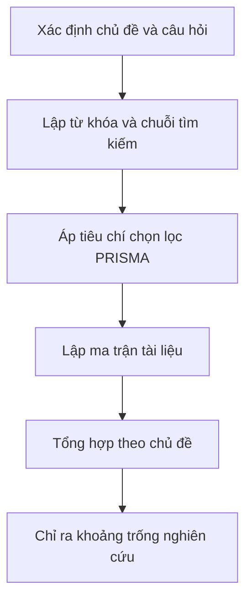

# 📚 Mẫu Outline Tổng Quan Tài Liệu

> ✏️ **Đây là template mẫu, hãy sao chép và chỉnh theo đề tài của bạn.** Tổng quan tài liệu **không phải là liệt kê** từng bài, mà là **tổng hợp theo chủ đề** để làm lộ ra khoảng trống nghiên cứu.

| Thông tin | Chi tiết |
|---|---|
| **Chủ đề tổng quan** | [điền chủ đề] |
| **Tác giả** | [điền họ tên] |
| **Ngày cập nhật** | [điền ngày/tháng/năm] |

---

## 🗺️ Quy trình dựng tổng quan



---

## 1. Chủ đề và câu hỏi tổng quan

- **Chủ đề:** [điền].
- **Phạm vi:** [điền — bối cảnh, ngành, khoảng thời gian, ví dụ 2019–2025].
- **Câu hỏi tổng quan chính:** [điền — ví dụ: "AI tạo sinh ảnh hưởng thế nào đến động lực học tập của sinh viên đại học?"].
- **Câu hỏi phụ (nếu có):** [điền].

---

## 2. Từ khóa & chuỗi tìm kiếm

| # | Từ khóa | Từ đồng nghĩa / biến thể |
|---|---|---|
| 1 | [điền] | [điền] |
| 2 | [điền] | [điền] |
| 3 | [điền] | [điền] |

**Chuỗi tìm kiếm mẫu (search string):**

```text
[điền — ví dụ: ("ChatGPT" OR "generative AI") AND ("higher education" OR "university") AND ("learning" OR "motivation")]
```

- **Cơ sở dữ liệu đã tìm:** [điền — ví dụ Scopus, Google Scholar, Web of Science].

---

## 3. Tiêu chí chọn lọc (theo tinh thần PRISMA)

| Tiêu chí | Đưa vào (Include) | Loại ra (Exclude) |
|---|---|---|
| Chủ đề | [điền — đúng chủ đề X] | [điền — lạc chủ đề] |
| Năm xuất bản | [điền — từ năm … trở lại] | [điền — quá cũ] |
| Loại nghiên cứu | [điền — thực nghiệm/bình duyệt] | [điền — editorial, không dữ liệu] |
| Ngôn ngữ | [điền] | [điền] |

**Tóm tắt dòng chảy chọn lọc PRISMA:**

- Số bản ghi tìm được: `[điền số]`
- Sau khi loại trùng: `[điền số]`
- Sau khi sàng lọc tiêu đề/abstract: `[điền số]`
- Đọc toàn văn: `[điền số]`
- **Đưa vào tổng quan cuối cùng:** `[điền số]`

---

## 4. Ma trận tài liệu

| Mã | Tác giả & năm | Bối cảnh / Quốc gia | Loại nghiên cứu | Cỡ mẫu | Phương pháp | Phát hiện chính | Hạn chế |
|---|---|---|---|---|---|---|---|
| [t01] | [điền] | [điền] | [điền] | `[điền số]` | [điền] | [điền] | [điền] |
| [t02] | [điền] | [điền] | [điền] | `[điền số]` | [điền] | [điền] | [điền] |
| [t03] | [điền] | [điền] | [điền] | `[điền số]` | [điền] | [điền] | [điền] |

> 💡 Mỗi dòng là một nghiên cứu. Điền đầy đủ rồi mới tổng hợp theo chủ đề ở phần sau.

---

## 5. Tổng hợp theo chủ đề (thematic)

### Chủ đề 1 — [điền tên chủ đề]

- **Ý chính:** [điền].
- **Điểm đồng thuận:** [điền].
- **Điểm mâu thuẫn (nếu có):** [điền].
- **Tài liệu liên quan:** [điền mã, ví dụ t01, t03].

### Chủ đề 2 — [điền tên chủ đề]

- **Ý chính:** [điền].
- **Điểm đồng thuận:** [điền].
- **Điểm mâu thuẫn:** [điền].
- **Tài liệu liên quan:** [điền].

### Chủ đề 3 — [điền tên chủ đề]

- **Ý chính:** [điền].
- **Điểm đồng thuận:** [điền].
- **Điểm mâu thuẫn:** [điền].
- **Tài liệu liên quan:** [điền].

---

## 6. Khoảng trống nghiên cứu (research gap)

| # | Mô tả khoảng trống | Xuất phát từ tài liệu nào | Câu hỏi nghiên cứu gợi ý |
|---|---|---|---|
| 1 | [điền] | [điền mã] | [điền] |
| 2 | [điền] | [điền mã] | [điền] |
| 3 | [điền] | [điền mã] | [điền] |

> 📌 **Nhắc lại nguyên tắc:** chưa kiểm chứng được nguồn (DOI / Google Scholar) thì chưa đưa vào tổng quan. Mỗi khẳng định quan trọng cần ít nhất một nguồn thật kèm năm.
