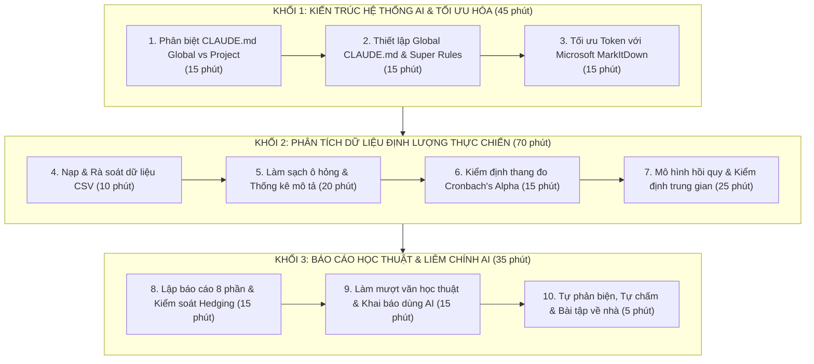
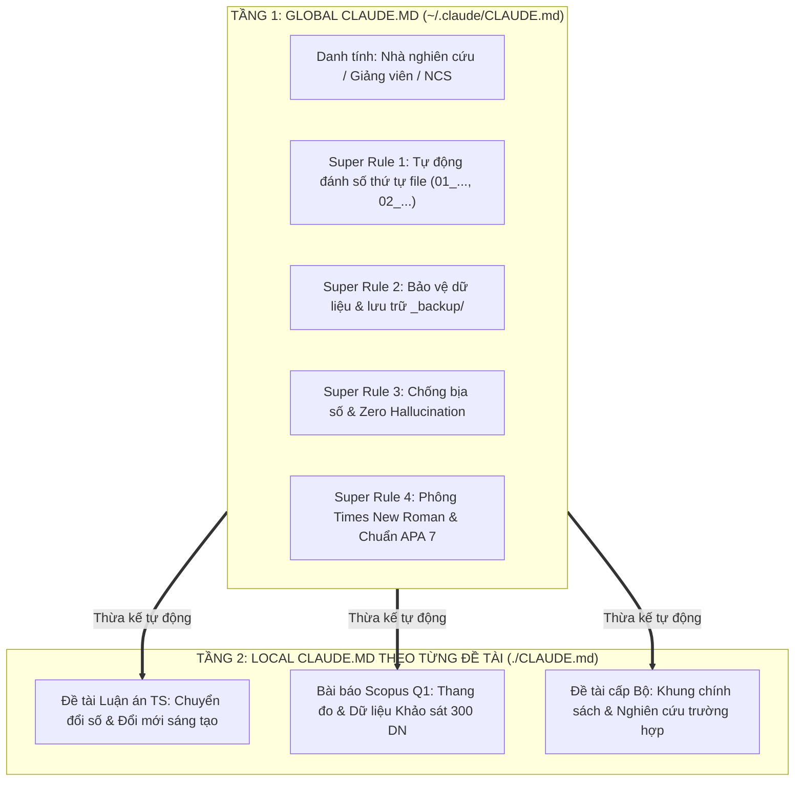
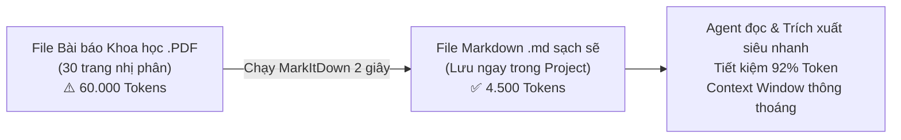
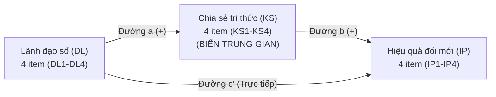
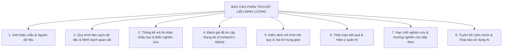
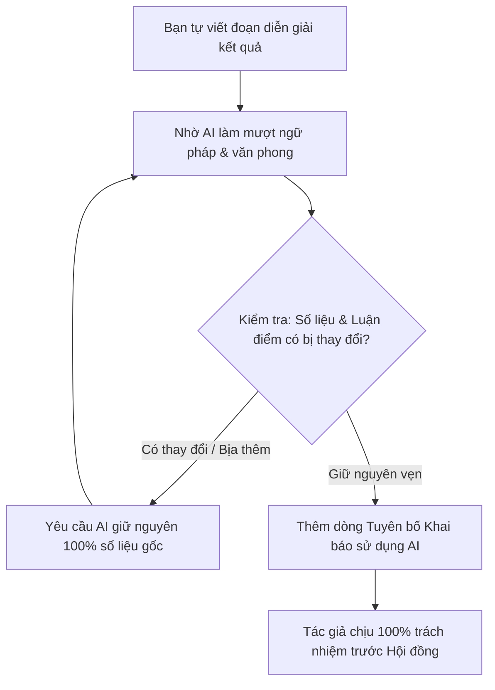

# Buổi 3: Kiến Trúc CLAUDE.md 2 Tầng (Global vs Project), Tối Ưu Token Với MarkItDown & Phân Tích Dữ Liệu Khảo Sát Nghiên Cứu Khoa Học

> **Cách dùng tài liệu này:** 
> - Mỗi phần gồm hai phần rõ rệt: **Lý thuyết** giúp bạn hiểu sâu bản chất và tư duy nghiên cứu (kèm ví von trực quan); **Thao tác** cung cấp các bước hành động cụ thể với prompt chuẩn mực (có cả bản Giảng viên chạy ngay và bản Học viên tự điền).
> - **Làm tuần tự, không nhảy cóc:** Mỗi bước kế thừa trực tiếp kết quả của bước trước.
> - **Chuẩn bị trước khi bắt đầu:** Mở VS Code, mở đúng thư mục dự án nghiên cứu/luận án của bạn (ví dụ `k3-research`), mở panel Claude Code (hoặc Terminal chạy `claude`).
> - Bộ dữ liệu thực hành nằm tại: `du-lieu-mau/khao-sat/khao-sat-doi-moi-dnnvv.csv`.

---

## ⏱️ Nhịp Buổi Học (150 Phút)



| Khối | Nội dung trọng tâm | Thời lượng | Hình thức | Sản phẩm đầu ra |
|---|---|:---:|:---:|---|
| **Khối 1** | **Kiến trúc CLAUDE.md 2 tầng & MarkItDown**<br>• Phân biệt Global (`~/.claude/`) vs Local (`./`)<br>• Cài đặt Super Rules: Tự đánh số file `01_...`, an toàn dữ liệu, chống bịa số, chuẩn font Times New Roman<br>• Cài đặt & chạy `markitdown` tiết kiệm 80% token | **45 phút** | GV 20'<br>HV 25' | • File `~/.claude/CLAUDE.md` chuẩn<br>• Cây thư mục tự động đánh số<br>• Chuyển đổi tài liệu sang `.md` |
| **Khối 2** | **Phân tích định lượng dữ liệu khảo sát**<br>• Nạp 320 phiếu khảo sát Likert 1–5<br>• Làm sạch dữ liệu listwise (còn 302 mẫu sạch)<br>• Thống kê mô tả nhân khẩu học + Mean/SD<br>• Kiểm định độ tin cậy Cronbach's Alpha (≥ 0.7)<br>• Hồi quy tuyến tính & Bootstrap trung gian 95% | **70 phút** | GV 25'<br>HV 45' | • Bảng làm sạch minh bạch<br>• Bảng thống kê mô tả APA<br>• Bảng Cronbach's Alpha đạt chuẩn<br>• Kết quả kiểm định trung gian |
| **Khối 3** | **Báo cáo học thuật, Làm mượt & Liêm chính**<br>• Đổ kết quả vào Template 8 phần chuẩn APA 7<br>• Rà soát ngôn từ cẩn trọng (Hedging) tránh phóng đại nhân quả với dữ liệu cắt ngang<br>• Làm mượt văn phong giữ nguyên 100% số liệu<br>• Khai báo sử dụng AI minh bạch theo chuẩn quốc tế<br>• Tự phản biện và đối soát bộ số chuẩn | **35 phút** | GV 15'<br>HV 20' | • `bao-cao-phan-tich-du-lieu.md`<br>• File Word `.docx` chuẩn thể thức<br>• Bảng phản biện 3 điểm yếu |

---

# MỤC LỤC CHI TIẾT

- [KHỐI 1: KIẾN TRÚC HỆ THỐNG AI & TỐI ƯU HÓA NGHIÊN CỨU](#khối-1-kiến-trúc-hệ-thống-ai--tối-ưu-hóa-nghiên-cứu)
  - [PHẦN 1: KIẾN TRÚC CLAUDE.MD 2 TẦNG: GLOBAL VS PROJECT](#phần-1-kiến-trúc-claudemd-2-tầng-global-vs-project)
    - [1.1. Bản chất: Vì sao một nhà nghiên cứu cần 2 cấp cấu hình?](#11-bản-chất-vì-sao-một-nhà-nghiên-cứu-cần-2-cấp-cấu-hình)
    - [1.2. Bảng so sánh toàn diện: Global CLAUDE.md vs Local CLAUDE.md](#12-bảng-so-sánh-toàn-diện-global-claudemd-vs-local-claudemd)
    - [1.3. Quy tắc giải quyết xung đột: Cụ thể hơn sẽ thắng](#13-quy-tắc-giải-quyết-xung-đột-cụ-thể-hơn-sẽ-thắng)
  - [PHẦN 2: THIẾT LẬP GLOBAL CLAUDE.MD VỚI CÁC "SUPER RULES" NGHIÊN CỨU](#phần-2-thiết-lập-global-claudemd-với-các-super-rules-nghiên-cứu)
    - [2.1. 5 "Quy tắc thép" bắt buộc cài vào máy nghiên cứu](#21-5-quy-tắc-thép-bắt-buộc-cài-vào-máy-nghiên-cứu)
    - [2.2. Thao tác P1: Thiết lập Global CLAUDE.md cho Nhà nghiên cứu](#22-thao-tác-p1-thiết-lập-global-claudemd-cho-nhà-nghiên-cứu)
    - [2.3. Thao tác P2: Kiểm tra Super Rule tự động đánh số thứ tự file](#23-thao-tác-p2-kiểm-tra-super-rule-tự-động-đánh-số-thứ-tự-file)
  - [PHẦN 3: TỐI ƯU TOKEN & BẢO VỆ CONTEXT WINDOW VỚI MICROSOFT MARKITDOWN](#phần-3-tối-ưu-token--bảo-vệ-context-window-với-microsoft-markitdown)
    - [3.1. "Cơn đói Token" và bẫy tràn ngữ cảnh khi đọc tài liệu NCKH](#31-cơn-đói-token-và-bẫy-tràn-ngữ-cảnh-khi-đọc-tài-liệu-nckh)
    - [3.2. Giới thiệu Microsoft MarkItDown (`markitdown`)](#32-giới-thiệu-microsoft-markitdown-markitdown)
    - [3.3. Pipeline 3 bước chuyển đổi tài liệu trong dự án luận án](#33-pipeline-3-bước-chuyển-đổi-tài-liệu-trong-dự-án-luận-án)
    - [3.4. Thao tác P3: Cài đặt và chuyển đổi tài liệu khảo cứu với MarkItDown](#34-thao-tác-p3-cài-đặt-và-chuyển-đổi-tài-liệu-khảo-cứu-với-markitdown)
- [KHỐI 2: QUY TRÌNH PHÂN TÍCH DỮ LIỆU ĐỊNH LƯỢNG THỰC CHIẾN](#khối-2-quy-trình-phân-tích-dữ-liệu-định-lượng-thực-chiến)
  - [PHẦN 4: NẠP VÀ RÀ SOÁT CẤU TRÚC BỘ DỮ LIỆU KHẢO SÁT](#phần-4-nạp-và-rà-soát-cấu-trúc-bộ-dữ-liệu-khảo-sát)
    - [4.1. Bối cảnh mô hình nghiên cứu mẫu](#41-bối-cảnh-mô-hình-nghiên-cứu-mẫu)
    - [4.2. Thao tác P4: Đọc file CSV và phân loại biến](#42-thao-tác-p4-đọc-file-csv-và-phân-loại-biến)
  - [PHẦN 5: LÀM SẠCH DỮ LIỆU & LẬP BẢNG THỐNG KÊ MÔ TẢ](#phần-5-làm-sạch-dữ-liệu--lập-bảng-thống-kê-mô-tả)
    - [5.1. Nhặt "lá úa" trong dữ liệu: Missing, Outlier và Nhãn sai lệch](#51-nhặt-lá-úa-trong-dữ-liệu-missing-outlier-và-nhãn-sai-lệch)
    - [5.2. Thao tác P5: Tìm lỗi và làm sạch theo phương pháp listwise](#52-thao-tác-p5-tìm-lỗi-và-làm-sạch-theo-phương-pháp-listwise)
    - [5.3. Thao tác P6: Lập bảng nhân khẩu học và Mean/SD các thang đo](#53-thao-tác-p6-lập-bảng-nhân-khẩu-học-và-meansd-các-thang-đo)
  - [PHẦN 6: ĐÁNH GIÁ ĐỘ TIN CẬY THANG ĐO (CRONBACH'S ALPHA)](#phần-6-đánh-giá-độ-tin-cậy-thang-đo-cronbachs-alpha)
    - [6.1. Bản chất: Khi nào các câu hỏi thực sự cùng đo một khái niệm?](#61-bản-chất-khi-nào-các-câu-hỏi-thực-sự-cùng-đo-một-khái-niệm)
    - [6.2. Thao tác P7: Tính Cronbach's Alpha và phân tích tương quan biến - tổng](#62-thao-tác-p7-tính-cronbachs-alpha-và-phân-tích-tương-quan-biến---tổng)
    - [6.3. Thao tác P8: Đọc hiểu và diễn giải kết quả Alpha cho hội đồng](#63-thao-tác-p8-đọc-hiểu-và-diễn-giải-kết-quả-alpha-cho-hội-đồng)
  - [PHẦN 7: HỒI QUY TUYẾN TÍNH & KIỂM ĐỊNH TRUNG GIAN (MEDIATION)](#phần-7-hồi-quy-tuyến-tính--kiểm-định-trung-gian-mediation)
    - [7.1. Bản chất tác động trực tiếp và trạm trung chuyển trung gian](#71-bản-chất-tác-động-trực-tiếp-và-trạm-trung-chuyển-trung-gian)
    - [7.2. Thao tác P9: Chạy hồi quy tuyến tính đơn (DL → IP)](#72-thao-tác-p9-chạy-hồi-quy-tuyến-tính-đơn-dl--ip)
    - [7.3. Thao tác P10: Kiểm định trung gian theo Bootstrap 95% (Preacher & Hayes)](#73-thao-tác-p10-kiểm-định-trung-gian-theo-bootstrap-95-preacher--hayes)
    - [7.4. Thao tác P11: Diễn giải thận trọng (Hedging) — Tuyệt đối không phóng đại nhân quả](#74-thao-tác-p11-diễn-giải-thận-trọng-hedging--tuyệt-đối-không-phóng-đại-nhân-quả)
- [KHỐI 3: BÁO CÁO HỌC THUẬT, LÀM MƯỢT VĂN & LIÊM CHÍNH AI](#khối-3-báo-cáo-học-thuật-làm-mượt-văn--liêm-chính-ai)
  - [PHẦN 8: LẬP BÁO CÁO PHÂN TÍCH 8 PHẦN CHUẨN APA 7](#phần-8-lập-báo-cáo-phân-tích-8-phần-chuẩn-apa-7)
    - [8.1. Cấu trúc 8 phần của một báo cáo định lượng chuẩn mực](#81-cấu-trúc-8-phần-của-một-báo-cáo-định-lượng-chuẩn-mực)
    - [8.2. Thao tác P12: Đổ kết quả vào template báo cáo hoàn chỉnh](#82-thao-tác-p12-đổ-kết-quả-vào-template-báo-cáo-hoàn-chỉnh)
    - [8.3. Thao tác P13: Viết phần Hạn chế nghiên cứu trung thực và thuyết phục](#83-thao-tác-p13-viết-phần-hạn-chế-nghiên-cứu-trung-thực-và-thuyết-phục)
    - [8.4. Thao tác P14: Rà soát câu chữ bằng quy trình kiem-tra-hedging](#84-thao-tác-p14-rà-soát-câu-chữ-bằng-quy-trình-kiem-tra-hedging)
  - [PHẦN 9: LÀM MƯỢT VĂN HỌC THUẬT ĐÚNG ĐẠO ĐỨC & KHAI BÁO DÙNG AI](#phần-9-làm-mượt-văn-học-thuật-đúng-đạo-đức--khai-báo-dùng-ai)
    - [9.1. Ranh giới sống còn: Làm mượt văn (Đúng) vs. Gian lận/Che giấu (Sai)](#91-ranh-giới-sống-còn-làm-mượt-văn-đúng-vs-gian-lậnche-giấu-sai)
    - [9.2. Thao tác P15: Làm mượt phần diễn giải bằng quy trình chinh-van-phong](#92-thao-tác-p15-làm-mượt-phần-diễn-giải-bằng-quy-trình-chinh-van-phong)
    - [9.3. Thao tác P16: Thêm Tuyên bố Khai báo Sử dụng AI (AI Disclosure Statement)](#93-thao-tác-p16-thêm-tuyên-bố-khai-báo-sử-dụng-ai-ai-disclosure-statement)
    - [9.4. Thao tác P17: (Tùy chọn) Xuất báo cáo sang Word (.docx) chuẩn thể thức](#94-thao-tác-p17-tùy-chọn-xuất-báo-cáo-sang-word-docx-chuẩn-thể-thức)
  - [PHẦN 10: TỰ PHẢN BIỆN, BỘ SỐ KIỂM ĐỊNH & BÀI TẬP VỀ NHÀ](#phần-10-tự-phản-biện-bộ-số-kiểm-định--bài-tập-về-nhà)
    - [10.1. Thao tác P18: Tự phản biện nghiên cứu bằng critical-review](#101-thao-tác-p18-tự-phản-biện-nghiên-cứu-bằng-critical-review)
    - [10.2. Bộ số kiểm định "chống ảo giác" để tự chấm bài](#102-bộ-số-kiểm-định-chống-ảo-giác-để-tự-chấm-bài)
    - [10.3. Checklist nghiệm thu năng lực sau Buổi 3](#103-checklist-nghiệm-thu-năng-lực-sau-buổi-3)
    - [10.4. Bài tập về nhà](#104-bài-tập-về-nhà)

---

# KHỐI 1: KIẾN TRÚC HỆ THỐNG AI & TỐI ƯU HÓA NGHIÊN CỨU

---

## PHẦN 1: KIẾN TRÚC CLAUDE.MD 2 TẦNG: GLOBAL VS PROJECT

### 1.1. Bản chất: Vì sao một nhà nghiên cứu cần 2 cấp cấu hình?

Ở Buổi 1, bạn đã biết tạo file `CLAUDE.md` trong thư mục dự án luận án. Tuy nhiên, khi làm nghiên cứu thực tế, bạn sẽ gặp tình huống:
- Bạn mở một thư mục mới để viết bài báo gửi tạp chí quốc tế.
- Bạn mở một thư mục khác để phân tích dữ liệu cho một đề tài cấp Bộ.
- Bạn mở thêm một thư mục để làm đề cương luận án.

**Nỗi đau:** Chẳng lẽ mỗi lần mở thư mục mới, bạn lại phải copy và dặn lại AI từ đầu: *"Tôi là nghiên cứu sinh, phải viết chuẩn APA 7, cấm bịa số liệu, cấm tự ý xóa file, phải dùng font Times New Roman"*?

Đó là lý do Claude Code cung cấp **Kiến trúc cấu hình 2 tầng**:
1. **CLAUDE.md Toàn cục (Global):** Nằm tại thư mục người dùng máy tính (`~/.claude/CLAUDE.md`). Đây là **Hiến pháp & Chuẩn mực đạo đức nghiên cứu chung** của chính bạn. Mọi dự án mở trên máy tính đều tự động thừa hưởng các quy tắc này.
2. **CLAUDE.md Dự án (Project / Local):** Nằm ngay tại thư mục gốc của từng nghiên cứu (`./CLAUDE.md`). Đây là **Quy chế chuyên môn riêng của đề tài** (câu hỏi nghiên cứu, mô hình lý thuyết, danh mục biến số, quy chuẩn của tạp chí mục tiêu).



---

### 1.2. Bảng so sánh toàn diện: Global CLAUDE.md vs Local CLAUDE.md

| Tiêu chí | CLAUDE.md Global (Toàn cục) | CLAUDE.md Local (Dự án / Đề tài) |
|---|---|---|
| **Đường dẫn vật lý** | `~/.claude/CLAUDE.md`<br>*(Windows: `C:\Users\<TênUser>\.claude\CLAUDE.md`)* | `./CLAUDE.md`<br>*(Ngay tại gốc thư mục đề tài nghiên cứu)* |
| **Phạm vi hiệu lực** | **Tất cả thư mục** mở bằng Claude Code trên máy | **Duy nhất thư mục đó** và các thư mục con |
| **Vai trò học thuật** | **Hiến pháp & Kỷ luật nghiên cứu của bạn**:<br>Danh tính học thuật, cấm bịa số liệu, tự động đánh số thứ tự file, bảo vệ file cũ vào `_backup/`, chuẩn văn phong khoa học. | **Hồ sơ chuyên môn của đề tài cụ thể**:<br>Tên đề tài, câu hỏi nghiên cứu, giả thuyết $H_1, H_2$, từ điển biến số (codebook), format riêng của tạp chí đích. |
| **Tần suất cập nhật** | Rất ít khi sửa (cài 1 lần dùng cho cả đời nghiên cứu). | Cập nhật thường xuyên theo từng giai đoạn nghiên cứu. |
| **Cơ chế nạp vào AI** | Đọc tự động mỗi khi khởi động phiên làm việc. | Đọc tự động kết hợp cùng file Global. |
| **Yêu cầu sau khi sửa** | **BẮT BUỘC MỞ PHIÊN MỚI** (`claude` hoặc New Session). | **BẮT BUỘC MỞ PHIÊN MỚI** để AI nạp quy tắc mới. |

---

### 1.3. Quy tắc giải quyết xung đột: Cụ thể hơn sẽ thắng

Khi một chỉ thị ở `CLAUDE.md Local` khác với `CLAUDE.md Global`, quy tắc vàng là:
> **"Cụ thể hơn sẽ thắng" (Local Overrides Global).**

*Ví dụ thực tế trong NCKH:*
- File **Global** bạn quy định chung: Trích dẫn theo chuẩn **APA 7th** (Author-Date).
- File **Local** của một bài báo gửi tạp chí Kỹ thuật / Y sinh: Yêu cầu trích dẫn theo chuẩn **IEEE** hoặc **Vancouver** (Number [1], [2]).
- ➔ **Kết quả:** Trong dự án bài báo đó, Agent sẽ tuân thủ chuẩn IEEE của Local mà không làm ảnh hưởng đến các dự án khác trên máy của bạn.

---

## PHẦN 2: THIẾT LẬP GLOBAL CLAUDE.MD VỚI CÁC "SUPER RULES" NGHIÊN CỨU

### 2.1. 5 "Quy tắc thép" bắt buộc cài vào máy nghiên cứu

Để biến AI từ một công cụ chat ngẫu hứng thành một "trợ lý nghiên cứu chuẩn mực", chúng ta cài đặt 5 Super Rules vào Global CLAUDE.md:

```
┌─────────────────────────────────────────────────────────────────────────────┐
│ 1. QUY TẮC TỰ ĐỘNG ĐÁNH SỐ FILE (Sequential Auto-Numbering)                 │
│    Trước khi tạo bất kỳ file tài liệu, báo cáo, phân tích mới nào, Agent     │
│    PHẢI quét thư mục hiện tại để xác định số thứ tự tiếp theo và gán tiền   │
│    tố: 01_..., 02_..., 03_... Tránh tuyệt đối tên file vô tổ chức.         │
├─────────────────────────────────────────────────────────────────────────────┤
│ 2. AN TOÀN DỮ LIỆU & LƯU TRỮ TỰ ĐỘNG (Anti-Deletion & Auto-Backup)          │
│    Cấm tuyệt đối chạy lệnh xóa hàng loạt (rm -rf, del *.*). Khi nâng cấp     │
│    hoặc thay thế tài liệu, di chuyển bản cũ vào thư mục con _backup/.        │
│    Bên ngoài chỉ giữ duy nhất 01 phiên bản hoạt động chuẩn mực.              │
├─────────────────────────────────────────────────────────────────────────────┤
│ 3. KỶ LUẬT CHỐNG BỊA SỐ LIỆU (Zero Hallucination on Academic Metrics)       │
│    Mọi con số phân tích (p-value, Beta, R², Cronbach's Alpha, Mean, SD)      │
│    BẮT BUỘC phải trích xuất chính xác từ file dữ liệu/code. Nếu thiếu số     │
│    liệu, ghi rõ [Chờ bổ sung], tuyệt đối không tự suy diễn, bịa đặt.         │
├─────────────────────────────────────────────────────────────────────────────┤
│ 4. CHUẨN MỰC THỂ THỨC VĂN BẢN & PHÔNG CHỮ TIMES NEW ROMAN                   │
│    100% file tài liệu Word (.docx), PDF, Excel (.xlsx) tạo ra BẮT BUỘC dùng  │
│    phông chữ Times New Roman, tuân thủ Nghị định 30/2020/NĐ-CP và APA 7th.  │
├─────────────────────────────────────────────────────────────────────────────┤
│ 5. BỐ CỤC BẢNG BIỂU CHỐNG DỒN CHỮ & ĐÈ DÒNG                                  │
│    Bảng dữ liệu/Excel phải tách riêng cột STT (căn giữa, rộng 6-8), cột text │
│    rộng rãi có Wrap Text, cột số liệu căn phải có phân cách hàng nghìn.      │
└─────────────────────────────────────────────────────────────────────────────┘
```

---

### 2.2. Thao tác P1: Thiết lập Global CLAUDE.md cho Nhà nghiên cứu

#### Prompt P1 — Bản Giảng viên chạy ngay (Copy dán vào Claude Code):
```
Tạo hoặc cập nhật file CLAUDE.md cấp Global tại thư mục .claude của người dùng (~/.claude/CLAUDE.md) với toàn bộ các nguyên tắc sau:

1. DANH TÍNH & BỐI CẢNH HỌC THUẬT:
- Vai trò: Trợ lý Nghiên cứu Khoa học cao cấp phục vụ Nghiên cứu sinh và Giảng viên.
- Phong cách: Khách quan, trung thực học thuật, nghiêm cẩn, tiếng Việt chuẩn mực, tuyệt đối không dùng emoji trong văn bản và báo cáo khoa học.

2. SUPER RULES BẮT BUỘC CHO MỌI DỰ ÁN (MANDATORY RULES):
- SUPER RULE 1 (TỰ ĐỘNG ĐÁNH SỐ THỨ TỰ FILE): Trước khi tạo bất kỳ file mới nào (.md, .docx, .xlsx, .py), PHẢI kiểm tra thư mục hiện tại để lấy số thứ tự tiếp theo dạng 01_..., 02_..., 03_... Tuyệt đối không đặt tên file rời rạc không có số thứ tự.
- SUPER RULE 2 (BẢO VỆ DỮ LIỆU & LƯU TRỮ _BACKUP): Tuyệt đối không chạy lệnh xóa hàng loạt (rm -rf, del *.*). Khi cập nhật hoặc thay thế tài liệu, luôn chuyển bản cũ vào thư mục con _backup/. Bên ngoài chỉ duy trì duy nhất 01 phiên bản mới nhất (Single Source of Truth).
- SUPER RULE 3 (KỶ LUẬT CHỐNG BỊA SỐ): Mọi số liệu thống kê (Mean, SD, Cronbach's Alpha, hệ số Beta, p-value, R-square) phải dẫn chứng chính xác từ file dữ liệu. Nếu dữ liệu chưa có, ghi rõ [Chờ bổ sung], nghiêm cấm tự suy diễn con số.
- SUPER RULE 4 (CHUẨN FONT TIMES NEW ROMAN & THỂ THỨC HÀNH CHÍNH): Mọi tài liệu Word (.docx), PDF, Excel (.xlsx) xuất ra BẮT BUỘC 100% sử dụng phông chữ Times New Roman theo chuẩn Nghị định 30/2020/NĐ-CP và chuẩn APA 7th.
- SUPER RULE 5 (BỐ CỤC BẢNG BIỂU CHỐNG DỒN CHỮ): Cột STT tách riêng (căn giữa, rộng 6-8 ký tự), cột số căn phải, cột chữ rộng rãi có tự động xuống dòng (Wrap Text), tính toán chiều cao dòng động để không bao giờ bị đè chữ.
```

#### Prompt P1 — Bản Học viên tự điền theo đề tài:
```
Tạo hoặc cập nhật file CLAUDE.md cấp Global tại ~/.claude/CLAUDE.md:
- Tôi là: [Họ và tên] - [Nghiên cứu sinh / Học viên cao học / Giảng viên] tại [Tên Viện / Trường Đại học].
- Lĩnh vực nghiên cứu: [Kinh tế / Y Dược / Quản trị kinh doanh / Khoa học xã hội].
- Phong cách: Nghiêm cẩn học thuật, khách quan, tiếng Việt chuẩn mực, không dùng emoji trong báo cáo khoa học.
- Cài đặt 5 Super Rules:
  1. Tự động đánh số thứ tự file (01_..., 02_...).
  2. Không xóa file cũ, chuyển bản cũ vào _backup/.
  3. Tuyệt đối không bịa số liệu, mọi số liệu phải trích dẫn từ file nguồn.
  4. 100% tài liệu xuất ra bắt buộc dùng phông chữ Times New Roman.
  5. Bố cục bảng biểu khoa học, chống dồn chữ, đè dòng.
```

> ⚠️ **THAO TÁC THEN CHỐT CỦA BƯỚC NÀY:**
> Sau khi tạo hoặc cập nhật file Global CLAUDE.md xong, bạn **PHẢI ĐÓNG PHIÊN HIỆN TẠI VÀ MỞ PHIÊN MỚI** (chạy lại lệnh `claude` trong Terminal hoặc mở New Session). AI chỉ đọc file Global khi khởi tạo phiên làm việc mới!

---

### 2.3. Thao tác P2: Kiểm tra Super Rule tự động đánh số thứ tự file

Để kiểm tra xem "Hiến pháp" Global đã ngấm vào Agent chưa, ta thử yêu cầu tạo một file ghi chú mà **hoàn toàn không dặn nó đánh số**:

#### Prompt P2 (Test lệnh):
```
Hãy tạo giúp tôi 1 file ghi chú tóm tắt 3 mục tiêu nghiên cứu của luận án vào thư mục hiện tại.
```

#### Kết quả mong đợi:
- Agent tự động quét thư mục hiện tại.
- Agent tự động đặt tên file là `01_muc-tieu-nghien-cuu.md` (hoặc số kế tiếp nếu đã có file số) mà bạn **không cần nhắc một chữ nào về 01_**!
- Đây chính là sự kỳ diệu của việc cài Super Rule vào Global CLAUDE.md.

---

## PHẦN 3: TỐI ƯU TOKEN & BẢO VỆ CONTEXT WINDOW VỚI MICROSOFT MARKITDOWN

### 3.1. "Cơn đói Token" và bẫy tràn ngữ cảnh khi đọc tài liệu NCKH

Trong nghiên cứu, chúng ta thường xuyên làm việc với các tài liệu rất "nặng":
- Một bài báo khoa học PDF 25 trang tải từ ScienceDirect / Springer.
- Một cuốn sách chuyên khảo PDF 300 trang.
- File Word đề cương luận án 60 trang có đủ hình vẽ, bảng biểu và format rác.

**Vấn đề nan giải:**
- File PDF và Word nhị phân chứa vô số mã định dạng ẩn (font, XML, layout, metadata).
- Ném thẳng một file PDF 30 trang cho AI đọc trực tiếp có thể ngốn tới **40.000 – 80.000 tokens**!
- Hậu quả:
  1. **Chi phí token tăng vọt:** Rất tốn kém tài nguyên API.
  2. **Tràn Context Window:** Cửa sổ ngữ cảnh bị lấp đầy bởi rác định dạng khiến Agent bị "ngáo", quên mất đề tài, quên quy tắc chống bịa số, hoặc trả lời vòng vo mất trí nhớ.
  3. **Tốc độ chậm chạp:** Thời gian đọc và phản hồi kéo dài hàng phút.

---

### 3.2. Giới thiệu Microsoft MarkItDown (`markitdown`)

- **Kho mã nguồn:** [https://github.com/microsoft/markitdown](https://github.com/microsoft/markitdown)
- **Đơn vị phát triển:** Tập đoàn Microsoft (Mã nguồn mở chính thức).
- **Nguyên lý hoạt động:** Bóc tách toàn bộ phần ruột nội dung (văn bản thuần, cấu trúc tiêu đề `#`, `##`, bảng biểu Markdown) từ các file phức tạp (`.pdf`, `.docx`, `.pptx`, `.xlsx`, `.html`, `.zip`) và loại bỏ hoàn toàn mã định dạng nhị phân rác.
- **Hiệu quả thực tế:**
  - **Giảm 70% đến 90% lượng token tiêu thụ!**
  - Giữ nguyên vẹn 100% bảng biểu khoa học và cấu trúc phân cấp.
  - Tốc độ đọc của Agent tăng gấp 5–10 lần.



---

### 3.3. Pipeline 3 bước chuyển đổi tài liệu trong dự án luận án

Quy trình chuẩn hóa để tài liệu nghiên cứu luôn gọn gàng và tiết kiệm:
1. **Bước 1: Cài đặt công cụ một lần duy nhất trên máy tính:**
   ```bash
   pip install markitdown
   ```
2. **Bước 2: Dạy Agent nguyên tắc xử lý trong `CLAUDE.md`:**
   > *"Khi người dùng yêu cầu đọc hoặc phân tích tài liệu phức tạp (.pdf, .docx, .xlsx), Agent hãy dùng lệnh `markitdown <file-goc> -o <file.md>` để chuyển đổi sang Markdown lưu vào thư mục dự án trước, sau đó mới đọc file `.md` để làm việc."*
3. **Bước 3: Agent đọc file Markdown sạch và phân tích.**

---

### 3.4. Thao tác P3: Cài đặt và chuyển đổi tài liệu khảo cứu với MarkItDown

#### Bước 3.4.1: Kiểm tra cài đặt trong Terminal VS Code
Mở Terminal trong VS Code và gõ:
```bash
pip install markitdown
```

#### Prompt P3 — Bản Giảng viên chạy ngay:
```
Hãy kiểm tra xem công cụ markitdown đã sẵn sàng chưa. Sau đó, hãy dùng markitdown để chuyển đổi file tài liệu khảo cứu trong thư mục du-lieu-mau/ (file .docx hoặc .pdf) thành một file markdown lưu tại thu-muc-hien-tai với tên đúng chuẩn Super Rule (ví dụ: 02_tong-quan-tai-lieu.md).
Sau khi chuyển đổi xong, hãy đọc file markdown đó và tóm tắt:
1. Mục tiêu chính của tài liệu.
2. Phương pháp nghiên cứu được đề cập.
3. Ba phát hiện hoặc kết luận quan trọng nhất.
```

#### Kết quả mong đợi:
- Agent tự động gọi lệnh ngầm: `markitdown <duong-dan-file-goc> -o 02_tong-quan-tai-lieu.md`.
- File Markdown sinh ra ngay trong dự án: Sạch sẽ, không còn rác định dạng, bảng biểu ngay ngắn.
- Token tiêu thụ chỉ còn ~2.000 token thay vì 30.000 token nếu đọc file gốc!

---

# KHỐI 2: QUY TRÌNH PHÂN TÍCH DỮ LIỆU ĐỊNH LƯỢNG THỰC CHIẾN

---

## PHẦN 4: NẠP VÀ RÀ SOÁT CẤU TRÚC BỘ DỮ LIỆU KHẢO SÁT

### 4.1. Bối cảnh mô hình nghiên cứu mẫu

Để thực hành phân tích dữ liệu định lượng, chúng ta sử dụng bộ dữ liệu khảo sát thực tế (giả lập có gài sẵn lỗi để luyện tập làm sạch):
- **Đề tài:** *Tác động của Lãnh đạo số đến Hiệu quả đổi mới sáng tạo trong các Doanh nghiệp nhỏ và vừa (DNNVV): Vai trò trung gian của Chia sẻ tri thức.*
- **Mô hình lý thuyết 3 khái niệm (đo bằng thang đo Likert 5 điểm, 1 = Hoàn toàn không đồng ý, 5 = Hoàn toàn đồng ý):**
  1. **Lãnh đạo số (Digital Leadership - DL):** 4 item (`DL1, DL2, DL3, DL4`) — Biến độc lập.
  2. **Chia sẻ tri thức (Knowledge Sharing - KS):** 4 item (`KS1, KS2, KS3, KS4`) — Biến trung gian (Mediator).
  3. **Hiệu quả đổi mới (Innovation Performance - IP):** 4 item (`IP1, IP2, IP3, IP4`) — Biến phụ thuộc.
- **Biến nhân khẩu học:** `gioi_tinh`, `nhom_tuoi`, `kinh_nghiem`, `quy_mo_dn`, `nganh`.
- **Tập dữ liệu gốc:** `du-lieu-mau/khao-sat/khao-sat-doi-moi-dnnvv.csv` gồm **320 quan sát**.



---

### 4.2. Thao tác P4: Đọc file CSV và phân loại biến

#### Prompt P4:
```
Hãy đọc file du-lieu-mau/khao-sat/khao-sat-doi-moi-dnnvv.csv:
1. In ra 5 dòng đầu tiên của dữ liệu.
2. Cho biết tổng số dòng (quan sát) và tổng số cột.
3. Liệt kê tên tất cả các cột và phân loại rạch ròi: Đâu là biến định danh/nhân khẩu học, đâu là các item thang đo Likert (thuộc khái niệm nào).
Trình bày câu trả lời bằng bảng rõ ràng, tiếng Việt chuẩn mực.
```

#### Kết quả mong đợi:
- Tổng số dòng: **320 dòng**.
- Biến nhân khẩu học: 5 cột (`gioi_tinh`, `nhom_tuoi`, `kinh_nghiem`, `quy_mo_dn`, `nganh`).
- Nhóm biến nghiên cứu: 12 item Likert gồm `DL1-DL4` (Lãnh đạo số), `KS1-KS4` (Chia sẻ tri thức), `IP1-IP4` (Hiệu quả đổi mới).

---

## PHẦN 5: LÀM SẠCH DỮ LIỆU & LẬP BẢNG THỐNG KÊ MÔ TẢ

### 5.1. Nhặt "lá úa" trong dữ liệu: Missing, Outlier và Nhãn sai lệch

Không có bộ dữ liệu thực tế nào là sạch hoàn hảo ngay từ đầu. Một nhà nghiên cứu trung thực phải luôn thực hiện khâu **Làm sạch dữ liệu (Data Cleaning)** và báo cáo minh bạch trong bài báo:
- **Ô trống (Missing values):** Người khảo sát bỏ qua câu hỏi.
- **Giá trị ngoài thang (Outliers vô lý):** Thang Likert chỉ từ 1 đến 5 mà xuất hiện điểm 0, điểm 7, điểm 9 (do lỗi gõ phím của điều tra viên).
- **Nhãn không nhất quán:** Cùng là giới tính nam nhưng lúc ghi "Nam", lúc ghi "nam".

**Phương pháp xử lý chuẩn trong nghiên cứu hàn lâm:**
Phương pháp **Listwise Deletion (Loại bỏ theo dòng)**: Loại bỏ các phiếu khảo sát có bất kỳ ô trống hoặc giá trị ngoài thang nào. Phương pháp này đơn giản, minh bạch và hoàn toàn có thể tái lập được bởi các nhà nghiên cứu độc lập.

---

### 5.2. Thao tác P5: Tìm lỗi và làm sạch theo phương pháp listwise

#### Prompt P5:
```
Trên file dữ liệu du-lieu-mau/khao-sat/khao-sat-doi-moi-dnnvv.csv, hãy thực hiện quy trình kiểm tra chất lượng dữ liệu:
1. Đếm số ô trống (missing) trên từng cột và cho biết mã phiếu vi phạm.
2. Quét các giá trị ngoài khoảng thang đo Likert [1, 5] ở tất cả 12 item, chỉ rõ mã phiếu (ID), tên cột và giá trị sai lệch.
3. Kiểm tra các nhãn không nhất quán ở biến định danh hoặc dòng trùng lặp hoàn toàn.
4. Đề xuất quy trình làm sạch theo phương pháp listwise deletion: Nêu rõ tổng số quan sát bị loại theo từng lý do, và xác định chính xác số quan sát sạch còn lại để đưa vào phân tích.
Trình bày bằng các bảng đối soát chi tiết.
```

#### Kết quả mong đợi:
- **14 ô trống (missing)** rải rác ở một số phiếu.
- **4 giá trị ngoài thang Likert**:
  * Mã phiếu `R045`: `DL3` = 0
  * Mã phiếu `R110`: `KS1` = 0
  * Mã phiếu `R077`: `IP2` = 7
  * Mã phiếu `R203`: `IP4` = 9
- **Kết quả sau làm sạch listwise:** Từ 320 phiếu ban đầu, loại bỏ 18 phiếu lỗi ➔ Còn lại **302 quan sát sạch** (đạt chuẩn mẫu lớn trong phân tích định lượng).

---

### 5.3. Thao tác P6: Lập bảng nhân khẩu học và Mean/SD các thang đo

#### Prompt P6:
```
Dựa trên bộ dữ liệu đã làm sạch (302 quan sát sạch):
1. Lập bảng thống kê mô tả đặc điểm mẫu nghiên cứu (nhân khẩu học): Giới tính, Nhóm tuổi, Kinh nghiệm công tác, Quy mô doanh nghiệp, Ngành nghề. Mỗi biến nêu rõ Số lượng (Tần số N) và Tỷ lệ phần trăm (%).
2. Tính giá trị Trung bình (Mean) và Độ lệch chuẩn (Standard Deviation - SD) cho từng item từ DL1 đến IP4, đồng thời tính điểm trung bình đại diện cho 3 thang đo tổng hợp (DL, KS, IP).
Trình bày chuẩn bảng APA 7, phông Times New Roman, các số thập phân lấy 2 chữ số sau dấu phẩy.
```

#### Kết quả mong đợi:
- Bảng nhân khẩu học chuẩn mực, tổng tỷ lệ cộng tròn 100% trên 302 mẫu.
- Bảng Mean và SD của 12 item nằm chuẩn trong khoảng từ 1.00 đến 5.00:
  * Điểm trung bình Lãnh đạo số (DL): dao động quanh mức ~3.60 – 3.80.
  * Điểm trung bình Chia sẻ tri thức (KS): dao động quanh mức ~3.50 – 3.75.
  * Điểm trung bình Hiệu quả đổi mới (IP): dao động quanh mức ~3.45 – 3.70.
  * Độ lệch chuẩn SD nằm trong khoảng 0.70 – 0.95 (phản ánh mức độ phân tán hợp lý, không có hiện tượng đồng nhất thái quá).

---

## PHẦN 6: ĐÁNH GIÁ ĐỘ TIN CẬY THANG ĐO (CRONBACH'S ALPHA)

### 6.1. Bản chất: Khi nào các câu hỏi thực sự cùng đo một khái niệm?

Trong khoa học xã hội và quản trị, các khái niệm trừu tượng (như "Lãnh đạo số") không thể đo bằng một câu hỏi đơn lẻ, mà phải dùng một nhóm câu hỏi (item). 

**Cronbach's Alpha** là hệ số đo lường mức độ **nhất quán nội tại (Internal Consistency)** giữa các câu hỏi trong cùng một thang đo:
- Ví von: Giống như 4 vị giám khảo cùng chấm một thí sinh. Nếu cả 4 người cùng cho điểm tương đồng (thí sinh giỏi thì cho 8-9 điểm, thí sinh yếu thì cho 4-5 điểm), nghĩa là thang chấm đáng tin cậy.
- **Tiêu chuẩn học thuật (Nunnally & Bernstein, 1994):**
  * $\alpha \ge 0.70$: Đạt độ tin cậy tốt để đưa vào nghiên cứu chính thức.
  * Hệ số tương quan biến - tổng (Corrected Item-Total Correlation) của từng item $\ge 0.30$.
  * Chỉ số **Cronbach's Alpha if Item Deleted**: Nếu loại bỏ một câu hỏi mà $\alpha$ tổng tăng vọt, câu hỏi đó là "kẻ lạc lõng", cần xem xét loại bỏ.

---

### 6.2. Thao tác P7: Tính Cronbach's Alpha và phân tích tương quan biến - tổng

#### Prompt P7:
```
Trên bộ dữ liệu 302 quan sát đã làm sạch, hãy tính toán kiểm định độ tin cậy thang đo Cronbach's Alpha cho 3 khái niệm:
1. Thang đo Lãnh đạo số (DL): Gồm DL1, DL2, DL3, DL4.
2. Thang đo Chia sẻ tri thức (KS): Gồm KS1, KS2, KS3, KS4.
3. Thang đo Hiệu quả đổi mới (IP): Gồm IP1, IP2, IP3, IP4.

Với mỗi thang đo, hãy báo cáo:
- Hệ số Cronbach's Alpha tổng thể.
- Bảng chi tiết từng item: Trung bình thang nếu loại item, Phương sai thang nếu loại item, Tương quan biến - tổng hiệu chỉnh (Corrected Item-Total Correlation), và Cronbach's Alpha nếu loại item (Alpha if item deleted).
- Đưa ra nhận xét đánh giá độ tin cậy theo ngưỡng chuẩn học thuật (ngưỡng 0.70 và tương quan biến tổng 0.30).
```

#### Kết quả mong đợi:
- **Lãnh đạo số (DL):** Cronbach's Alpha $\approx$ **0.81** (Rất tốt).
- **Chia sẻ tri thức (KS):** Cronbach's Alpha $\approx$ **0.81** (Rất tốt).
- **Hiệu quả đổi mới (IP):** Cronbach's Alpha $\approx$ **0.83** (Rất tốt).
- Toàn bộ các item đều có hệ số tương quan biến - tổng $> 0.50$ (vượt xa ngưỡng tối thiểu 0.30).
- Không có item nào nếu loại bỏ làm tăng Cronbach's Alpha đáng kể ➔ Giữ nguyên toàn bộ 12 item.

---

### 6.3. Thao tác P8: Đọc hiểu và diễn giải kết quả Alpha cho hội đồng

#### Prompt P8:
```
Dựa trên kết quả Cronbach's Alpha ở trên, hãy viết một đoạn văn giải thích học thuật ngắn gọn (khoảng 150-200 từ) để đưa vào Luận án hoặc thuyết trình trước Hội đồng:
- Khẳng định tính nhất quán nội tại của cả 3 thang đo.
- Giải thích vì sao không cần loại bỏ bất kỳ item nào.
- Kết luận về tính sẵn sàng của dữ liệu để tiến hành phân tích hồi quy và kiểm định giả thuyết tiếp theo.
Văn phong khách quan, chuẩn mực học thuật.
```

---

## PHẦN 7: HỒI QUY TUYẾN TÍNH & KIỂM ĐỊNH TRUNG GIAN (MEDIATION)

### 7.1. Bản chất tác động trực tiếp và trạm trung chuyển trung gian

Nghiên cứu khoa học không chỉ dừng lại ở việc xem hai yếu tố có đi cùng nhau hay không, mà còn giải thích **cơ chế dẫn truyền**:
- **Tác động trực tiếp (Direct effect):** Lãnh đạo số (DL) tác động thẳng lên Hiệu quả đổi mới (IP).
- **Tác động gián tiếp qua trung gian (Indirect effect):** Lãnh đạo số (DL) thúc đẩy Văn hóa chia sẻ tri thức (KS), và chính sự chia sẻ tri thức này thúc đẩy Hiệu quả đổi mới (IP).

**Phương pháp kiểm định trung gian hiện đại (Preacher & Hayes):**
- Thay vì dùng kiểm định Sobel truyền thống (vốn đòi hỏi giả định phân phối chuẩn khắt khe), giới học thuật quốc tế hiện nay ưu tiên sử dụng **Kỹ thuật lấy mẫu lặp lại Bootstrap (thường là 1.000 đến 5.000 lần)** để ước lượng khoảng tin cậy 95% (95% Bootstrap Confidence Interval).
- **Quy tắc phán quyết:** Nếu Khoảng tin cậy 95% của tác động gián tiếp ($a \times b$) **KHÔNG CHỨA SỐ 0** (ví dụ từ $[0.08, 0.23]$), vai trò trung gian có ý nghĩa thống kê!
  * Nếu tác động trực tiếp ($c'$) vẫn còn ý nghĩa: **Trung gian một phần (Partial mediation)**.
  * Nếu tác động trực tiếp ($c'$) triệt tiêu về 0 ($p > 0.05$): **Trung gian toàn phần (Full mediation)**.

---

### 7.2. Thao tác P9: Chạy hồi quy tuyến tính đơn (DL → IP)

#### Prompt P9:
```
1. Tính biến đại diện (Composite variable) cho mỗi khái niệm bằng giá trị trung bình cộng của 4 item tương ứng:
   - DL = Mean(DL1, DL2, DL3, DL4)
   - KS = Mean(KS1, KS2, KS3, KS4)
   - IP = Mean(IP1, IP2, IP3, IP4)
2. Chạy mô hình hồi quy tuyến tính đơn kiểm định tác động tổng thể: Biến phụ thuộc IP theo Biến độc lập DL.
3. Báo cáo bảng kết quả gồm: Hệ số hồi quy chưa chuẩn hóa (B), Sai số chuẩn (SE), Hệ số Beta chuẩn hóa, Giá trị thống kê t, Mức ý nghĩa p-value, Hệ số xác định $R^2$ và $R^2$ hiệu chỉnh, Thống kê kiểm định F.
```

#### Kết quả mong đợi:
- Hệ số hồi quy chưa chuẩn hóa $B \approx$ **0.53** (SE $\approx$ 0.05).
- Hệ số Beta chuẩn hóa $\beta \approx$ **0.51** ($t \approx 10.3$, **$p < 0.001$**).
- $R^2 \approx$ **0.26** (Lãnh đạo số giải thích được khoảng 26% sự biến thiên của Hiệu quả đổi mới).

---

### 7.3. Thao tác P10: Kiểm định trung gian theo Bootstrap 95% (Preacher & Hayes)

#### Prompt P10:
```
Thực hiện quy trình kiểm định vai trò trung gian của Chia sẻ tri thức (KS) trong mối quan hệ giữa Lãnh đạo số (DL) và Hiệu quả đổi mới (IP) theo phương pháp Bootstrap 95% (Preacher & Hayes):
1. Phương trình đường a: Hồi quy KS theo DL.
2. Phương trình đường b và c': Hồi quy IP đồng thời theo cả DL và KS.
3. So sánh Tổng tác động c với Tác động trực tiếp c'.
4. Ước lượng Tác động gián tiếp (Indirect Effect = a * b) kèm Khoảng tin cậy Bootstrap 95% (Lower Bound - Upper Bound).
5. Kết luận rõ ràng: Vai trò trung gian có ý nghĩa thống kê hay không? Đây là trung gian một phần (partial) hay toàn phần (full)?
Lập bảng tổng hợp mô hình trung gian chuẩn APA.
```

#### Kết quả mong đợi:
- **Đường a ($DL \rightarrow KS$):** $B \approx$ **0.48**, $p < 0.001$.
- **Đường b ($KS \rightarrow IP$ khi có kiểm soát DL):** $B \approx$ **0.32**, $p < 0.001$.
- **Đường trực tiếp c' ($DL \rightarrow IP$ khi có mặt KS):** $B \approx$ **0.37**, $p < 0.001$.
- **Tác động gián tiếp ($a \times b$):** $\approx$ **0.15** ($0.48 \times 0.32$). Khoảng tin cậy Bootstrap 95% nằm hoàn toàn ở phía dương (ví dụ $[0.09, 0.22]$), **không chứa số 0**.
- **Kết luận:** Chia sẻ tri thức đóng vai trò **Trung gian một phần (Partial Mediator)**. Lãnh đạo số vừa tác động trực tiếp đến đổi mới sáng tạo, vừa truyền dẫn một phần quan trọng thông qua việc kích hoạt văn hóa chia sẻ tri thức.

---

### 7.4. Thao tác P11: Diễn giải thận trọng (Hedging) — Tuyệt đối không phóng đại nhân quả

> ⚠️ **CẢNH BÁO SỐNG CÒN TRONG NCKH (ĐIỂM DỄ BỊ HỘI ĐỒNG BẮT BẺ NHẤT):**
> Bộ dữ liệu của chúng ta là **Dữ liệu cắt ngang (Cross-sectional Data)** — tức là chụp lại ý kiến tại một thời điểm duy nhất.
> - Dữ liệu cắt ngang chỉ chứng minh được **MỐI QUAN HỆ LIÊN HỆ THUẬN / TƯƠNG QUAN (Association / Correlation)**.
> - Dữ liệu cắt ngang **KHÔNG CHỨNG MINH ĐƯỢC QUAN HỆ NHÂN QUẢ (Causality)** vì không thỏa mãn điều kiện tiên quyết về tính tuần tự thời gian (Temporal precedence).
> - **Tuyệt đối cấm dùng các từ phóng đại:** *"Lãnh đạo số gây ra đổi mới"*, *"Lãnh đạo số tạo ra kết quả"*, *"Nghiên cứu đã chứng minh nhân quả"*.
> - **Bắt buộc dùng ngôn từ thận trọng (Hedging):** *"Kết quả cho thấy mối liên hệ thuận"*, *"Dữ liệu ủng hộ giả thuyết"*, *"Phản ánh mối liên hệ thống kê có ý nghĩa"*.

#### Prompt P11:
```
Dựa trên kết quả hồi quy và kiểm định trung gian ở trên, hãy viết một đoạn thảo luận kết quả nghiên cứu (khoảng 300 từ) áp dụng kỹ thuật Hedging chuẩn học thuật:
- Nêu rõ mối liên hệ thuận giữa DL, KS và IP.
- Giải thích ý nghĩa của vai trò trung gian một phần của KS trong bối cảnh DNNVV.
- Nhắc lại rõ ràng tính chất của dữ liệu cắt ngang, từ chối khẳng định quan hệ nhân quả tuyệt đối, và diễn đạt bằng các thuật ngữ cẩn trọng: "cho thấy", "có mối liên hệ thuận", "ủng hộ giả thuyết".
```

---

# KHỐI 3: BÁO CÁO HỌC THUẬT, LÀM MƯỢT VĂN & LIÊM CHÍNH AI

---

## PHẦN 8: LẬP BÁO CÁO PHÂN TÍCH 8 PHẦN CHUẨN APA 7

### 8.1. Cấu trúc 8 phần của một báo cáo định lượng chuẩn mực

Một báo cáo kết quả nghiên cứu hoàn chỉnh nộp cho Thầy Hướng dẫn hoặc Hội đồng bao gồm đủ 8 phần cấu trúc:



---

### 8.2. Thao tác P12: Đổ kết quả vào template báo cáo hoàn chỉnh

#### Prompt P12:
```
Dựa trên toàn bộ kết quả đã phân tích từ Phần 4 đến Phần 7 (Làm sạch 302 mẫu, Nhân khẩu học, Mean/SD, Cronbach's Alpha, Hồi quy, Bootstrap trung gian):
Hãy tổng hợp và lập một Báo cáo Kết quả Phân tích Dữ liệu hoàn chỉnh theo đúng cấu trúc 8 phần học thuật chuẩn mực.
Yêu cầu:
- Tên file lưu tại thư mục hiện tại theo đúng Super Rule đánh số thứ tự tuần tự: 03_bao-cao-phan-tich-du-lieu.md.
- Toàn bộ các bảng số liệu phải được điền số thật, chính xác 100% từ kết quả đã chạy.
- Văn phong học thuật, khách quan, áp dụng triệt để kỹ thuật Hedging.
```

---

### 8.3. Thao tác P13: Viết phần Hạn chế nghiên cứu trung thực và thuyết phục

Một báo cáo nghiên cứu không có phần "Hạn chế" là một báo cáo thiếu trung thực khoa học. Hội đồng luôn đánh giá rất cao những tác giả dũng cảm chỉ ra các điểm yếu trong thiết kế nghiên cứu của mình.

#### Prompt P13:
```
Hãy viết lại Phần 7 (Hạn chế của nghiên cứu) trong báo cáo 03_bao-cao-phan-tich-du-lieu.md một cách sâu sắc và trung thực, tập trung vào 3 hạn chế kinh điển:
1. Thiết kế dữ liệu cắt ngang (Cross-sectional design): Chỉ phản ánh tại một thời điểm, chưa theo dõi được sự thay đổi theo thời gian (Longitudinal).
2. Phương pháp chọn mẫu thuận tiện (Convenience sampling): Hạn chế khả năng khái quát hóa toàn bộ nền kinh tế.
3. Sai lệch do tự báo cáo (Self-report bias & Common Method Bias): Người trả lời tự chấm điểm có thể có xu hướng đánh giá tích cực hơn thực tế.
Với mỗi hạn chế, nêu rõ tác động của nó tới phạm vi áp dụng kết quả và đề xuất giải pháp cho các nghiên cứu tiếp theo.
```

---

### 8.4. Thao tác P14: Rà soát câu chữ bằng quy trình kiem-tra-hedging

#### Prompt P14:
```
Hãy rà soát toàn bộ văn bản trong file 03_bao-cao-phan-tich-du-lieu.md và chỉ ra tất cả những câu có dấu hiệu phóng đại (Overclaiming / Hyping), ví dụ dùng các từ: "chứng minh", "khẳng định chắc chắn", "gây ra", "tạo nên".
Sau đó, hãy đề xuất câu viết lại thay thế áp dụng phong cách Hedging thận trọng của giới nghiên cứu quốc tế.
```

---

## PHẦN 9: LÀM MƯỢT VĂN HỌC THUẬT ĐÚNG ĐẠO ĐỨC & KHAI BÁO DÙNG AI

### 9.1. Ranh giới sống còn: Làm mượt văn (Đúng) vs. Gian lận/Che giấu (Sai)

Khi sử dụng AI để hỗ trợ viết bài nghiên cứu, chúng ta phải giữ vững nguyên tắc **Liêm chính học thuật (Academic Integrity)**:

| Tiêu chí | DÙNG ĐÚNG ĐẠO ĐỨC (Ethical AI Use) | DÙNG SAI & GIAN LẬN (Academic Dishonesty) |
|---|---|---|
| **Mục đích** | **Làm rõ tiếng nói của chính bạn**; sửa lỗi ngữ pháp, làm cho câu văn trôi chảy, mạch lạc, chuẩn giọng học thuật. | Giả mạo tiếng nói; biến văn AI thành văn mình để đối phó bài tập hoặc qua mặt thầy cô. |
| **Bản quyền ý tưởng** | Ý tưởng, lập luận, thiết kế nghiên cứu và số liệu phân tích **hoàn toàn là của bạn**. | Phó mặc toàn bộ cho AI nghĩ hộ, lập luận hộ mà bản thân không hiểu gì về nghiên cứu. |
| **Số liệu** | Giữ nguyên vẹn 100% các con số thống kê, không để AI tự bịa thêm dữ liệu. | Để AI tự sinh ra các số liệu "đẹp" mà không có khảo sát thật. |
| **Minh bạch** | **Khai báo công khai và trung thực** việc có sử dụng AI làm công cụ hỗ trợ ở cuối bài báo. | Cố tình tìm cách giấu giếm, dùng công cụ để qua mặt máy dò AI (Turnitin, GPTZero). |



---

### 9.2. Thao tác P15: Làm mượt phần diễn giải bằng quy trình chinh-van-phong

#### Prompt P15:
```
Dưới đây là đoạn thảo luận kết quả nghiên cứu do chính tôi soạn thảo. Hãy giúp tôi chỉnh sửa văn phong học thuật để câu văn mạch lạc, chặt chẽ, trang trọng hơn theo chuẩn bài báo Scopus/Luận án:
NGUYÊN TẮC BẮT BUỘC:
- Giữ nguyên 100% toàn bộ các số liệu thống kê (Beta = 0.51, p < 0.001, Bootstrap indirect = 0.15).
- Không được tự ý đưa thêm các luận điểm hoặc giả định mới nằm ngoài văn bản gốc của tôi.
- Tôi sẽ khai báo minh bạch việc sử dụng AI hỗ trợ ngôn ngữ ở cuối tài liệu.

Đoạn văn gốc của tôi:
[Dán đoạn văn bạn tự viết hoặc đoạn thảo luận kết quả vào đây]
```

---

### 9.3. Thao tác P16: Thêm Tuyên bố Khai báo Sử dụng AI (AI Disclosure Statement)

Các nhà xuất bản lớn trên thế giới (Elsevier, Springer Nature, Wiley, Taylor & Francis) đều yêu cầu tác giả phải có **Tuyên bố sử dụng AI hỗ trợ**. Đây là chuẩn mực của sự trung thực và tự tin học thuật.

#### Prompt P16:
```
Hãy viết một Tuyên bố Khai báo Sử dụng Trí tuệ Nhân tạo (AI Disclosure Statement) chuẩn mực song ngữ (Việt - Anh) và bổ sung vào Mục 8 của file 03_bao-cao-phan-tich-du-lieu.md với nội dung:
- Tác giả đã sử dụng mô hình Claude để hỗ trợ: (1) Làm sạch và cấu trúc dữ liệu khảo sát, (2) Chạy các lệnh kiểm định thống kê và lập bảng biểu, (3) Rà soát ngữ pháp và tối ưu hóa văn phong học thuật.
- Tác giả khẳng định toàn bộ số liệu khảo sát là trung thực, đã tự mình rà soát, đối soát toàn bộ kết quả phân tích và chịu trách nhiệm cao nhất về tính chính xác và nội dung của nghiên cứu này.
```

---

### 9.4. Thao tác P17: (Tùy chọn) Xuất báo cáo sang Word (.docx) chuẩn thể thức

Sau khi hoàn thiện file Markdown, bạn có thể xuất báo cáo ra file Microsoft Word chuẩn thể thức Nghị định 30 và Luận án Tiến sĩ:

#### Prompt P17:
```
Hãy chuyển đổi file báo cáo 03_bao-cao-phan-tich-du-lieu.md thành một file Word (.docx) lưu tại thư mục hiện tại với tên đúng chuẩn Super Rule (ví dụ: 04_bao-cao-ket-qua-phan-tich.docx):
- BẮT BUỘC 100% sử dụng phông chữ Times New Roman.
- Cỡ chữ 13, giãn dòng 1.3 - 1.5 lines, lề trang chuẩn A4 (Trên 2cm, Dưới 2cm, Trái 3cm, Phải 2cm).
- Các bảng biểu có viền rõ ràng, tiêu đề bảng in đậm phía trên, ghi chú nguồn phía dưới.
```

---

## PHẦN 10: TỰ PHẢN BIỆN, BỘ SỐ KIỂM ĐỊNH & BÀI TẬP VỀ NHÀ

### 10.1. Thao tác P18: Tự phản biện nghiên cứu bằng critical-review

Đỉnh cao của tư duy khoa học là năng lực tự soi và tự chất vấn nghiên cứu của mình trước khi bước vào phòng bảo vệ trước Hội đồng.

#### Prompt P18:
```
Hãy đóng vai một Vị Phản biện khó tính và sắc sảo trong Hội đồng Đánh giá Luận án Tiến sĩ:
1. Đặt ra 3 câu hỏi chất vấn hóc búa nhất nhắm vào các điểm yếu phương pháp luận trong báo cáo vừa rồi (về việc dùng dữ liệu cắt ngang để kiểm định trung gian, về cỡ mẫu 302 doanh nghiệp, về nguy cơ sai lệch phương pháp chung Common Method Bias).
2. Đề xuất cho tôi câu trả lời thông minh, khiêm tốn nhưng chặt chẽ về mặt học thuật để thuyết phục Hội đồng.
```

---

### 10.2. Bộ số kiểm định "chống ảo giác" để tự chấm bài

Giảng viên và học viên sử dụng bộ số kiểm định chuẩn này để soi chiếu chéo kết quả chạy của AI. Bất kỳ sự sai lệch nào về con số đều phải được kiểm tra lại ngay lập tức:

| Chỉ số kiểm định | Giá trị chuẩn xác (Ground Truth) | Ý nghĩa học thuật |
|---|---|---|
| **Tổng số mẫu ban đầu** | **320 quan sát** | Tập dữ liệu khảo sát gốc |
| **Số phiếu bị lỗi (loại)** | **18 phiếu** (14 ô trống + 4 outlier ngoài thang 1–5) | Danh sách lỗi: R045, R110, R077, R203 |
| **Số mẫu sạch phân tích** | **302 quan sát** | Đạt chuẩn phân tích mẫu lớn ($N > 200$) |
| **Cronbach's Alpha DL** | $\approx$ **0.81** (4 item) | Đạt độ tin cậy tốt ($\ge 0.70$) |
| **Cronbach's Alpha KS** | $\approx$ **0.81** (4 item) | Đạt độ tin cậy tốt ($\ge 0.70$) |
| **Cronbach's Alpha IP** | $\approx$ **0.83** (4 item) | Đạt độ tin cậy tốt ($\ge 0.70$) |
| **Hồi quy DL $\rightarrow$ IP ($R^2$)** | $R^2 \approx$ **0.26**; Beta $\approx$ **0.51** ($p < 0.001$) | DL giải thích 26% biến thiên của IP |
| **Đường a ($DL \rightarrow KS$)** | $B \approx$ **0.48** ($p < 0.001$) | Tác động có ý nghĩa thống kê cao |
| **Đường b ($KS \rightarrow IP$)** | $B \approx$ **0.32** ($p < 0.001$) | Tác động trung gian có ý nghĩa |
| **Đường trực tiếp c'** | $B \approx$ **0.37** ($p < 0.001$) | Vẫn có ý nghĩa $\rightarrow$ Trung gian một phần |
| **Tác động gián tiếp ($a \times b$)** | $\approx$ **0.15** (Bootstrap 95% không chứa số 0) | Khẳng định vai trò trung gian có ý nghĩa |

---

### 10.3. Checklist nghiệm thu năng lực sau Buổi 3

Hãy tự kiểm tra danh mục kỹ năng bạn đã thuần thục sau buổi học:

- [ ] **Kiến trúc CLAUDE.md 2 tầng:** Phân biệt rạch ròi Global (`~/.claude/CLAUDE.md`) và Local (`./CLAUDE.md`), nắm vững nguyên tắc "cụ thể hơn sẽ thắng".
- [ ] **Cài đặt 5 Super Rules:** Máy tính của bạn đã có Super Rule tự động đánh số file (`01_...`, `02_...`), an toàn dữ liệu `_backup/`, cấm bịa số, phông Times New Roman và chống dồn chữ.
- [ ] **Làm chủ Microsoft MarkItDown:** Cài đặt thành công `markitdown`, biết cách ép gọn tài liệu PDF/Word sang Markdown để tiết kiệm 80% token và bảo vệ Context Window.
- [ ] **Kỹ năng làm sạch dữ liệu:** Biết cách phát hiện missing, outlier và lọc dữ liệu listwise một cách minh bạch (320 mẫu ➔ 302 mẫu sạch).
- [ ] **Kiểm định thang đo:** Tính và đọc hiểu chỉ số Cronbach's Alpha, tương quan biến tổng.
- [ ] **Kiểm định mô hình & Trung gian:** Chạy hồi quy tuyến tính và Bootstrap 95% trung gian (Preacher & Hayes), phân biệt được trung gian một phần và toàn phần.
- [ ] **Tư duy cẩn trọng (Hedging):** Tuyệt đối không quy kết quan hệ nhân quả đối với dữ liệu cắt ngang.
- [ ] **Liêm chính học thuật AI:** Biết cách dùng AI làm mượt câu chữ giữ nguyên 100% số liệu và đính kèm Tuyên bố khai báo sử dụng AI minh bạch.

---

### 10.4. Bài tập về nhà

#### Bài 1: Hoàn thiện "Hiến pháp cá nhân" Global CLAUDE.md (20 phút)
- Mở file `~/.claude/CLAUDE.md` trên máy tính của bạn, cá nhân hóa danh tính và đề tài nghiên cứu chính thức của bạn.
- Chụp ảnh màn hình cây thư mục tự động đánh số thứ tự tuần tự (`01_...`, `02_...`) nộp lên nhóm học tập.

#### Bài 2: Thực hành MarkItDown trên 01 bài báo khoa học thực tế (30 phút)
- Chọn 1 bài báo khoa học tiếng Anh hoặc tiếng Việt (.pdf từ 15–30 trang) thuộc chuyên ngành của bạn.
- Dùng công cụ `markitdown` chuyển đổi sang file `.md` lưu trong thư mục dự án luận án.
- Yêu cầu Agent đọc file `.md` và trích xuất: Khoảng trống nghiên cứu (Research Gap), Khung lý thuyết và Phương pháp phân tích dữ liệu của bài báo.

#### Bài 3: Phân tích trọn vẹn bộ dữ liệu & Viết báo cáo chuẩn APA (60 phút)
- Thực hiện lại từ đầu toàn bộ quy trình phân tích dữ liệu trên tập `khao-sat-doi-moi-dnnvv.csv` (Làm sạch ➔ Mô tả ➔ Alpha ➔ Hồi quy ➔ Trung gian).
- Soạn thảo file báo cáo `03_bao-cao-phan-tich-du-lieu.md` hoàn chỉnh có phần Thảo luận áp dụng Hedging, phần Hạn chế trung thực và dòng Tuyên bố khai báo sử dụng AI.
- Đối soát toàn bộ các chỉ số thống kê với [Bảng số kiểm định ở Mục 10.2](#102-bộ-số-kiểm-định-chống-ảo-giác-để-tự-chấm-bài).

---

## 📌 Bảng Tra Cứu Nhanh Các Prompt Thực Hành Buổi 3

| Mã Prompt | Mục đích sử dụng | Vị trí chi tiết trong bài | Kết quả mong đợi |
|---|---|---|---|
| **P1** | Cài đặt Global CLAUDE.md có 5 Super Rules | [Mục 2.2](#22-thao-tác-p1-thiết-lập-global-claudemd-cho-nhà-nghiên-cứu) | Tạo file `~/.claude/CLAUDE.md` chuẩn học thuật |
| **P2** | Test Super Rule tự động đánh số thứ tự file mới | [Mục 2.3](#23-thao-tác-p2-kiểm-tra-super-rule-tự-động-đánh-số-thứ-tự-file) | Tự động sinh file có tiền tố `01_...` |
| **P3** | Dùng Microsoft MarkItDown chuyển đổi tài liệu | [Mục 3.4](#34-thao-tác-p3-cài-đặt-và-chuyển-đổi-tài-liệu-khảo-cứu-với-markitdown) | Sinh file `.md` sạch sẽ, tiết kiệm 80% token |
| **P4** | Đọc file CSV và phân loại biến nghiên cứu | [Mục 4.2](#42-thao-tác-p4-đọc-file-csv-và-phân-loại-biến) | Xác định 320 dòng, 5 biến nhân khẩu, 12 item Likert |
| **P5** | Kiểm tra chất lượng và làm sạch dữ liệu listwise | [Mục 5.2](#52-thao-tác-p5-tìm-lỗi-và-làm-sạch-theo-phương-pháp-listwise) | Phát hiện 14 missing + 4 outlier $\rightarrow$ Còn 302 mẫu sạch |
| **P6** | Thống kê mô tả nhân khẩu học và Mean/SD | [Mục 5.3](#53-thao-tác-p6-lập-bảng-nhân-khẩu-học-và-meansd-các-thang-đo) | Lập bảng tần số/tỷ lệ % và Mean/SD chuẩn APA |
| **P7** | Tính Cronbach's Alpha và Alpha if item deleted | [Mục 6.2](#62-thao-tác-p7-tính-cronbachs-alpha-và-phân-tích-tương-quan-biến---tổng) | $\alpha_{DL} \approx 0.81$, $\alpha_{KS} \approx 0.81$, $\alpha_{IP} \approx 0.83$ |
| **P8** | Diễn giải kết quả Alpha cho Hội đồng | [Mục 6.3](#63-thao-tác-p8-đọc-hiểu-và-diễn-giải-kết-quả-alpha-cho-hội-đồng) | Đoạn văn khẳng định độ tin cậy thang đo |
| **P9** | Chạy hồi quy tuyến tính đơn (DL $\rightarrow$ IP) | [Mục 7.2](#72-thao-tác-p9-chạy-hồi-quy-tuyến-tính-đơn-dl--ip) | Beta $\approx 0.51$, $R^2 \approx 0.26$, $p < 0.001$ |
| **P10** | Kiểm định vai trò trung gian Bootstrap 95% | [Mục 7.3](#73-thao-tác-p10-kiểm-định-trung-gian-theo-bootstrap-95-preacher--hayes) | Gián tiếp $a \times b \approx 0.15$ $\rightarrow$ Trung gian một phần |
| **P11** | Diễn giải kết quả áp dụng kỹ thuật Hedging | [Mục 7.4](#74-thao-tác-p11-diễn-giải-thận-trọng-hedging--tuyệt-đối-không-phóng-đại-nhân-quả) | Tránh khẳng định nhân quả với dữ liệu cắt ngang |
| **P12** | Đổ kết quả vào Báo cáo hoàn chỉnh 8 phần | [Mục 8.2](#82-thao-tác-p12-đổ-kết-quả-vào-template-báo-cáo-hoàn-chỉnh) | Sinh file `03_bao-cao-phan-tich-du-lieu.md` |
| **P13** | Viết phần Hạn chế nghiên cứu sâu sắc | [Mục 8.3](#83-thao-tác-p13-viết-phần-hạn-chế-nghiên-cứu-trung-thực-và-thuyết-phục) | Nêu 3 hạn chế kinh điển và hướng khắc phục |
| **P14** | Rà soát và loại bỏ câu chữ nói quá | [Mục 8.4](#84-thao-tác-p14-rà-soát-câu-chữ-bằng-quy-trình-kiem-tra-hedging) | Thay thế các từ khẳng định tuyệt đối |
| **P15** | Làm mượt văn học thuật giữ nguyên 100% số | [Mục 9.2](#92-thao-tác-p15-làm-mượt-phần-diễn-giải-bằng-quy-trình-chinh-van-phong) | Tối ưu câu cú trôi chảy, giữ nguyên số liệu |
| **P16** | Soạn Tuyên bố Khai báo Sử dụng AI song ngữ | [Mục 9.3](#93-thao-tác-p16-thêm-tuyên-bố-khai-báo-sử-dụng-ai-ai-disclosure-statement) | Đoạn AI Disclosure chuẩn mực ở Mục 8 |
| **P17** | (Tùy chọn) Xuất báo cáo ra Word chuẩn thể thức | [Mục 9.4](#94-thao-tác-p17-tùy-chọn-xuất-báo-cáo-sang-word-docx-chuẩn-thể-thức) | Sinh file `.docx` Times New Roman, A4 |
| **P18** | Đóng vai Phản biện chất vấn nghiên cứu | [Mục 10.1](#101-thao-tác-p18-tự-phản-biện-nghiên-cứu-bằng-critical-review) | 3 câu hỏi hóc búa + kịch bản trả lời |
