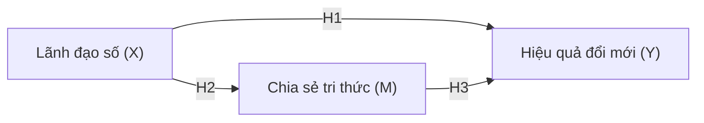

# 📋 Bảng Mô Tả Dữ Liệu (Codebook)

> Tài liệu này mô tả file [`khao-sat-doi-moi-dnnvv.csv`](khao-sat-doi-moi-dnnvv.csv) — dữ liệu khảo sát **giả lập** để luyện phân tích ở Buổi 3.
>
> Đây là dữ liệu mô phỏng phục vụ dạy học, **không phải dữ liệu nghiên cứu thật**.

## 1. Tổng quan

| Thông tin | Giá trị |
|---|---|
| Số quan sát (dòng) | **320** |
| Số biến (cột) | 18 |
| Định dạng | CSV, mã hóa UTF-8 (có BOM), phân tách bằng dấu phẩy |
| Thang đo các item | Likert 5 mức (1 = Hoàn toàn không đồng ý … 5 = Hoàn toàn đồng ý) |
| Chủ đề | Lãnh đạo số → Chia sẻ tri thức → Hiệu quả đổi mới trong DNNVV |

> 📌 **Cố ý gài lỗi để bạn luyện làm sạch dữ liệu:** file chứa **14 ô trống (missing)** và **4 giá trị ngoài thang đo (outlier)**. Xem mục 4.

## 2. Biến nhân khẩu học

| Tên cột | Ý nghĩa | Giá trị |
|---|---|---|
| `ma_phieu` | Mã phiếu (định danh) | R001 … R320 |
| `gioi_tinh` | Giới tính | Nam / Nữ |
| `nhom_tuoi` | Nhóm tuổi | Dưới 30 / 30-39 / 40-49 / 50 trở lên |
| `kinh_nghiem` | Kinh nghiệm làm việc | Dưới 3 năm / 3-5 năm / 6-10 năm / Trên 10 năm |
| `quy_mo_dn` | Quy mô doanh nghiệp | Siêu nhỏ / Nhỏ / Vừa |
| `nganh` | Ngành | Thương mại-Dịch vụ / Sản xuất / Công nghệ thông tin / Xây dựng / Khác |

## 3. Biến đo lường (item Likert 1–5)

| Khái niệm | Vai trò trong mô hình | Các item |
|---|---|---|
| **Lãnh đạo số** (Digital Leadership) | Biến độc lập (X) | `DL1`, `DL2`, `DL3`, `DL4` |
| **Chia sẻ tri thức** (Knowledge Sharing) | Biến trung gian (M) | `KS1`, `KS2`, `KS3`, `KS4` |
| **Hiệu quả đổi mới** (Innovation Performance) | Biến phụ thuộc (Y) | `IP1`, `IP2`, `IP3`, `IP4` |

Mô hình giả thuyết:

## 4. Lỗi đã gài sẵn (để luyện làm sạch)

**14 ô trống (missing)** nằm rải rác ở các item — bạn sẽ tự phát hiện khi kiểm tra dữ liệu.

**4 giá trị ngoài thang đo 1–5 (outlier cần xử lý):**

| Mã phiếu | Cột | Giá trị sai | Hợp lệ phải là |
|---|---|---|---|
| R045 | `DL3` | 0 | 1–5 |
| R110 | `KS1` | 0 | 1–5 |
| R077 | `IP2` | 7 | 1–5 |
| R203 | `IP4` | 9 | 1–5 |

> 💡 Cách xử lý gợi ý: coi giá trị ngoài thang là dữ liệu lỗi → chuyển thành khuyết (missing) rồi loại theo dòng (listwise). Sau khi loại 14 dòng có ô trống + 4 dòng có outlier (tổng **18 dòng**), còn lại **302 quan sát** để phân tích.

Xem [đề bài](de-bai.md) để biết các bước thực hành, và [kết quả mong đợi](ket-qua-mong-doi.md) để tự chấm.
