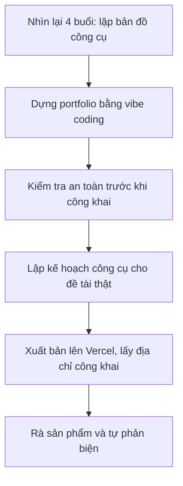
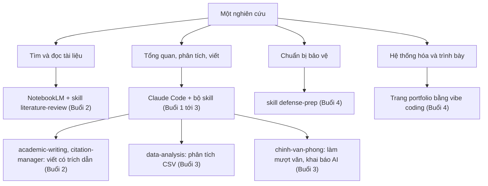

# Buổi 4: Hệ thống hóa cả khóa, dựng trang portfolio nghiên cứu và lập kế hoạch công cụ cho đề tài thật

> Cách dùng file này: mỗi phần có hai khúc. Khúc **Lý thuyết** đọc để hiểu mình sắp làm gì và vì sao, có ví von cho dễ nhớ. Khúc **Thao tác** là các bước có sẵn prompt, cứ copy dán vào Claude.
>
> Làm lần lượt, không nhảy cóc. Bước sau dùng kết quả bước trước.
>
> Trước khi bắt đầu: mở VS Code, mở đúng thư mục dự án luận án đã dựng ở buổi 1 (ví dụ `k3-research`), rồi mở panel Claude Code (biểu tượng tia sáng). Chuẩn bị sẵn bốn sản phẩm ba buổi trước: workspace + `CLAUDE.md` (buổi 1), `research-gap.md` và báo cáo tổng quan tài liệu (buổi 2), `bao-cao-phan-tich-du-lieu.md` (buổi 3).
>
> Buổi này bạn **không tự gõ code**. Bạn mô tả trang web muốn có bằng lời, Claude viết code, bạn xem thử rồi chỉ chỗ chưa ưng, Claude sửa, lặp lại tới khi vừa ý. Kiểu làm này gọi là **vibe coding**.
>
> Năm phần, đi từ hệ thống lại tới làm sản phẩm cuối rồi đưa lên mạng:
> - Phần A: nhìn lại cả khóa, lập bản đồ khi nào dùng công cụ nào
> - Phần B: dựng trang portfolio nghiên cứu bằng vibe coding
> - Phần C: kiểm tra an toàn trước khi công khai trang
> - Phần D: lập kế hoạch dùng công cụ AI cho đề tài thật của bạn
> - Phần E: xuất bản trang portfolio lên mạng bằng Vercel
>
> Cuối bài có một Phần mở rộng tùy chọn: chuyển tài liệu PDF sang Markdown bằng MarkItDown, để đưa tài liệu vào AI cho sạch.

> ⚠️ **Nhắc trước một nguyên tắc an toàn:** trang web tĩnh thì ai xem cũng đọc được mã nguồn. Vì vậy **kiểm tra thông tin nhạy cảm TRƯỚC khi công khai, không phải sau khi đã đăng**. Phần C làm đúng việc này, đừng bỏ qua.

## Nhịp buổi

| Phần | Nội dung | Phút | Dạng | Bước |
|---|---|---|---|---|
| A | Nhìn lại cả khóa, lập bản đồ công cụ | 12' | LT 6' + HV 6' | 1 |
| B | Dựng trang portfolio (vibe coding) | 38' | LT 8' + HV 30' | 2-4 |
| C | Kiểm tra an toàn trước khi công khai | 12' | LT 5' + HV 7' | 5-6 |
| D | Kế hoạch công cụ cho đề tài thật | 12' | LT 4' + HV 8' | 7 |
| E | Xuất bản portfolio lên Vercel | 12' | LT 4' + HV 8' | 8-10 |
| Chốt | Rà sản phẩm và tự phản biện | 4' | HV 4' | 11 |
| Mở rộng | Chuyển PDF sang Markdown (tùy chọn) | - | DEMO / về nhà | 12 |

LT = giảng viên nói. HV = học viên tự làm. DEMO = giảng viên làm, học viên xem. Tổng khoảng 90 phút phần lõi. Phần mở rộng và bài tập về nhà nằm cuối file.

### Toàn cảnh việc hôm nay



### Tư duy cốt lõi của buổi này

- Một nghiên cứu chỉ thực sự trọn vẹn khi được **hệ thống hóa và trình bày ra ngoài**. Trang portfolio biến quá trình học của cả khóa thành một sản phẩm thấy được.
- Bạn **không cần biết lập trình** để tạo ra sản phẩm số. Mô tả rõ ý muốn là đủ: bạn làm chủ ý tưởng, AI lo phần kỹ thuật.
- **An toàn và bảo mật phải kiểm tra trước khi công khai**, không phải sau khi đã đăng. Ai cũng đọc được mã nguồn của một trang web tĩnh.

---

## PHẦN A. Nhìn lại cả khóa: khi nào dùng công cụ nào

### Lý thuyết

Ba buổi qua bạn đã đi gần trọn một vòng nghiên cứu: buổi 1 dựng văn phòng (workspace, `CLAUDE.md`, bộ tám skill), buổi 2 cho AI đọc kho tài liệu rồi viết tổng quan có trích dẫn, buổi 3 làm sạch dữ liệu khảo sát rồi viết báo cáo có khai báo dùng AI. Nhiều công cụ, nhiều skill. Dễ lẫn.

Trước khi làm sản phẩm cuối, hãy dừng lại **treo một tấm bản đồ**: việc nào thì cầm công cụ nào. Bản đồ này chính là thứ bạn mang theo dùng cho đề tài thật sau khóa, quan trọng hơn bất kỳ một prompt lẻ nào.

Nguyên tắc chọn công cụ: **chọn theo việc cần làm, đừng cố nhồi mọi việc vào một công cụ.** Bảng dưới là bản đồ tổng thể của cả khóa.

| Việc cần làm | Công cụ hoặc skill nên dùng | Gắn với |
|---|---|---|
| Dựng workspace, cài skill, làm việc bằng tiếng Việt | VS Code + Claude Code | Buổi 1 |
| Hỏi đáp sâu trên kho tài liệu của mình, tạo tóm tắt | NotebookLM hoặc notebooklm-py | Buổi 2 |
| Tìm khoảng trống nghiên cứu, sàng lọc tài liệu | skill `literature-review` | Buổi 2 |
| Tổng hợp và viết tổng quan có trích dẫn APA 7 | skill `academic-writing` + `citation-manager` | Buổi 2 |
| Xuất báo cáo ra Word đúng format | skill riêng xuất docx của bạn | Buổi 2 |
| Làm sạch CSV, chạy kiểm định, viết báo cáo dữ liệu | skill `data-analysis` | Buổi 3 |
| Làm mượt văn của mình (kèm khai báo AI) | skill `academic-writing`, quy trình `chinh-van-phong` | Buổi 3 |
| Dựng khung lý thuyết, biến số, giả thuyết | skill `research-framework` | Bộ skill, cho đề tài thật |
| Thiết kế phương pháp, bảng hỏi, chọn mẫu | skill `methodology-design` | Bộ skill, cho đề tài thật |
| Tự phản biện, kiểm chất lượng trước khi nộp | skill `critical-review` | Buổi 3, buổi 4 |
| Chuẩn bị bảo vệ: slide, câu hỏi hội đồng | skill `defense-prep` | Buổi 4 |
| Hệ thống hóa và trình bày bản thân học thuật | Trang portfolio (vibe coding) | Buổi 4 |

### Thao tác

**Bước 1. Nhờ Claude dựng bản đồ công cụ theo giai đoạn của bạn**

Để làm gì: có một bản đồ gọn, đúng thứ tự các giai đoạn nghiên cứu, để bạn cầm theo sau khóa.

Gõ vào Claude:
```
Dựa trên bốn buổi tôi vừa học (thiết lập dự án với Claude Code; tổng quan tài liệu và NotebookLM; phân tích dữ liệu và báo cáo; hệ thống hóa và portfolio) và bộ tám skill nghiên cứu đang cài, hãy lập một bảng bản đồ công cụ theo giai đoạn nghiên cứu. Mỗi dòng một giai đoạn (tìm và đọc tài liệu, tổng quan, khung lý thuyết, phương pháp, phân tích dữ liệu, viết, bảo vệ), các cột gồm: công cụ dùng, skill dùng, sản phẩm mong đợi. Trình bày bằng bảng, tiếng Việt.
```

Bạn sẽ thấy: một bảng bảy tới tám dòng theo giai đoạn, mỗi giai đoạn ghi rõ công cụ, skill và sản phẩm. Đọc lại, sửa cho khớp đề tài của bạn, rồi lưu lại để dùng ở Phần D.



---

## PHẦN B. Dựng trang portfolio nghiên cứu bằng vibe coding

### Lý thuyết

Tới đây bạn có sẵn nhiều sản phẩm nằm rải trong các thư mục: research gap, báo cáo tổng quan, báo cáo phân tích dữ liệu. Người khác muốn biết bạn nghiên cứu gì thì phải mở từng file. **Portfolio là gom tất cả vào một trang, để ai cũng liếc một lượt là hiểu bạn là ai, làm gì.**

Cách làm là **vibe coding**: bạn mô tả trang muốn có bằng lời, Claude viết code, bạn mở xem thử, chỉ chỗ chưa ưng, Claude sửa, lặp lại. Ví von: bạn là chủ nhà nói rõ muốn phòng khách thế nào, Claude là thợ thi công. Bạn **không cầm bay tự xây**, bạn mô tả và duyệt.

Trang portfolio là một **file HTML duy nhất** mở thẳng bằng trình duyệt, không cần cài gì. Cấu trúc gợi ý có sẵn trong `du-lieu-mau/tai-lieu-mau/BRIEF_CAPSTONE_PORTFOLIO.md`, gồm sáu mục: giới thiệu, đề tài, tổng quan, phương pháp, kết quả, liên hệ.

> [!IMPORTANT]
> **Vibe coding** nghĩa là: bạn nói muốn gì, Claude viết code, bạn xem trước, chỉ chỗ chưa ưng, Claude sửa, lặp lại. **Bạn không tự gõ code.** Nếu thấy mình đang cố tự viết code và bị kẹt, hãy quay lại mô tả bằng lời.

### Thao tác

**Bước 2. Tạo trang portfolio bằng lời**

Để làm gì: có ngay một trang web nháp đủ các mục, để chỉnh dần cho ra sản phẩm.

Mở sẵn `du-lieu-mau/tai-lieu-mau/BRIEF_CAPSTONE_PORTFOLIO.md` để đối chiếu cấu trúc, rồi gõ vào Claude:
```
Hãy tạo cho tôi một trang web portfolio nghiên cứu cá nhân bằng HTML và CSS đơn giản, một file duy nhất, dễ mở bằng trình duyệt. Gồm các mục:

1) Giới thiệu: họ tên và chức danh học thuật.
2) Đề tài nghiên cứu (dán nội dung từ research-gap buổi 2).
3) Tổng quan / hướng nghiên cứu (tóm tắt báo cáo tổng quan buổi 2).
4) Phương pháp (tóm tắt ngắn).
5) Kết quả (tóm tắt báo cáo phân tích dữ liệu buổi 3).
6) Liên hệ (email).

Giao diện sạch, chữ dễ đọc, có mục lục đầu trang. Tiếng Việt.
Để chỗ trống mẫu cho mục nào chưa có nội dung. Giải thích cho tôi cách mở file.
```

Bạn sẽ thấy: Claude tạo một file (thường là `index.html`) và hướng dẫn cách mở. Trang có đủ sáu mục với nội dung mẫu để bạn thay sau.

---

**Bước 3. Xem trước trong trình duyệt**

Để làm gì: thấy trang thật trông ra sao, để biết chỗ nào cần chỉnh.

Mở file Claude vừa tạo bằng trình duyệt: bấm đúp vào file, hoặc chuột phải rồi chọn **Open with** và chọn trình duyệt. Nếu chưa rõ, hỏi Claude:
```
Hãy chỉ tôi cách mở file index.html này trong trình duyệt, từng bước cho người mới.
```

Bạn sẽ thấy: trang portfolio hiện ra trong trình duyệt. Nếu trang trắng hoặc lỗi, **mô tả đúng cái bạn thấy** ("trang trắng", "chữ chồng lên nhau") để Claude sửa.

---

**Bước 4. Chỉnh sửa lặp cho tới khi ưng**

Để làm gì: đưa trang từ bản nháp thành bản bạn thật sự hài lòng.

Mô tả điều muốn đổi bằng lời, gom vài thay đổi vào một lần:
```
Phần giới thiệu đề tài hơi dài, hãy rút còn 3 câu.
Đổi màu tiêu đề sang xanh đậm.
Thêm phần "Liên hệ" với email ở cuối trang.
```

Xem lại rồi đổi tiếp. Làm **ít nhất 2 vòng**.

> 💡 **Mẹo gỡ kẹt:** nếu chỉnh mãi không ưng, mất phương hướng, hãy quay lại brief, liệt kê đúng **3 thay đổi quan trọng nhất**, rồi yêu cầu Claude làm một lần.

---

## PHẦN C. Kiểm tra an toàn trước khi công khai

### Lý thuyết

Đây là bước **bắt buộc** trước khi chia sẻ trang cho bất kỳ ai. Một trang web tĩnh thì bất kỳ ai mở cũng đọc được toàn bộ mã nguồn, nên **không được để lộ thông tin bí mật** trong file.

Ba nhóm thông tin tuyệt đối không để lộ:

- **Khóa bí mật**: API key, token, mật khẩu. Lộ ra là người khác dùng được tài khoản của bạn.
- **Thông tin cá nhân nhạy cảm**: số điện thoại, địa chỉ nhà, số CMND/CCCD, những thứ bạn không muốn công khai.
- **Dữ liệu người tham gia nghiên cứu**: thông tin định danh người trả lời khảo sát, dữ liệu thô chưa ẩn danh. Để lộ là vi phạm đạo đức nghiên cứu.

Nguyên tắc cốt lõi: **kiểm tra TRƯỚC khi công khai, không phải sau.** Đăng rồi mới phát hiện lộ là đã muộn, vì có thể đã có người xem hoặc lưu lại.

### Thao tác

**Bước 5. Nhờ Claude rà soát thông tin nhạy cảm**

Để làm gì: dùng AI soi nhanh cả file để bắt những chỗ lộ mà mắt dễ bỏ sót.

Gõ vào Claude:
```
Hãy rà soát toàn bộ file trang portfolio của tôi và cho biết có chỗ nào lộ thông tin nhạy cảm (API key, mật khẩu, token, dữ liệu cá nhân nên giấu, dữ liệu người tham gia nghiên cứu) không. Liệt kê cụ thể từng chỗ.
```

Bạn sẽ thấy: Claude liệt kê từng chỗ đáng ngờ, hoặc xác nhận không thấy thông tin nhạy cảm.

> [!WARNING]
> Nếu lỡ dán thông tin nhạy cảm vào file, yêu cầu Claude gỡ bỏ và chạy lại bước rà soát **NGAY**. Nếu đã công khai mà chưa kiểm tra, hãy gỡ công khai, sửa, kiểm tra lại, rồi mới đăng lại. Kiểm tra TRƯỚC khi công khai, không phải sau.

---

**Bước 6. Tự kiểm bằng mắt theo checklist**

Để làm gì: một lượt tự soát cuối, không phó thác hoàn toàn cho AI.

Đối chiếu file của bạn với checklist an toàn (cũng có trong `du-lieu-mau/tai-lieu-mau/BRIEF_CAPSTONE_PORTFOLIO.md`, mục 4):

- [ ] **Không** có khóa API, mật khẩu, token trong file.
- [ ] **Không** có thông tin cá nhân bạn không muốn công khai (số điện thoại, địa chỉ nhà, CMND/CCCD).
- [ ] **Không** có dữ liệu người tham gia nghiên cứu (thông tin định danh, dữ liệu thô chưa ẩn danh).
- [ ] Email và liên kết trên trang là thứ bạn **chấp nhận ai cũng thấy**.

Đủ bốn dấu tích mới sang phần sau. Thiếu dấu nào thì sửa file rồi rà lại từ Bước 5.

---

## PHẦN D. Kế hoạch dùng công cụ AI cho đề tài thật

### Lý thuyết

Cả khóa dùng một bộ dữ liệu và tài liệu mẫu để tập. Nhưng đề tài thật của bạn mới là thứ đáng giá. **Sản phẩm mang theo lớn nhất sau khóa không phải trang portfolio, mà là một kế hoạch: đề tài của tôi đi qua từng giai đoạn thì dùng công cụ nào, skill nào, ra sản phẩm gì.**

Kế hoạch này biến bản đồ chung ở Phần A thành lộ trình riêng cho đề tài của bạn. Nó cũng cho bạn thấy mình đang đứng ở giai đoạn nào và bước tiếp theo làm gì.

### Thao tác

**Bước 7. Lập bảng kế hoạch tích hợp công cụ**

Để làm gì: có một lộ trình theo giai đoạn, gắn công cụ và skill cụ thể vào đề tài thật của bạn.

Trong Claude Code:
```
Đề tài thật của tôi là [đề tài]. Dựa trên bốn buổi đã học và bộ tám skill đang cài, hãy giúp tôi lập kế hoạch tích hợp công cụ: mỗi dòng một giai đoạn (tìm tài liệu, tổng quan, khung lý thuyết, phương pháp, thu thập dữ liệu, phân tích, viết, bảo vệ), các cột gồm: công cụ dùng, skill dùng, sản phẩm mong đợi. Trình bày bằng bảng, tiếng Việt.
```

Bạn sẽ thấy: một bảng kế hoạch theo giai đoạn nghiên cứu, mỗi giai đoạn ghi rõ công cụ, skill và sản phẩm. Đọc lại và sửa cho khớp đề tài của bạn. Ví dụ đề tài định tính thì phần phân tích khác đề tài định lượng.

---

Bảng kế hoạch này là sản phẩm bạn mang theo. Còn trang portfolio thì nên đưa lên mạng để chia sẻ, đó là việc của Phần E.

---

## PHẦN E. Xuất bản trang portfolio lên mạng bằng Vercel

### Lý thuyết

Trang portfolio đang nằm trên máy bạn, chỉ mình bạn mở được. Muốn gửi link cho người khác xem, phải **đưa nó lên mạng, tức xuất bản (deploy)**. Vercel là một dịch vụ host trang web miễn phí, rất hợp với trang tĩnh một file như portfolio: bạn đẩy file lên, Vercel trả về một địa chỉ công khai dạng `ten-trang.vercel.app`.

Điểm hay cho khóa này: Vercel có **công cụ dòng lệnh (CLI), tức bạn gõ lệnh là nó tự deploy**, nên **Claude Code chạy lệnh giúp bạn được**, khỏi phải bấm chuột qua giao diện web.

Ba việc, làm một lần rồi những lần sau chỉ còn một lệnh:

- Cài Vercel CLI (một lần cho máy).
- Đăng nhập Vercel (một lần, mở trình duyệt xác nhận).
- Deploy: nhờ Claude Code chạy lệnh, Vercel trả về địa chỉ công khai.

> [!WARNING]
> Vẫn nguyên tắc cũ: **chạy kiểm tra an toàn (Phần C) TRƯỚC khi deploy.** Đưa lên Vercel là ai có link cũng xem được.

> [!IMPORTANT]
> Bước **đăng nhập** (`vercel login`) mở trình duyệt để bạn tự xác nhận. Đây là việc của bạn, không phải của Claude. Sau khi đăng nhập một lần, Claude Code mới chạy lệnh deploy giúp được.

### Thao tác

**Bước 8. Cài Vercel CLI và đăng nhập (làm một lần)**

Để làm gì: trang bị công cụ deploy cho máy và nối với tài khoản Vercel.

Chưa có tài khoản Vercel thì đăng ký miễn phí trước tại vercel.com (đăng nhập bằng GitHub hoặc email cho nhanh). Rồi mở terminal trong VS Code (menu Terminal, hoặc phím tắt) và chạy hai lệnh.

Cài Vercel CLI (máy cần có sẵn Node.js):
```
npm i -g vercel
```

Đăng nhập (lệnh này mở trình duyệt để bạn xác nhận, tự bạn làm):
```
vercel login
```

Bạn sẽ thấy: sau khi xác nhận trên trình duyệt, terminal báo đăng nhập thành công. Từ giờ máy đã nhớ tài khoản.

> 💡 **Chưa có Node.js?** Nhờ Claude Code: "Máy tôi đã có Node.js và npm chưa? Nếu chưa, hướng dẫn tôi cài cho Windows." Cài xong mới chạy được `npm i -g vercel`.

---

**Bước 9. Nhờ Claude Code deploy lên Vercel**

Để làm gì: đẩy trang portfolio lên mạng và nhận địa chỉ công khai.

Chắc chắn đã qua kiểm tra an toàn (Phần C). Mở đúng thư mục chứa `index.html`, rồi gõ vào Claude Code:
```
Hãy deploy trang portfolio trong thư mục này lên Vercel. Chạy lệnh: vercel --yes (đây là lần deploy đầu nên tự động là bản production; --yes để bỏ qua các câu hỏi thiết lập, lấy mặc định theo tên thư mục). Xong thì cho tôi biết địa chỉ .vercel.app của trang.
```

Claude Code sẽ chạy lệnh:
```
vercel --yes
```

Bạn sẽ thấy: Vercel dựng dự án và in ra một địa chỉ dạng `https://ten-thu-muc.vercel.app`. Mở địa chỉ đó trên trình duyệt để kiểm tra trang đã lên đúng chưa.

> ℹ️ **Vì sao lần đầu không cần `--prod`:** Vercel quy ước lần deploy đầu của một dự án mới **luôn là bản production**. Những lần sau, deploy thường (không kèm cờ) chỉ tạo bản xem thử (preview); muốn cập nhật bản chính thức thì thêm `--prod` (xem Bước 10).

---

**Bước 10. Cập nhật trang sau khi sửa**

Để làm gì: mỗi lần sửa portfolio xong, đẩy bản mới lên đúng địa chỉ cũ.

Sau khi chỉnh `index.html`, chạy lại kiểm tra an toàn rồi nhờ Claude Code:
```
Tôi vừa cập nhật index.html. Hãy deploy bản production mới lên Vercel bằng lệnh: vercel --prod. Xong cho tôi địa chỉ.
```

Claude Code chạy lệnh:
```
vercel --prod
```

Bạn sẽ thấy: một bản production mới, địa chỉ `.vercel.app` giữ nguyên như cũ.

> 💡 **Tự động hoàn toàn (nâng cao, tùy chọn):** muốn Claude Code deploy mà không phải đăng nhập tay trên từng máy, hãy tạo một **Access Token** trong phần cài đặt tài khoản Vercel, rồi dùng lệnh kèm token: `vercel --prod --yes --token <TOKEN_CỦA_BẠN>`. Coi token như mật khẩu: **không** dán vào file trang, **không** public, **không** đưa vào ảnh chụp màn hình.

> 🔁 **Cách khác không cần CLI (GitHub Pages):** đã quen GitHub thì có thể đưa `index.html` lên một repo rồi bật GitHub Pages trong Settings để lấy địa chỉ công khai. Nhờ Claude hướng dẫn từng bước nếu cần. Với người mới, Vercel gọn hơn vì deploy chỉ bằng một lệnh.

---

## Chốt buổi

**Bước 11. Rà sản phẩm và tự phản biện**

Để làm gì: gom sản phẩm cả khóa, và tập nhìn ra điểm yếu trước khi hội đồng nhìn ra.

Gõ vào Claude:
```
Dùng skill critical-review. Với đề tài và các sản phẩm tôi đã làm trong khóa (research gap, báo cáo tổng quan, báo cáo phân tích dữ liệu, trang portfolio), hãy chỉ ra 3 điểm yếu lớn nhất về mặt học thuật và đề xuất cách khắc phục cho từng điểm. Rồi liệt kê các file sản phẩm tôi đã tạo trong cả khóa.
```

Bạn sẽ thấy: một bảng ba điểm yếu kèm cách khắc phục, và danh sách sản phẩm cả khóa (workspace + `CLAUDE.md`, `research-gap.md`, báo cáo tổng quan, `bao-cao-phan-tich-du-lieu.md`, trang portfolio, địa chỉ Vercel).

---

## Phần mở rộng (tùy chọn): Chuyển tài liệu PDF sang Markdown bằng MarkItDown

### Lý thuyết

Suốt khóa, Claude và NotebookLM đọc tài liệu của bạn tốt nhất khi tài liệu ở dạng **văn bản thuần (Markdown)**. Nhưng phần lớn tài liệu bạn có là **PDF**: bài báo, luận án, sách. PDF nặng, hay có cột, có bảng, để máy đọc thẳng dễ lộn xộn.

**MarkItDown là công cụ của Microsoft, chuyển PDF (và cả Word, PowerPoint, Excel, ảnh, HTML...) sang Markdown gọn gàng**, giữ được tiêu đề, danh sách, bảng, link. Markdown vừa nhẹ vừa hợp cho AI đọc, nên chuyển xong rồi đưa vào Claude hoặc NotebookLM sẽ tóm tắt và trích dẫn chính xác hơn.

Việc này bổ trợ cho buổi 2 (tổng quan tài liệu): thay vì đưa cả xấp PDF, bạn chuyển sang Markdown trước cho sạch.

### Thao tác

**Bước 12. Cài MarkItDown và chuyển một file PDF**

Để làm gì: có một công cụ chuyển PDF sang Markdown ngay trong máy.

MarkItDown cần **Python 3.10 trở lên**. Nhờ Claude Code lo giúp việc cài và chạy:
```
Hãy giúp tôi cài công cụ MarkItDown của Microsoft (pip install 'markitdown[all]') và chuyển file [ten-file].pdf trong thư mục này sang Markdown, lưu thành [ten-file].md. Nếu máy chưa có Python hoặc pip, hãy hướng dẫn tôi cài trước.
```

Hai lệnh cốt lõi (Claude Code sẽ chạy giúp):
```
pip install 'markitdown[all]'
markitdown duong-dan-file.pdf -o ket-qua.md
```

Bạn sẽ thấy: một file `.md` mới, nội dung PDF đã thành Markdown có tiêu đề, đoạn, bảng. Mở ra kiểm lại vài chỗ (bảng phức tạp đôi khi lệch), sửa tay nếu cần.

> ℹ️ **Mẹo:** `[all]` cài đủ khả năng đọc mọi định dạng (PDF, Word, PowerPoint, Excel, ảnh...). Chỉ cần PDF thì cài gọn hơn: `pip install 'markitdown[pdf]'`.

> 💡 **Dùng tiếp:** có bản Markdown rồi thì đưa vào notebook (buổi 2) hoặc mở thẳng trong VS Code cho Claude đọc để tóm tắt, tìm research gap, trích dẫn. Vẫn nhớ **kiểm chứng lại nguồn**: công cụ chuyển đổi không thay việc đọc của bạn.

---

## Bài tập về nhà

**Tổng thời lượng ước tính: 90 tới 145 phút.**

### Bài 1. Hoàn thiện trang portfolio (khoảng 50 phút)

Lấy trang dựng ở lớp, đưa **thật** các sản phẩm cả khóa vào:
```
Hãy hoàn thiện trang portfolio index.html của tôi:

1) Phần đề tài: dùng research-gap buổi 2, rút gọn còn 4 tới 5 câu.
2) Thêm mục "Sản phẩm nghiên cứu": liệt kê báo cáo tổng quan tài liệu (buổi 2) và báo cáo phân tích dữ liệu (buổi 3), mỗi cái 1 tới 2 câu mô tả.
3) Giới thiệu, liên hệ và CV học thuật: điền theo thông tin tôi cung cấp dưới đây.

[dán thông tin của tôi]

Giao diện sạch, có mục lục đầu trang. Tiếng Việt.
```

Mở trong trình duyệt, chỉnh lặp ít nhất 2 vòng, chạy lại kiểm tra an toàn (Phần C), rồi deploy lên Vercel (Phần E, Bước 8 tới 10).

📦 Nộp: file trang portfolio đủ các mục, đã qua checklist an toàn, kèm địa chỉ `.vercel.app` công khai.

### Bài 2. Kế hoạch tích hợp công cụ cho đề tài thật (khoảng 40 phút)

Dùng prompt ở Bước 7 để lập bảng kế hoạch, rồi sửa cho khớp thực tế đề tài của bạn.

📦 Nộp: bảng kế hoạch theo giai đoạn, có công cụ, skill và sản phẩm mong đợi cho từng giai đoạn.

### Bài 3. Chuẩn bị bảo vệ (tùy chọn, làm nếu còn thời gian, khoảng 40 phút)

Tập dùng skill `defense-prep`:
```
Hãy dùng skill defense-prep. Tôi bảo vệ đề cương trong 20 phút về đề tài [đề tài của tôi]. Hãy đề xuất cấu trúc 15 slide và 15 câu hỏi hội đồng có thể hỏi, kèm gợi ý trả lời cho 5 câu khó nhất.
```

📦 Nộp: cấu trúc slide và bộ 15 câu hỏi, có gợi ý trả lời cho 5 câu khó.

### Bài 4. Chuyển một tài liệu PDF sang Markdown (tùy chọn, khoảng 15 phút)

Lấy một bài báo hoặc tài liệu PDF thật của bạn, dùng MarkItDown (Bước 12) chuyển sang `.md`, mở ra kiểm lại vài chỗ.

📦 Nộp: file `.md` chuyển ra từ PDF, kèm một câu nhận xét chỗ nào chuyển tốt, chỗ nào lệch.

---

## Xong buổi 4, kiểm lại bạn đã có

Tự tay làm được:
- [ ] Một bản đồ công cụ theo giai đoạn, biết việc nào dùng công cụ hoặc skill nào
- [ ] Trang portfolio nghiên cứu mở được trong trình duyệt: giới thiệu, đề tài, tổng quan, phương pháp, kết quả, liên hệ
- [ ] Trang đã qua kiểm tra an toàn (không lộ khóa bí mật, thông tin cá nhân, dữ liệu người tham gia)
- [ ] Trang đã deploy lên Vercel, có một địa chỉ `.vercel.app` công khai chia sẻ được
- [ ] Một bảng kế hoạch dùng công cụ AI cho đề tài thật theo từng giai đoạn

Hiểu để dùng sau:
- [ ] "Vibe coding" là gì, và vì sao người không biết lập trình vẫn tạo được trang web
- [ ] Vì sao trang web tĩnh phải kiểm tra thông tin nhạy cảm trước khi công khai, không phải sau
- [ ] Cách deploy một trang tĩnh lên mạng bằng một lệnh Vercel, và vì sao token phải giữ bí mật
- [ ] Chọn công cụ theo việc cần làm, không nhồi mọi việc vào một công cụ
- [ ] Chuyển PDF sang Markdown bằng MarkItDown để đưa tài liệu vào AI cho sạch

Thiếu mục nào thì làm lại đúng bước đó.

## Sau khóa học

Sau bốn buổi, bạn đã đi trọn một quy trình cho nghiên cứu: dựng workspace luận án (buổi 1), tổng quan tài liệu và viết có trích dẫn (buổi 2), phân tích dữ liệu và báo cáo có khai báo AI (buổi 3), hệ thống hóa và một trang portfolio (buổi 4).

Hai việc nên làm tiếp:

1. Áp bảng kế hoạch ở Bài 2 vào chính đề tài của bạn, bắt đầu từ giai đoạn bạn đang ở.
2. Cập nhật portfolio mỗi khi có công bố mới.

Khi cần ôn lại, mở lại các tài liệu của khóa trong `bai-hoc-4-buoi/`, các file mẫu trong `du-lieu-mau/`, và bộ skill trong `.claude/skills/`.
