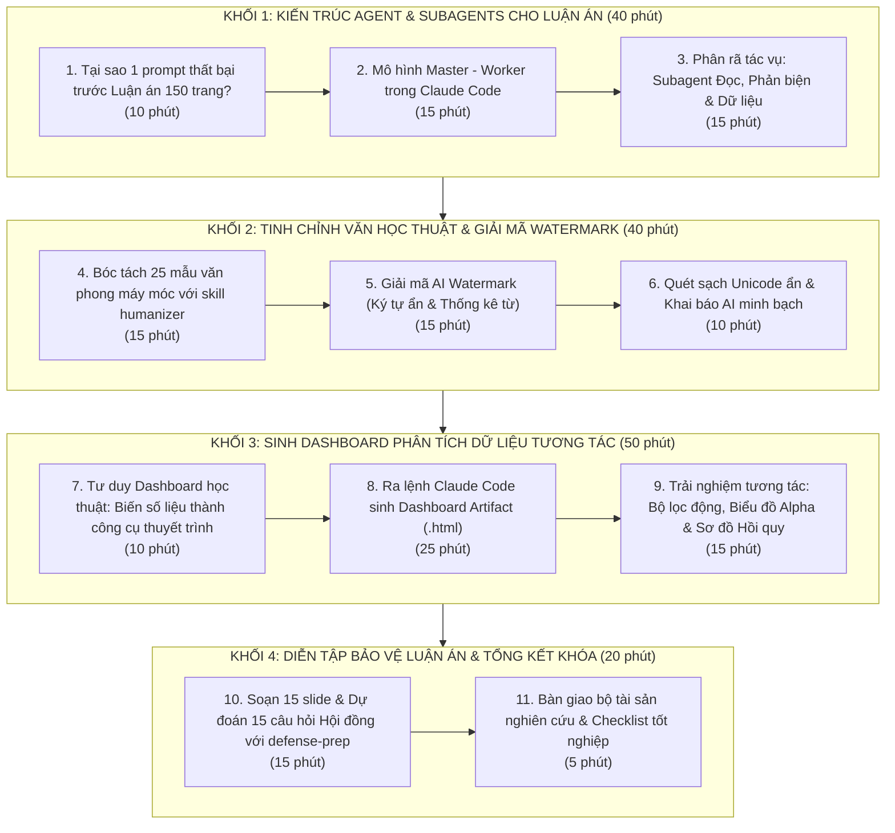
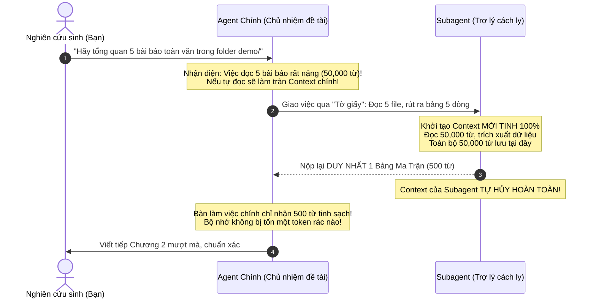

# Buổi 4: Kiến Trúc Đa Tác Nhân (Agent & Subagents), Khử Dấu Vết AI (Humanizer & Watermark Remover) & Trực Quan Hóa Dữ Liệu Luận Án (Dashboard Artifact)

> **Cách dùng tài liệu này:** 
> - Mỗi phần gồm hai khúc rõ rệt: **Lý thuyết** giúp bạn nắm vững bản chất công nghệ và tư duy phương pháp luận nghiên cứu (kèm ví von trực quan); **Thao tác** cung cấp các bước hành động cụ thể với prompt chuẩn mực (có cả bản Giảng viên chạy ngay và bản Học viên tự điền theo đề tài thật).
> - **Làm tuần tự, không nhảy cóc:** Mỗi bước kế thừa trực tiếp kết quả của các bước trước và dữ liệu từ Buổi 1, 2, 3.
> - **Chuẩn bị trước khi bắt đầu:** Mở VS Code, mở đúng thư mục dự án nghiên cứu của bạn (ví dụ `k3-research`), mở panel Claude Code (hoặc Terminal chạy `claude`).
> - Bộ công cụ và dữ liệu mẫu nằm tại: `04-buoi-04-he-thong-hoa-va-portfolio/demo/`.

---

## ⏱️ Nhịp Buổi Học (150 Phút)



| Khối | Nội dung trọng tâm | Thời lượng | Hình thức | Sản phẩm đầu ra |
|---|---|:---:|:---:|---|
| **Khối 1** | **Kiến trúc Agent & Subagents cho Luận án**<br>• Tránh bẫy tràn ngữ cảnh (Context Overflow)<br>• Mô hình Master - Worker điều phối nghiên cứu<br>• Phân bổ 4 Subagent: Tổng quan, Dữ liệu, Phản biện, Biên tập | **40 phút** | GV 15'<br>HV 25' | • Kịch bản phân rã đề tài luận án<br>• Nhật ký điều phối Subagent chạy song song |
| **Khối 2** | **Tinh chỉnh văn phong tự nhiên & Giải mã Watermark**<br>• Khử 25 mẫu câu sáo rỗng AI bằng skill `humanizer`<br>• Bóc tách Layer A (Unicode ẩn) & Layer B (Phân phối thống kê)<br>• Quét sạch rác ký tự ẩn tránh lỗi in ấn/LaTeX/cổng trường | **40 phút** | GV 15'<br>HV 25' | • Đoạn Thảo luận (Discussion) tự nhiên<br>• File bản thảo tinh sạch 100% ký tự ẩn |
| **Khối 3** | **Sinh Dashboard Phân Tích Dữ Liệu Tương Tác**<br>• Tư duy biến bảng số khô thành Bảng điều khiển trực quan<br>• Claude Code tự động code file HTML Artifact độc lập<br>• Thẻ KPI, Biểu đồ Cronbach Alpha, Sơ đồ Path Model, Bộ lọc động | **50 phút** | GV 15'<br>HV 35' | • File `04_dashboard-nghien-cuu.html`<br>• Đồ thị chất lượng cao chèn vào luận án<br>• Công cụ thuyết trình trước Hội đồng |
| **Khối 4** | **Diễn tập bảo vệ & Tổng kết toàn khóa**<br>• Soạn khung 15 slide bảo vệ đề cương/luận án tiến sĩ<br>• Dự đoán 15 câu hỏi hóc búa của Hội đồng & gợi ý đối đáp<br>• Đóng gói toàn bộ tài sản nghiên cứu 4 buổi | **20 phút** | GV 10'<br>HV 10' | • Khung 15 slide bảo vệ luận án<br>• Bộ câu hỏi phản biện & câu trả lời |

---

# MỤC LỤC CHI TIẾT

- [KHỐI 1: KIẾN TRÚC AGENT & SUBAGENTS CHO LUẬN ÁN TIẾN SĨ](#khối-1-kiến-trúc-agent--subagents-cho-luận-án-tiến-sĩ)
  - [PHẦN 1: BẢN CHẤT: VÌ SAO MỘT PROMPT THẤT BẠI TRƯỚC LUẬN ÁN 150 TRANG?](#phần-1-bản-chất-vì-sao-một-prompt-thất-bại-trước-luận-án-150-trang)
  - [PHẦN 2: THIẾT KẾ MÔ HÌNH HỘI ĐỒNG THU NHỎ (MASTER - WORKER)](#phần-2-thiết-kế-mô-hình-hội-đồng-thu-nhỏ-master---worker)
  - [PHẦN 3: THAO TÁC P1: ĐIỀU PHỐI SUBAGENTS TRONG CLAUDE CODE](#phần-3-thao-tác-p1-điều-phối-subagents-trong-claude-code)
- [KHỐI 2: TINH CHỈNH VĂN HỌC THUẬT TỰ NHIÊN & GIẢI MÃ AI WATERMARK](#khối-2-tinh-chỉnh-văn-học-thuật-tự-nhiên--giải-mã-ai-watermark)
  - [PHẦN 4: KHỬ VĂN PHONG MÁY MÓC VỚI SKILL HUMANIZER](#phần-4-khử-văn-phong-máy-móc-với-skill-humanizer)
  - [PHẦN 5: GIẢI MÃ CÔNG NGHỆ WATERMARK ẨN & NGUY CƠ KỸ THUẬT](#phần-5-giải-mã-công-nghệ-watermark-ẩn--nguy-cơ-kỹ-thuật)
  - [PHẦN 6: THAO TÁC P2 & P3: LÀM SẠCH KÝ TỰ VÔ HÌNH & BẢO TOÀN LIÊM CHÍNH](#phần-6-thao-tác-p2--p3-làm-sạch-ký-tự-vô-hình--bảo-toàn-liêm-chính)
- [KHỐI 3: TRỰC QUAN HÓA DỮ LIỆU BẰNG INTERACTIVE DASHBOARD ARTIFACT](#khối-3-trực-quan-hóa-dữ-liệu-bằng-interactive-dashboard-artifact)
  - [PHẦN 7: TƯ DUY DASHBOARD HỌC THUẬT CHO NHÀ NGHIÊN CỨU](#phần-7-tư-duy-dashboard-học-thuật-cho-nhà-nghiên-cứu)
  - [PHẦN 8: THAO TÁC P4: RA LỆNH CLAUDE CODE SINH DASHBOARD ARTIFACT](#phần-8-thao-tác-p4-ra-lệnh-claude-code-sinh-dashboard-artifact)
  - [PHẦN 9: THAO TÁC P5: TƯƠNG TÁC BỘ LỌC ĐỘNG & XUẤT BÁO CÁO](#phần-9-thao-tác-p5-tương-tác-bộ-lọc-động--xuất-báo-cáo)
- [KHỐI 4: DIỄN TẬP BẢO VỆ LUẬN ÁN & BÀN GIAO TÀI SẢN KHOA HỌC](#khối-4-diễn-tập-bảo-vệ-luận-án--bàn-giao-tài-sản-khoa-học)
  - [PHẦN 10: THAO TÁC P6 & P7: SOẠN SLIDE & TẬP PHẢN BIỆN VỚI DEFENSE-PREP](#phần-10-thao-tác-p6--p7-soạn-slide--tập-phản-biện-với-defense-prep)
  - [PHẦN 11: CHECKLIST NGHIỆM THU NĂNG LỰC TOÀN KHÓA](#phần-11-checklist-nghiệm-thu-năng-lực-toàn-khóa)

---

# KHỐI 1: GIẢI MÃ BẢN CHẤT AGENT, SUBAGENTS & RANH GIỚI CONTEXT WINDOW THEO CHUẨN ANTHROPIC

---

## PHẦN 1: BẢN CHẤT KỸ THUẬT: WORKFLOW VS AGENT VS SUBAGENT

Để làm chủ công nghệ và không bị mơ hồ bởi các thuật ngữ tiếp thị, một Nghiên cứu sinh cần phân biệt rạch ròi 3 cấp độ vận hành của AI theo tài liệu chuẩn mực của Anthropic (*Building Effective Agents*):

```mermaid
flowchart TD
    subgraph W ["1. WORKFLOW (Quy trình cố định)"]
        W1["Đầu vào"] --> W2["Bước A (Code cứng)"]
        W2 --> W3["Bước B (Prompt chuỗi)"]
        W3 --> W4["Đầu ra cố định"]
    end

    subgraph A ["2. AGENT (Tác nhân tự trị có vòng lặp)"]
        A1["Mục tiêu nghiên cứu"] --> A2["Suy nghĩ (Reasoning)"]
        A2 --> A3["Chọn công cụ (Tool Use: Read/Run)"]
        A3 --> A4["Quan sát phản hồi (Observation)"]
        A4 -->|Chưa đạt| A2
        A4 -->|Đã xong| A5["Hoàn thành"]
    end

    subgraph S ["3. SUBAGENT (Tác nhân con cách ly)"]
        S1["Agent Chính (Chủ nhiệm)"] ==>|"Tờ giấy giao việc"| S2["Subagent (Context độc lập)"]
        S2 --> S3["Cày cuốc dữ liệu thô (Logs tự hủy)"]
        S3 ==>|"Chỉ nộp 1 bản kết luận sạch"| S1
    end
```



### 1.1. Ba định nghĩa chuẩn mực:
1. **Workflow (Quy trình cố định):** Hệ thống trong đó các bước xử lý của LLM được lập trình cứng theo luồng định sẵn (chuỗi lệnh If/Else, Prompt Chaining tuần tự). Nó hoạt động như một dây chuyền đóng gói: đầu vào thế nào thì đi qua đúng các trạm đó, không có khả năng tự xoay chuyển khi gặp tình huống bất ngờ.
2. **Agent (Tác nhân chủ động):** Hệ thống mà **LLM tự điều khiển vòng lặp hành động (Autonomous Loop)**. Bạn chỉ giao **Mục tiêu cuối cùng** (ví dụ: *"Hãy tìm hiểu xem dữ liệu này có vi phạm giả định hồi quy không"*). Agent sẽ tự suy nghĩ $\rightarrow$ tự quyết định gọi công cụ nào (đọc file, chạy code Python) $\rightarrow$ quan sát kết quả trả về $\rightarrow$ nếu phát hiện lỗi tự sửa lại $\rightarrow$ lặp lại cho đến khi giải quyết xong mục tiêu.
3. **Subagent (Tác nhân con / Trợ lý chuyên trách):** Là một **phiên bản Claude độc lập** do Agent chính sinh ra để xử lý một tác vụ con có phạm vi xác định. Nó chạy trong **Context Window hoàn toàn riêng biệt**, có System Prompt riêng, quyền dùng công cụ riêng, và làm xong thì nộp kết quả rồi **tự giải phóng bộ nhớ**.

---

## PHẦN 2: BẢN CHẤT SÂU XA CỦA CONTEXT WINDOW & RANH GIỚI CONTEXT (CONTEXT BOUNDARY)

> ⚠️ **ĐÂY LÀ ĐIỂM QUAN TRỌNG NHẤT VỀ MẶT KỸ THUẬT:**  
> Vì sao không để 1 Agent làm từ đầu đến cuối mà phải sinh ra Subagent? Câu trả lời nằm ở **Ranh giới Context (Context Boundary)**.

### 2.1. "Cơn ác mộng" tràn bộ nhớ ngữ cảnh trong Luận án 150 trang
Khi viết Luận án tiến sĩ, bạn phải nạp vào hàng chục bài báo tham khảo, hàng trăm dòng code, hàng ngàn số liệu khảo sát.
* Nếu tất cả đều dồn vào **1 cửa sổ chat duy nhất**: Context window sẽ nhanh chóng phình to lên 50,000 – 100,000 tokens.
* Hậu quả: Hiện tượng **"Mù sương ngữ cảnh" (Context Saturation)**. AI bắt đầu quên mất các chỉ thị ban đầu trong `CLAUDE.md`, nhầm lẫn tên các biến số ($DL, IP, DC, FP$), và bắt đầu sinh ảo giác (bịa số liệu).

### 2.2. Sự cô lập 100% của Context Window Subagent (Context Isolation)
Khi Agent chính sinh ra một Subagent, một không gian bộ nhớ mới tinh được khởi tạo:
* Subagent **KHÔNG THẤY** bất kỳ dòng trò chuyện nào của bạn với Agent chính từ đầu buổi đến giờ.
* Subagent **KHÔNG BIẾT** các file mà Agent chính đã từng mở trước đó.
* Subagent bắt đầu với một cái đầu hoàn toàn trong sạch, không vướng bận bất kỳ thông tin thừa nào!

### 2.3. Kênh giao tiếp duy nhất: "Tờ giấy giao việc" (Task Prompt)
Agent chính và Subagent không dùng chung não bộ. Kênh giao tiếp duy nhất giữa hai bên là **nội dung prompt giao việc**:
* Mọi thông tin mà Subagent cần: đường dẫn file chính xác, tiêu chí bóc tách, thang đo, ràng buộc... **BẮT BUỘC phải được ghi rõ trên "tờ giấy giao việc"**.
* Nếu trên tờ giấy không ghi đường dẫn file, Subagent hoàn toàn mù tịt và không biết tìm tài liệu ở đâu!

### 2.4. Chiều ngược lại cực kỳ hẹp & Cơ chế tự hủy của dữ liệu trung gian
Đây là điều kỳ diệu nhất của kiến trúc Subagent:
* Trong quá trình làm việc, Subagent có thể đọc 5 bài báo toàn văn dài 50,000 từ, chạy hàng chục lệnh phân tích, sinh ra hàng ngàn dòng log rác.
* **TẤT CẢ các bước trung gian ồn ào đó nằm lại trong context riêng của Subagent và TỰ HỦY khi hoàn thành.**
* **Chỉ duy nhất tin nhắn kết luận cuối cùng** (ví dụ: đúng 1 bảng tổng hợp 5 dòng) được chuyển về cho Agent chính.
* **Bàn làm việc của Agent chính vẫn sạch bong 100%!**



### 2.5. Ẩn dụ sư phạm kinh điển: "Chủ nhiệm đề tài & Tờ giấy giao việc cho Trợ lý"
* **Agent chính** là **Chủ nhiệm đề tài** (đang ngồi trong phòng làm việc với bạn, nắm vững Đề cương và Mục tiêu nghiên cứu).
* **Subagent** là **Trợ lý nghiên cứu** ngồi ở phòng lưu trữ tài liệu bên cạnh.
* Trợ lý không được vào phòng họp, không nghe được hai Thầy trò trao đổi từ sáng đến giờ. Trợ lý chỉ nhận một **tờ giấy giao việc** được đẩy qua khe cửa.
* Cậu ấy đọc tờ giấy, mở đúng 5 tệp hồ sơ ra tra cứu, ghi lại đúng 1 trang tóm tắt, rồi đẩy tờ kết quả ngược lại qua khe cửa. Phòng làm việc của Chủ nhiệm đề tài luôn ngăn nắp, thoáng đãng!

---

## PHẦN 3: HAI GIỚI HẠN CỨNG & QUY TẮC NGÓN TAY CÁI CỦA ANTHROPIC

### 3.1. Hai giới hạn kỹ thuật không thể phá vỡ của Subagent
Theo thiết kế chuẩn mực của Anthropic:
1. **Subagent KHÔNG THỂ sinh Subagent khác (No nested subagents):** Không có chuyện "ủy quyền đa cấp" (ông giao cho cha, cha giao cho con, con giao cho cháu). Subagent chỉ là cấp thi hành cuối cùng.
2. **Subagent KHÔNG THỂ dừng lại hỏi người dùng giữa chừng:** Subagent chạy nền sẽ **tự động từ chối mọi thao tác cần xin quyền phê duyệt (permission)**. Vì vậy, "tờ giấy giao việc" phải tuyệt đối rõ ràng, độc lập và đầy đủ thông tin ngay từ đầu.

### 3.2. Quy tắc ngón tay cái của Anthropic: Khi nào dùng Subagent?

```
┌─────────────────────────────────────────────────────────────────────────────┐
│                 QUY TẮC NGÓN TAY CÁI (RULE OF THUMB):                       │
│                                                                             │
│ "Nếu mô tả được việc là: 'ĐI TÌM/ĐỌC X RỒI BÁO TÔI ĐÁP ÁN' ──> DÙNG SUBAGENT│
│  Đọc nhiều file thô, output lớn nhưng kết luận nhỏ. Giữ context tinh sạch." │
│                                                                             │
│ "Nếu việc cần trao đổi qua lại, cần bạn duyệt sửa file ──────> DÙNG AGENT   │
│  Cần người dùng ra quyết định giữa chừng. Giữ ở bàn làm việc chính."        │
└─────────────────────────────────────────────────────────────────────────────┘
```

| Tình huống thực tế trong Luận án | Nên dùng | Lý giải bản chất kỹ thuật |
|---|---|---|
| **Đọc quét 5–10 bài báo toàn văn để bóc tách lý thuyết** | **Subagent** | Đọc 50,000 từ thô, chỉ cần lấy 1 bảng ma trận. Tránh ô nhiễm bàn làm việc chính. |
| **Kiểm toán chéo số liệu trong file CSV 320 mẫu** | **Subagent** | Đọc dữ liệu số liệu lớn, chỉ cần báo về các con số lệch chuẩn. |
| **Đóng vai phản biện độc lập soi 3 lỗ hổng đề tài** | **Subagent** | Cần góc nhìn khách quan, không bị thiên kiến bởi các thảo luận trước đó. |
| **Viết và chỉnh sửa từng câu chữ của Chương 1, Chương 2** | **Agent chính** | Cần bạn đọc từng đoạn, phản hồi qua lại, chỉnh sửa lặp nhiều vòng. |
| **Phê duyệt sửa đổi cấu trúc file, lưu trữ file mới** | **Agent chính** | Cần quyền phê duyệt (permission) trực tiếp từ bạn. |

---

## PHẦN 4: THAO TÁC P1A: CHO SUBAGENT TRÍCH XUẤT 5 BÀI BÁO TOÀN VĂN THÀNH MA TRẬN LÝ THUYẾT 1 TRANG

### Bối cảnh thực tế:
Trong thư mục demo Buổi 4 `04-buoi-04-he-thong-hoa-va-portfolio/demo/01-bai-bao-pdf/`, chúng ta đã chuẩn bị sẵn trọn bộ 5 bài báo khoa học toàn văn định dạng **PDF** (kèm bản Markdown):
1. `bai-bao-01-chuyen-doi-so-ai-dnnvv-2026.pdf`
2. `bai-bao-02-genai-hoc-thuat-nghiencuu-2026.pdf`
3. `bai-bao-03-dong-luc-ket-qua-hoc-tap-chatgpt.pdf`
4. `bai-bao-04-tu-hoc-co-dieu-chinh-chatgpt.pdf`
5. `bai-bao-05-liem-chinh-hoc-thuat-chatgpt.pdf`

Nếu để Agent chính tự đọc cả 5 bài, context window sẽ bị nuốt chửng hơn **40,000 tokens** ngay lập tức!  
Chúng ta sẽ giao cho Subagent xử lý độc lập toàn bộ khối lượng đọc nặng nề này (Heavy Literature Processing).

#### Prompt P1A — "Tờ giấy giao việc chuẩn 3 thành phần" cho Subagent:
Copy và dán nguyên văn vào Claude Code:

```text
Hãy dùng một subagent độc lập để thực hiện nhiệm vụ bóc tách tài liệu tổng quan sau:

1. NGUỒN TÀI LIỆU CẦN ĐỌC:
Đọc toàn bộ 5 bài báo toàn văn PDF trong thư mục:
"04-buoi-04-he-thong-hoa-va-portfolio/demo/01-bai-bao-pdf/*.pdf" (hoặc *.md)

2. TIÊU CHÍ BÓC TÁCH CHUYÊN MÔN:
Với mỗi bài báo, hãy trích xuất chính xác 6 thông tin cốt lõi:
- Tác giả & Năm xuất bản
- Lý thuyết nền tảng được sử dụng (Theory)
- Cỡ mẫu khảo sát & Đối tượng nghiên cứu (Sample)
- Các biến số chính trong mô hình
- Phát hiện thực nghiệm quan trọng nhất
- Hạn chế nghiên cứu & Khoảng trống tác giả thừa nhận (Research Gap)

3. ĐỊNH DẠNG ĐẦU RA BẮT BUỘC:
- Trả về DUY NHẤT một bảng Ma Trận Tổng Hợp Lý Thuyết (Literature Synthesis Matrix) bằng Markdown gồm đúng 6 cột trên.
- Phía dưới bảng, tóm tắt đúng 3 khoảng trống nghiên cứu (Gaps) chung mà 5 bài báo trên chưa giải quyết được.

RÀNG BUỘC KỸ THUẬT: Chỉ trả về bảng kết quả và tóm tắt gap. TUYỆT ĐỐI KHÔNG đổ nguyên văn nội dung 5 bài báo vào cuộc trò chuyện chính để giữ context sạch sẽ!
```

#### Kết quả đối soát mong đợi:
* Subagent mở context riêng, đọc cày xới cả 5 bài báo.
* Chỉ trả về đúng 1 bảng tổng hợp 5 dòng sắc sảo và 3 gạch đầu dòng về Research Gap.
* Toàn bộ 40,000 tokens văn bản thô tự động biến mất, bàn làm việc chính của bạn tinh sạch 100%!

---

## PHẦN 5: THAO TÁC P1B: CHO SUBAGENT KIỂM TOÁN ĐỐI SOÁT SỐ LIỆU ĐỘC LẬP & HEDGING

### Bối cảnh thực tế:
Toàn bộ dữ liệu kiểm toán đã được đặt sẵn ngay tại `04-buoi-04-he-thong-hoa-va-portfolio/demo/02-du-lieu-va-bao-cao-kiem-toan/` gồm báo cáo phân tích (`bao-cao-phan-tich-du-lieu.pdf` & `.md`) và file CSV gốc (`khao-sat-doi-moi-dnnvv.csv`). Thay vì tự ngồi dò từng dòng số, ta giao cho Subagent đóng vai **Kiểm toán viên độc lập (Independent Auditor)**:

#### Prompt P1B — Kiểm toán số liệu không làm bẩn context chính:

```text
Hãy khởi tạo một subagent đóng vai trò Kiểm Toán Viên Dữ Liệu Độc Lập (Data Auditor):

1. NGUỒN DỮ LIỆU:
- Đọc file báo cáo phân tích: "04-buoi-04-he-thong-hoa-va-portfolio/demo/02-du-lieu-va-bao-cao-kiem-toan/bao-cao-phan-tich-du-lieu.md" (hoặc .pdf).
- Đọc file dữ liệu khảo sát gốc: "04-buoi-04-he-thong-hoa-va-portfolio/demo/02-du-lieu-va-bao-cao-kiem-toan/khao-sat-doi-moi-dnnvv.csv".

2. NHIỆM VỤ KIỂM TOÁN:
- Đối soát chéo: Con số cỡ mẫu sạch N = 302, hệ số Cronbach Alpha của 4 thang đo (DL, IP, DC, FP) và hệ số hồi quy Beta trong bài viết có khớp 100% với dữ liệu phân tích không?
- Kiểm tra kỷ luật Hedging: Có câu văn nào trong báo cáo vi phạm nguyên tắc nghiên cứu cắt ngang (dùng từ quy kết nhân quả tuyệt đối như "chứng minh chuyển đổi số gây ra thành công", "chắc chắn dẫn đến") không?

3. ĐẦU RA:
- Trả về đúng 1 Bảng Biên Bản Kiểm Toán gồm: Hạng mục kiểm tra, Trạng thái (Đạt / Cảnh báo), Chi tiết phát hiện và Đề xuất sửa đổi.
```

*Giá trị nhận được:* Bạn có một trợ lý kiểm toán độc lập, cực kỳ khách quan, nhặt sạch lỗi số liệu và lỗi phát ngôn trước khi nộp cho Thầy Cô hướng dẫn!

---

# KHỐI 2: TINH CHỈNH VĂN HỌC THUẬT TỰ NHIÊN & GIẢI MÃ AI WATERMARK

---

## PHẦN 4: KHỬ VĂN PHONG MÁY MÓC VỚI SKILL HUMANIZER

### 4.1. Vì sao văn bản AI sinh ra đọc lên là biết ngay?
AI tạo câu theo cơ chế xác suất từ tiếp theo phổ biến nhất (*most statistically likely token*). Hậu quả là văn bản AI luôn mắc phải **25 mẫu "vết tích AI" (AI Writing Markers)**:
* Dùng từ hoa mỹ rỗng tuếch: *delve into, testament to, multifaceted, beacon, pivotal, bức tranh toàn cảnh, minh chứng sống động...*
* Cụm ba từ gượng gạo: *"đổi mới, sáng tạo và phát triển"*, *"sâu sắc, toàn diện và bền vững"*.
* Câu chốt kịch tính vụng về: *"Và đó mới chính là chìa khóa thành công."*
* Bôi đậm trang trí tùy tiện hoặc chèn emoji vào bài báo khoa học.

### 4.2. Kỹ năng `humanizer`: Cắt bỏ hư văn, giữ lại thực chất
Skill `humanizer` (dựa trên mã nguồn mở `blader/humanizer`) được tinh chỉnh riêng cho giới học thuật Việt Nam:
1. Quét sạch 25 mẫu văn phong máy móc.
2. Tái cấu trúc câu văn gãy gọn, có câu ngắn đan xen câu dài tự nhiên.
3. **Bảo toàn 100% số liệu thống kê (Beta, p-value, R²) và các trích dẫn chuẩn APA 7th.**

---

## PHẦN 5: GIẢI MÃ CÔNG NGHỆ WATERMARK ẨN & NGUY CƠ KỸ THUẬT

### 5.1. Hai tầng Watermark của AI
Dựa trên kiến trúc của `guillaumemeyer/watermarks-remover`, AI nhúng dấu vết theo 2 lớp:
1. **Layer A (Ký tự Unicode vô hình):** Các mã như Zero-Width Space (`\u200B`), Word Joiner (`\u2060`), Bi-directional embedding. Mắt thường nhìn màn hình hoàn toàn không thấy, nhưng máy tính lưu chuỗi byte ẩn.
2. **Layer B (Mẫu phân phối thống kê):** Thuật toán ép chọn từ trong "danh sách xanh" (Green-list), làm cho văn bản có chỉ số *Perplexity* (độ ngạc nhiên) rất thấp.

### 5.2. Nguy cơ tai hại khi để sót ký tự ẩn trong Luận án:
* **Lỗi Word:** Gây ngắt dòng gãy chữ vô lý, lỗi font chữ khi in ấn luận án đóng bìa cứng.
* **Lỗi LaTeX:** Gây lỗi crash biên dịch `! Package utf8 Error: Unicode character (U+200B) not set up for use with LaTeX`.
* **Lỗi Cổng nộp luận án:** Cổng tiếp nhận số của Đại học báo lỗi mã hóa file.

---

## PHẦN 6: THAO TÁC P2 & P3: LÀM SẠCH KÝ TỰ VÔ HÌNH & BẢO TOÀN LIÊM CHÍNH

### Thao tác P2: Chạy Skill Humanizer làm mượt đoạn Thảo luận

#### Prompt P2 (Làm mượt câu chữ học thuật):
```text
Dùng skill humanizer trong bo-skill/humanizer/. Hãy viết lại đoạn văn thảo luận kết quả dưới đây:
Yêu cầu:
1. Khử toàn bộ các từ ngữ sáo rỗng (như "bức tranh toàn cảnh", "then chốt", "testament").
2. Bỏ cấu trúc ba vế gượng ép và các câu cảm thán.
3. Giữ nguyên 100% các con số thống kê (Beta = 0.428, p < 0.001, R2 = 0.418) và trích dẫn tác giả.
4. Giọng văn học thuật tự nhiên, khiêm nhường, đúng chuẩn APA 7.

[Dán đoạn thảo luận thô từ Buổi 3 vào đây]
```

### Thao tác P3: Quét sạch ký tự Unicode ẩn bằng công cụ tích hợp

#### Lệnh P3 (Chạy script dọn rác Unicode):
Trong Terminal VS Code (hoặc nhờ Claude Code chạy giúp):
```bash
python 04-buoi-04-he-thong-hoa-va-portfolio/demo/watermark-tool/clean_unicode_watermarks.py [duong-dan-file-cua-ban.md]
```

*Kết quả mong đợi:* Script sẽ quét từng byte, thông báo số lượng ký tự `Zero-Width Space` phát hiện được, tạo bản backup tự động và xuất file tinh sạch 100%.

> ⚖️ **KỶ LUẬT LIÊM CHÍNH HỌC THUẬT:**
> Tẩy ký tự rác công nghệ là để bảo vệ chất lượng file khi in ấn. Tính minh bạch học thuật bắt buộc phải đi kèm **Bản khai báo sử dụng AI (AI Disclosure Statement)** đã học ở Buổi 3: *"Tác giả sử dụng Claude Code để hỗ trợ định dạng bảng biểu và rà soát lỗi chính tả; tác giả chịu trách nhiệm 100% về nội dung khoa học."*

---

# KHỐI 3: TRỰC QUAN HÓA DỮ LIỆU BẰNG INTERACTIVE DASHBOARD ARTIFACT

---

## PHẦN 7: TƯ DUY DASHBOARD HỌC THUẬT CHO NHÀ NGHIÊN CỨU

Trước đây, nghiên cứu sinh thường chỉ sao chép các bảng số liệu đen trắng từ SPSS/SmartPLS vào Word. Khi bảo vệ luận án hoặc báo cáo Hội đồng:
* Người nghe rất khó theo dõi các con số khô khan.
* Khi Hội đồng hỏi: *"Nếu chỉ xét riêng nhóm Doanh nghiệp sản xuất thì hệ số ra sao?"*, tác giả lúng túng vì không có công cụ minh họa tức thì.

**Interactive Research Dashboard Artifact là gì?**
Đó là một file HTML duy nhất (`.html`) được sinh ra tự động bởi Claude Code. File này:
* Chạy trực tiếp trên trình duyệt của máy tính, **không cần cài đặt server hay phần mềm phức tạp**.
* Chứa sẵn các thẻ chỉ số KPI lớn, biểu đồ tròn, biểu đồ cột tương tác và **Sơ đồ đường dẫn mô hình (Path Model Diagram)**.
* Có thanh **Bộ lọc động (Filter)**: Bấm chuột để lọc số liệu theo ngành nghề, quy mô ngay trước mắt Hội đồng.

---

## PHẦN 8: THAO TÁC P4: RA LỆNH CLAUDE CODE SINH DASHBOARD ARTIFACT

### Prompt P4 — Bản Giảng viên chạy ngay (Dùng số liệu Buổi 3):

```text
Dựa trên kết quả phân tích 302 mẫu khảo sát sạch từ Buổi 3 (Cronbach Alpha DL = 0.865, IP = 0.842, DC = 0.819, FP = 0.851; Hồi quy Beta = 0.428, p < 0.001; Trung gian Bootstrap 95% = 0.185):

Hãy lập trình tạo một file Dashboard Artifact HTML độc lập tên là "04_dashboard-du-lieu-nghien-cuu.html" ngay tại thư mục hiện tại:
1. Thiết kế học thuật sang trọng: Phông chữ 100% Times New Roman, tông màu chủ đạo Xanh Navy (#1B365D), có nút "In Báo Cáo / Xuất PDF".
2. Khối 4 thẻ KPI chỉ số vàng: Cỡ mẫu N=302, Cronbach Alpha TB 0.844, R2 = 0.418, Tác động trung gian Beta = 0.185.
3. Biểu đồ Chart.js:
   - Biểu đồ phân bổ cơ cấu mẫu theo ngành.
   - Biểu đồ thanh ngang kiểm định Cronbach Alpha từng nhân tố có vạch chuẩn 0.70.
4. Sơ đồ đường dẫn mô hình (SVG Path Diagram): Hiển thị mối quan hệ Chuyển đổi số -> ĐMST -> Hiệu quả kèm trọng số Beta và dấu ý nghĩa ***.
5. Bảng tóm tắt kết quả kiểm định giả thuyết H1, H2, H3 chuẩn APA 7.
6. Thanh bộ lọc tương tác: Cho phép lọc theo nhóm ngành (Sản xuất, Dịch vụ, Công nghệ) và cập nhật số liệu tương ứng.
```

### Prompt P4 — Bản Học viên tự điền theo số liệu thật:

```text
Dựa trên bộ dữ liệu [Tên file dữ liệu của bạn] gồm các thang đo: [Liệt kê tên thang đo và hệ số Alpha, Beta]:
Hãy tạo cho tôi 1 file "04_dashboard-nghien-cuu.html" tương tác:
- Dùng phông Times New Roman chuẩn học thuật.
- Hiển thị 4 thẻ KPI, 2 biểu đồ cơ cấu và kiểm định thang đo.
- Có sơ đồ mô hình đường dẫn các giả thuyết nghiên cứu.
- Có bộ lọc dữ liệu theo [Nhân khẩu học bạn muốn lọc].
```

---

## PHẦN 9: THAO TÁC P5: TƯƠNG TÁC BỘ LỌC ĐỘNG & XUẤT BÁO CÁO

### Các bước trải nghiệm và sử dụng Dashboard:

1. **Mở file:** Trong VS Code, chuột phải vào file `04_dashboard-du-lieu-nghien-cuu.html` vừa sinh ra ➔ Chọn **Reveal in File Explorer** ➔ Bấm đúp để mở bằng Google Chrome hoặc Microsoft Edge.
2. **Thao tác lọc:** Bấm vào nút *"Sản xuất & Chế tạo"* ➔ Quan sát các thẻ KPI và biểu đồ tự động cập nhật số liệu riêng của nhóm ngành đó.
3. **Thuyết trình trước Hội đồng:** Chiếu Dashboard lên màn hình để minh họa sinh động mức độ vững chắc của mô hình nghiên cứu.
4. **Xuất ảnh/In báo cáo:** Bấm nút **"In Báo Cáo / Xuất PDF"** (hoặc nhấn `Ctrl + P`) để in trang phân tích A4 tuyệt đẹp kẹp vào phụ lục Luận án.

---

# KHỐI 4: DIỄN TẬP BẢO VỆ LUẬN ÁN & BÀN GIAO TÀI SẢN KHOA HỌC

---

## PHẦN 10: THAO TÁC P6 & P7: SOẠN SLIDE & TẬP PHẢN BIỆN VỚI DEFENSE-PREP

### Thao tác P6: Kích hoạt skill `defense-prep` soạn khung 15 Slide bảo vệ

#### Prompt P6 (Tạo khung slide bảo vệ luận án tiến sĩ):
```text
Dùng skill defense-prep trong bo-skill/defense-prep/.
Dựa trên toàn bộ kết quả nghiên cứu từ Buổi 1 đến Buổi 4 của đề tài:
"Tác động của Chuyển đổi số đến Hiệu quả hoạt động qua Đổi mới sáng tạo tại các DNNVV":

Hãy thiết kế cho tôi cấu trúc 15 slide bảo vệ trước Hội đồng chấm Luận án Tiến sĩ (thời lượng trình bày: 20 phút).
Mỗi slide ghi rõ:
- Tiêu đề slide chuẩn mực học thuật.
- 3 đến 4 gạch đầu dòng nội dung cốt lõi (súc tích, không đọc chữ).
- Đồ thị hoặc bảng biểu cần đưa vào slide để thuyết phục Hội đồng.
```

### Thao tác P7: Dự đoán 15 câu hỏi xoáy của Hội đồng và kịch bản trả lời

#### Prompt P7 (Diễn tập đối đáp Hội đồng):
```text
Hãy đóng vai Chủ tịch Hội đồng chấm Luận án khó tính:
1. Đặt ra 15 câu hỏi chất vấn hóc búa nhất tập trung vào:
   - Tính đại diện của cỡ mẫu N = 302.
   - Hiện tượng thiên lệch phương pháp chung (CMV).
   - Kiểm định trung gian qua Bootstrap và vấn đề Hedging với dữ liệu cắt ngang.
2. Với 5 câu hỏi nguy hiểm nhất có nguy cơ bị trừ điểm nặng, hãy soạn sẵn câu trả lời mẫu mẫu mực, khiêm tốn nhưng đanh thép về mặt phương pháp luận.
```

---

## PHẦN 11: CHECKLIST NGHIỆM THU NĂNG LỰC TOÀN KHÓA

Sau khi hoàn thành 4 buổi học, bạn đã làm chủ trọn vẹn bộ công cụ Agentic AI cho Nghiên cứu khoa học:

- [ ] **Khởi tạo Workspace chuẩn:** File `CLAUDE.md` Global và Local với 5 Super Rules bảo vệ dữ liệu và chuẩn mực Times New Roman.
- [ ] **Tổng quan tài liệu không ảo giác:** Tìm kiếm Research Gap, trích dẫn chuẩn APA 7th và tối ưu 80% token bằng MarkItDown.
- [ ] **Làm chủ phân tích định lượng:** Tự làm sạch dữ liệu listwise, chạy Cronbach's Alpha, Hồi quy tuyến tính, Kiểm định trung gian Bootstrap 95% và kiểm soát Hedging.
- [ ] **Kiến trúc Đa tác nhân (Subagents):** Biết cách phân rã nhiệm vụ phức tạp của Luận án cho các Subagents chuyên trách.
- [ ] **Văn phong học thuật tự nhiên:** Làm chủ skill `humanizer` và `watermarks-remover` để khử sạch văn phong máy móc và rác ký tự ẩn.
- [ ] **Bảng điều khiển dữ liệu sống:** Sở hữu Interactive Dashboard Artifact trực quan hóa toàn bộ số liệu nghiên cứu.
- [ ] **Tự tin bảo vệ trước Hội đồng:** Nắm trong tay 15 slide chuẩn mực và kịch bản đối đáp 15 câu hỏi phản biện.

---

<p align="center"><i>CES Global · Chương Trình Đào Tạo Agentic AI Cho Nghiên Cứu Khoa Học & Luận Án Tiến Sĩ</i></p>
