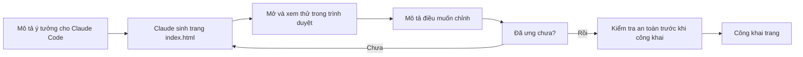

# 🎓 Brief — Sản Phẩm Capstone: Trang Web Portfolio Nghiên Cứu

> ✏️ **Đây là template mẫu, hãy sao chép và chỉnh theo đề tài của bạn.** Bản brief này là khung để bạn dựng một **trang web portfolio nghiên cứu cá nhân** bằng "vibe coding" — bạn mô tả bằng lời, Claude Code viết code.

| Thông tin | Chi tiết |
|---|---|
| **Sản phẩm** | Trang web portfolio nghiên cứu (1 file HTML mở bằng trình duyệt) |
| **Cách làm** | Vibe coding — mô tả bằng lời, **không tự gõ code** |
| **Đối tượng** | Người mới, không cần biết lập trình |

---

## 1. Mục tiêu

- Hệ thống hóa toàn bộ sản phẩm nghiên cứu của bạn vào **một trang dễ thấy**.
- Trình bày bản thân học thuật một cách chuyên nghiệp (giới thiệu, đề tài, công bố, liên hệ).
- Có một sản phẩm số **chạy được trong trình duyệt**, có thể chia sẻ.

> [!IMPORTANT]
> **"Vibe coding"** nghĩa là: bạn nói muốn gì → Claude viết code → bạn xem trước → chỉ chỗ chưa ưng → Claude sửa → lặp lại. Nếu thấy mình đang cố tự viết code và bị kẹt, hãy quay lại **mô tả bằng lời**.

---

## 2. Các mục cần có trên trang

| Mục | Nội dung | Nguồn nội dung |
|---|---|---|
| **Giới thiệu** | Họ tên, chức danh học thuật, một câu mô tả bản thân | [điền] |
| **Đề tài** | Tên đề tài + giới thiệu ngắn (rút từ research gap) | Sản phẩm Buổi 1 |
| **Tổng quan** | Tóm tắt phần tổng quan tài liệu / hướng nghiên cứu | Sản phẩm Buổi 2 |
| **Phương pháp** | Tóm tắt thiết kế, mẫu, công cụ đo | [điền] |
| **Kết quả** | Tóm tắt kết quả phân tích dữ liệu (1–2 đoạn) | Sản phẩm Buổi 3 |
| **Liên hệ** | Email và liên kết bạn chấp nhận công khai | [điền] |

> 💡 Để chỗ trống mẫu cho mục nào chưa có nội dung; điền dần sau.

---

## 3. Vòng lặp dựng trang



---

## 4. ✅ Checklist an toàn trước khi công khai (BẮT BUỘC)

> [!WARNING]
> Trang web tĩnh thì ai cũng xem được mã nguồn. **Kiểm tra TRƯỚC khi công khai, không phải sau.**

- [ ] **Không** có API key, token, mật khẩu trong file.
- [ ] **Không** có dữ liệu cá nhân nhạy cảm (số điện thoại, địa chỉ nhà, CMND/CCCD).
- [ ] **Không** có dữ liệu người tham gia nghiên cứu (thông tin định danh, dữ liệu thô chưa ẩn danh).
- [ ] Email và liên kết trên trang là thứ bạn **chấp nhận ai cũng thấy**.
- [ ] Đã nhờ Claude rà soát lại lần cuối (prompt ở mục 5).

Nếu lỡ dán thông tin nhạy cảm: yêu cầu Claude gỡ bỏ và chạy lại rà soát **NGAY**. Nếu đã public mà chưa kiểm tra: gỡ public → sửa → kiểm tra lại → mới đăng lại.

---

## 5. Gợi ý prompt "vibe coding" cho Claude Code

**Prompt tạo trang lần đầu:**

```text
Hãy tạo cho tôi một trang web portfolio nghiên cứu cá nhân bằng HTML và CSS
đơn giản, một file duy nhất, dễ mở bằng trình duyệt. Gồm các mục:

1) Giới thiệu: họ tên và chức danh học thuật.
2) Đề tài nghiên cứu (dán nội dung từ research gap buổi 1).
3) Tổng quan / hướng nghiên cứu (tóm tắt buổi 2).
4) Phương pháp (tóm tắt ngắn).
5) Kết quả (tóm tắt phân tích dữ liệu buổi 3).
6) Liên hệ (email).

Giao diện sạch, chữ dễ đọc, có mục lục đầu trang. Tiếng Việt.
Giải thích cho tôi cách mở file.
```

**Prompt chỉnh sửa (gom nhiều thay đổi một lần):**

```text
Phần giới thiệu đề tài hơi dài, hãy rút còn 3 câu.
Đổi màu tiêu đề sang xanh đậm.
Thêm phần "Liên hệ" với email ở cuối trang.
```

**Prompt kiểm tra an toàn:**

```text
Hãy rà soát toàn bộ file trang portfolio của tôi và cho biết có chỗ nào lộ
thông tin nhạy cảm (API key, mật khẩu, dữ liệu cá nhân nên giấu) không.
Liệt kê cụ thể từng chỗ.
```

> 💡 **Mẹo gỡ kẹt:** nếu chỉnh mãi không ưng, quay lại brief này, liệt kê đúng **3 thay đổi quan trọng nhất**, rồi yêu cầu Claude làm một lần.

---

## 6. Sản phẩm cần đạt

- [ ] Trang portfolio mở được trong trình duyệt, đủ các mục ở phần 2.
- [ ] Đã chỉnh lặp ít nhất 2 vòng cho ưng ý.
- [ ] Đã qua **checklist an toàn** (phần 4) trước khi công khai.
