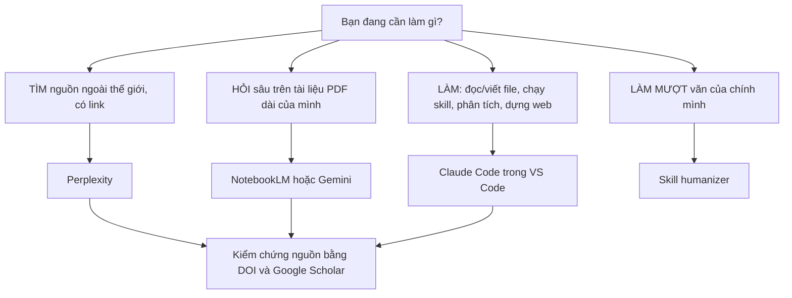

# 🧭 Cheat Sheet — Hệ Sinh Thái Công Cụ AI Cho Nghiên Cứu

> ✏️ **Đây là template mẫu, hãy sao chép và chỉnh theo đề tài của bạn.** Bạn dùng bảng tra này để biết "việc nào thì mở công cụ nào", không cần nhớ hết.

| Thông tin | Chi tiết |
|---|---|
| **Loại tài liệu** | Bảng tra nhanh (cheat sheet) |
| **Đối tượng** | Người mới, không cần biết lập trình |
| **Dùng khi nào** | Lúc phân vân "việc này dùng công cụ gì?" |
| **Phiên bản** | Template mẫu — bạn tự chỉnh |

---

## 🎯 Nhớ nhanh trong một dòng

- Cần **TÌM** ngoài thế giới, có link nguồn → **Perplexity**.
- Cần **HỎI** tài liệu dài của chính mình (PDF, bài báo đã tải) → **NotebookLM / Gemini**.
- Cần **LÀM** (đọc/viết file, chạy skill, phân tích, dựng web, nhiều bước) → **Claude Code**.
- Cần **MỘT CHỖ NGỒI** làm việc và tùy biến → **VS Code + Claude Code**.
- Cần **LÀM MƯỢT VĂN** của chính mình (có khai báo AI) → skill **humanizer**.

---

## 🗺️ Sơ đồ: chọn công cụ theo việc cần làm

---

## 🧰 Bảng tra: việc cần làm → công cụ → ghi chú

| Việc cần làm | Công cụ | Ghi chú quota / lưu ý |
|---|---|---|
| Tìm nguồn web có trích dẫn, kèm link để kiểm chứng | **Perplexity** | Bản miễn phí giới hạn số lượt tìm "Pro" mỗi ngày; luôn bấm vào link để chắc nguồn có thật |
| Quét nhanh các hướng nghiên cứu của một chủ đề | **Perplexity** | Hỏi kèm khoảng năm (ví dụ 2022–2025) để ra nguồn mới |
| Hỏi sâu một hoặc nhiều **PDF dài** mình đã có | **NotebookLM** | Trả lời dựa đúng trên tài liệu bạn tải lên nên ít bịa hơn; có giới hạn số nguồn / số notebook |
| Tóm tắt, tạo dàn ý hoặc podcast từ tài liệu của mình | **NotebookLM** | Tính năng tóm tắt/podcast rất hợp để ôn nhanh |
| Hỏi tài liệu khi không tiện mở NotebookLM | **Gemini** | Có thể đính kèm PDF; cẩn thận quota theo gói và độ dài tài liệu |
| Chạy 8 skill nghiên cứu (literature-review, data-analysis…) | **Claude Code** | Cần gói Claude Pro/Max; có giới hạn lượt theo phiên, hết thì chờ reset |
| Sàng lọc abstract, lập bảng tổng hợp, ma trận tài liệu | **Claude Code** | Đính kèm/nêu rõ đường dẫn file để Claude đọc đúng |
| Làm sạch CSV, thống kê, kiểm định, viết báo cáo dữ liệu | **Claude Code** (skill `data-analysis`) | Đính kèm file CSV trước khi gõ prompt |
| Viết và chỉnh chương luận án, bài báo, ebook | **Claude Code** (skill `academic-writing`) | Luôn đọc lại, không nộp phần chưa kiểm tra |
| Dựng trang web portfolio (vibe coding) | **Claude Code** | Mô tả bằng lời, không tự gõ code; kiểm tra an toàn trước khi public |
| Nơi mở thư mục dự án, xem/sửa file, tạo skill riêng | **VS Code + Claude Code** | Người mới chỉ cần vài chức năng cơ bản |
| Làm mượt văn **do chính bạn viết** | Skill **humanizer** | ⚠️ Chỉ làm mượt văn của mình; **không** để qua mặt máy dò AI; luôn kèm khai báo dùng AI |
| Kiểm chứng một nguồn, một con số, một DOI | **Perplexity** + **Google Scholar** | Bước bắt buộc; chưa kiểm tra được nguồn thì chưa đưa vào bài |

---

## 🔁 Phối hợp công cụ theo giai đoạn nghiên cứu

| Giai đoạn | Việc chính | Công cụ chính | Skill nên dùng |
|---|---|---|---|
| 1. Chọn & thu hẹp đề tài | Quét chủ đề, tìm khoảng trống ban đầu | Perplexity + Claude Code | `research-framework` |
| 2. Tổng quan tài liệu | Tìm bài, sàng lọc, tổng hợp, tìm gap | Perplexity + Claude Code + NotebookLM | `literature-review`, `critical-review` |
| 3. Phương pháp | Mẫu, thang đo, bảng hỏi | Claude Code | `methodology-design` |
| 4. Phân tích dữ liệu | Làm sạch, thống kê, kiểm định | VS Code + Claude Code | `data-analysis` |
| 5. Viết & trích dẫn | Viết chương, chuẩn văn phong, trích dẫn | Claude Code + NotebookLM | `academic-writing`, `citation-manager` |
| 6. Làm mượt văn | Sửa cho mạch lạc, đúng giọng | Claude Code | `humanizer` |
| 7. Rà soát phản biện | Tự bắt lỗi lập luận | Claude Code | `critical-review` |
| 8. Bảo vệ | Slide, câu hỏi hội đồng | Claude Code | `defense-prep` |

---

## ⭐ Nguyên tắc vàng (luôn ghi nhớ)

> 1. **Luôn kiểm tra nguồn.** AI có thể bịa tên bài, tác giả, DOI nghe rất thật.
> 2. **Không dán dữ liệu nhạy cảm** vào AI khi chưa rõ chính sách bảo mật.
> 3. **Khai báo việc dùng AI** theo quy định trường/tạp chí.
> 4. **AI hỗ trợ, không thay bạn tư duy.** Bạn chịu trách nhiệm nội dung.
> 5. **Không nộp** phần bạn chưa đọc, chưa hiểu, chưa kiểm tra.

---

> 📌 **Cách dùng template này:** chép file này vào thư mục đề tài của bạn, xóa các dòng không liên quan, và thêm cột "Khi nào tôi sẽ dùng cho đề tài của tôi" nếu cần.
