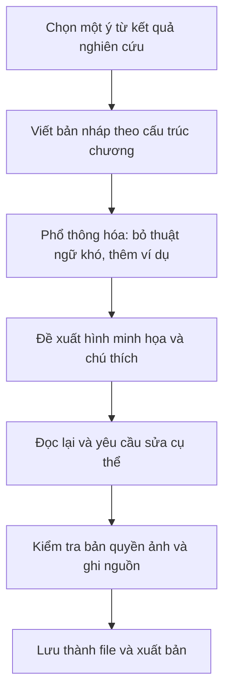

# ✍️ Hướng Dẫn Mẫu — Viết Một Chương Ebook Từ Kết Quả Nghiên Cứu

> ✏️ **Đây là template mẫu, hãy sao chép và chỉnh theo đề tài của bạn.** Hướng dẫn này giúp bạn biến một phần kết quả nghiên cứu thành một **chương ebook phổ thông**, dễ đọc cho người không chuyên.

| Thông tin | Chi tiết |
|---|---|
| **Loại tài liệu** | Hướng dẫn + khung chương ebook |
| **Đối tượng người đọc ebook** | Người mới, không chuyên |
| **Độ dài chương gợi ý** | 1000–1500 từ |

---

## 🗺️ Quy trình viết một chương



---

## 1. Cấu trúc một chương ebook

| Phần | Nội dung | Gợi ý độ dài |
|---|---|---|
| **Mở đầu** | Một câu chuyện/ví dụ/câu hỏi gợi tò mò; nêu chương này nói về gì | ~150 từ |
| **Nội dung 1** | Ý chính thứ nhất + ví dụ | ~300 từ |
| **Nội dung 2** | Ý chính thứ hai + ví dụ | ~300 từ |
| **Nội dung 3** | Ý chính thứ ba + ví dụ | ~300 từ |
| **Tóm tắt** | Gói lại 3 ý chính trong vài câu | ~100 từ |
| **Câu hỏi ôn tập** | 2–3 câu giúp người đọc tự kiểm tra | ~80 từ |

> 💡 Giữ **thuật ngữ nhất quán** giữa các chương. Lần đầu xuất hiện một thuật ngữ, giải thích ngắn gọn.

---

## 2. Giọng văn phổ thông hóa

Từ kết quả nghiên cứu (vốn khô, nhiều thuật ngữ) sang văn ebook (gần gũi, dễ hiểu):

| ❌ Văn học thuật khô | ✅ Văn ebook phổ thông |
|---|---|
| "Hệ số hồi quy β = 0.43 (p < 0.001) cho thấy mối quan hệ có ý nghĩa thống kê." | "Nói đơn giản: nhóm A càng cao thì nhóm B càng có xu hướng tăng theo — và đây không phải ngẫu nhiên." |
| "Nghiên cứu sử dụng thiết kế cắt ngang với mẫu thuận tiện." | "Chúng tôi khảo sát một nhóm người tại một thời điểm. Cách này nhanh, nhưng có giới hạn — sẽ nói ở cuối chương." |

**Mẹo phổ thông hóa:**

- Thay con số trần bằng **ý nghĩa thực tế** của con số đó.
- Dùng **ví dụ đời thường** để minh họa khái niệm trừu tượng.
- Câu ngắn, mỗi đoạn một ý.
- Giữ trung thực: phổ thông hóa **không** được làm sai lệch kết quả hay nói quá.

---

## 3. Chèn ví dụ và hình minh họa

Với mỗi phần nội dung, đề xuất **một hình** kèm chú thích (caption):

```text
[HÌNH 1] — Mô tả nội dung hình: [điền, ví dụ: biểu đồ cột so sánh nhóm A và nhóm B].
Chú thích (caption): [điền, ví dụ: "Hình 1. Nhóm A có điểm trung bình cao hơn nhóm B."].
Nguồn: [điền — tự tạo / ảnh AI / giấy phép tự do + link].
```

Bạn có **ba cách** lấy hình (có thể kết hợp):

- Nhờ AI gợi ý vị trí và mô tả hình để bạn **tự tạo**.
- **Tự chụp** hoặc đưa biểu đồ của chính mình vào.
- Dùng **ảnh giấy phép tự do** có ghi nguồn.

---

## 4. Lưu ý bản quyền ảnh và ghi nguồn (đọc kỹ)

> ⚠️ **Không** lấy ảnh trên mạng nếu không rõ giấy phép. Ưu tiên theo thứ tự:
> 1. Ảnh **bạn tự tạo** (biểu đồ, sơ đồ, ảnh chụp của bạn).
> 2. Ảnh **do AI tạo** — nên ghi chú rõ "ảnh do AI tạo".
> 3. Ảnh **giấy phép tự do** (ví dụ Creative Commons, public domain) — **luôn ghi nguồn**.
>
> Nếu mượn biểu đồ/hình từ bài báo khác, phải **xin phép hoặc trích nguồn đúng quy định**. Mọi số liệu mượn đều phải có nguồn đã kiểm tra.

---

## 5. Prompt mẫu cho Claude Code

```text
Hãy viết một chương ebook khoảng 1500 từ về chủ đề [chủ đề của tôi],
dành cho người mới.

Cấu trúc: mở đầu, 3 phần nội dung, tóm tắt, câu hỏi ôn tập.
Với mỗi phần, đề xuất 1 hình minh họa: ghi rõ nội dung hình và chú thích.

Ngôn ngữ: tiếng Việt, giọng thân thiện, phổ thông hóa thuật ngữ khó.
Dựa trên kết quả nghiên cứu của tôi sau đây: [dán kết quả/diễn giải].
```

Lưu và xuất file:

```text
Hãy lưu chương này thành file ebook/chuong-01.md.
Sau đó chuyển sang Word (.docx) để tôi dễ gửi người khác góp ý.
```

---

## ✅ Checklist trước khi phát hành chương

- [ ] Cấu trúc đủ: mở đầu, 3 phần, tóm tắt, câu hỏi ôn tập.
- [ ] Thuật ngữ giải thích lần đầu, dùng nhất quán.
- [ ] Mỗi phần có ví dụ; phổ thông hóa nhưng không làm sai kết quả.
- [ ] Mỗi hình có chú thích và **nguồn đúng bản quyền**.
- [ ] Số liệu mượn đều có nguồn đã kiểm tra.
- [ ] Có dòng **khai báo dùng AI** nếu công bố (xem `MAU_KHAI_BAO_AI.md`).
