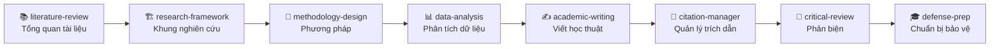

# 🎓 K3 - Bộ Kỹ Năng AI Cho Nghiên Cứu Khoa Học & Luận Án Tiến Sĩ

> Khóa học và bộ công cụ giúp **nghiên cứu sinh, giảng viên và học viên cao học** làm chủ **AI Agent (Claude Code)** để hỗ trợ nghiên cứu khoa học: thiết lập workspace, tổng quan tài liệu, phân tích dữ liệu định lượng, viết báo cáo học thuật chuẩn APA 7 và xây dựng portfolio nghiên cứu.
>
> **Bạn không cần biết lập trình.** Toàn bộ quy trình được module hóa theo từng buổi học thực chiến, có sẵn prompt tiếng Việt chuẩn mực để áp dụng ngay.

<p align="center">
  
  
  
  
</p>

---

## 🧭 1. Lộ Trình 4 Buổi Học Thực Chiến

Mỗi buổi học được đóng gói thành một **Module hoàn chỉnh và độc lập (Self-contained)** gồm đủ: **File Giáo án (.md)**, **Slide trình chiếu Keynote (.html)** và **Thư mục Demo / Dữ liệu thực hành**:

| Buổi | Tên Module Buổi Học | Giáo án & Hướng dẫn | Slide Trình Chiếu HTML | Dữ liệu Thực Hành & Demo |
|:---:|---|---|---|---|
| **01** | **[Thiết Lập Dự Án Luận Án](01-buoi-01-thiet-lap-du-an-luan-an/)** | [`buoi-01-thiet-lap-du-an-luan-an.md`](01-buoi-01-thiet-lap-du-an-luan-an/buoi-01-thiet-lap-du-an-luan-an.md) | [`buoi-01-slide-thiet-lap-du-an-luan-an.html`](01-buoi-01-thiet-lap-du-an-luan-an/buoi-01-slide-thiet-lap-du-an-luan-an.html) | Mẫu `CLAUDE.md`, cây thư mục chuẩn |
| **02** | **[Tổng Quan Tài Liệu & Skill](02-buoi-02-tong-quan-tai-lieu-va-skill/)** | [`buoi-02-lam-theo-tung-buoc.md`](02-buoi-02-tong-quan-tai-lieu-va-skill/buoi-02-lam-theo-tung-buoc.md) | [`buoi-02-slide-tong-quan-tai-lieu-va-skill.html`](02-buoi-02-tong-quan-tai-lieu-va-skill/buoi-02-slide-tong-quan-tai-lieu-va-skill.html) | 10 abstracts, 5 bài báo Word/MD, Workbook Buổi 2 |
| **03** | **[CLAUDE.md Global, MarkItDown & Dữ Liệu](03-buoi-03-phan-tich-du-lieu-va-bao-cao/)** | [`buoi-03-phan-tich-du-lieu-va-bao-cao.md`](03-buoi-03-phan-tich-du-lieu-va-bao-cao/buoi-03-phan-tich-du-lieu-va-bao-cao.md) | [`buoi-03-slide-phan-tich-du-lieu-va-bao-cao.html`](03-buoi-03-phan-tich-du-lieu-va-bao-cao/buoi-03-slide-phan-tich-du-lieu-va-bao-cao.html) | File CSV 320 mẫu, báo cáo mẫu, template APA 7 |
| **04** | **[Hệ Thống Hóa & Portfolio](04-buoi-04-he-thong-hoa-va-portfolio/)** | [`buoi-04-he-thong-hoa-va-portfolio.md`](04-buoi-04-he-thong-hoa-va-portfolio/buoi-04-he-thong-hoa-va-portfolio.md) | Đang cập nhật slide Buổi 4 | Brief Capstone, Cheat Sheet, Hướng dẫn Ebook |

---

## 📂 2. Cấu Trúc Thư Mục Repository

```
ai-agent-for-research-hocvien/
├── 01-buoi-01-thiet-lap-du-an-luan-an/         (Module Buổi 1: Khởi tạo dự án & 8 Skill)
│   ├── buoi-01-thiet-lap-du-an-luan-an.md
│   ├── buoi-01-slide-thiet-lap-du-an-luan-an.html
│   └── demo/                                  (Template CLAUDE.md, cấu trúc thư mục)
│
├── 02-buoi-02-tong-quan-tai-lieu-va-skill/     (Module Buổi 2: Tổng quan & Chống bịa số)
│   ├── buoi-02-lam-theo-tung-buoc.md
│   ├── buoi-02-slide-tong-quan-tai-lieu-va-skill.html
│   └── demo/
│       ├── abstracts/                         (10 tóm tắt nghiên cứu ab01–ab10, đề bài, đáp án)
│       ├── bai-bao-toan-van/                  (5 bài báo khoa học toàn văn .docx và .md)
│       ├── mau-outline/                       (Mẫu dàn ý tổng quan tài liệu chuẩn)
│       └── workbook/                          (Workbook thực hành Buổi 2)
│
├── 03-buoi-03-phan-tich-du-lieu-va-bao-cao/     (Module Buổi 3: Global, MarkItDown & Dữ liệu)
│   ├── buoi-03-phan-tich-du-lieu-va-bao-cao.md
│   ├── buoi-03-slide-phan-tich-du-lieu-va-bao-cao.html
│   └── demo/
│       ├── khao-sat/                          (Bộ dữ liệu 320 phiếu, codebook, đề bài, đáp án)
│       ├── san-pham-mau/                      (Báo cáo phân tích .md, .pdf, dashboard.html, print.html)
│       └── mau-tai-lieu/                      (Mẫu báo cáo dữ liệu 8 phần, Mẫu khai báo AI)
│
├── 04-buoi-04-he-thong-hoa-va-portfolio/       (Module Buổi 4: Hệ thống hóa & Portfolio)
│   ├── buoi-04-he-thong-hoa-va-portfolio.md
│   └── demo/
│       ├── brief-capstone/                    (Brief đồ án Capstone Portfolio)
│       ├── cheat-sheet/                       (Cheat sheet hệ sinh thái AI nghiên cứu)
│       └── huong-dan-ebook/                   (Hướng dẫn viết sách/ebook học thuật)
│
├── bo-skill/                                  (Bộ 8 Skill AI chuyên sâu cho NCKH)
├── README.md                                  (Bản đồ chỉ dẫn toàn khóa học)
└── _backup/                                   (Lưu trữ an toàn 100% dữ liệu lịch sử)
```

---

## 🧰 3. Bộ 8 Skill AI Nghiên Cứu Trong `bo-skill/`



| # | Skill | Chức năng chính |
|---|---|---|
| 1 | [`literature-review`](bo-skill/literature-review/) | Tìm kiếm, sàng lọc, bóc tách khoảng trống nghiên cứu (Research Gap) |
| 2 | [`research-framework`](bo-skill/research-framework/) | Xây dựng khung lý thuyết, định nghĩa biến số và phát triển giả thuyết |
| 3 | [`methodology-design`](bo-skill/methodology-design/) | Thiết kế phương pháp, chọn mẫu, thang đo và bảng câu hỏi |
| 4 | [`data-analysis`](bo-skill/data-analysis/) | Làm sạch dữ liệu, kiểm định Cronbach Alpha, hồi quy và trung gian |
| 5 | [`academic-writing`](bo-skill/academic-writing/) | Viết và chỉnh sửa văn phong học thuật chuẩn mực, làm mượt câu chữ |
| 6 | [`citation-manager`](bo-skill/citation-manager/) | Chuẩn hóa trích dẫn APA 7th, kiểm tra đối soát DOI và danh mục tài liệu |
| 7 | [`critical-review`](bo-skill/critical-review/) | Phản biện độc lập, tìm điểm yếu phương pháp luận và rà soát Hedging |
| 8 | [`defense-prep`](bo-skill/defense-prep/) | Soạn slide bảo vệ, dự đoán câu hỏi của Hội đồng và luyện trả lời |

---

## ⚠️ 4. Kỷ Luật Học Thuật & Liêm Chính AI

- 🔍 **Kỷ luật chống bịa số liệu:** Mọi số liệu phân tích và trích dẫn phải có bằng chứng từ dữ liệu thực tế.
- ⚖️ **Kỷ luật Hedging:** Dữ liệu cắt ngang không quy kết quan hệ nhân quả tuyệt đối.
- 📝 **Tuyên bố khai báo AI:** Luôn đính kèm Tuyên bố sử dụng AI (AI Disclosure Statement) minh bạch theo chuẩn mực quốc tế (Elsevier/Springer).
- 👤 **Trách nhiệm tác giả:** Kết quả từ AI là bản thảo hỗ trợ — tác giả chịu 100% trách nhiệm về nội dung khoa học trước Hội đồng.

---

<p align="center"><i>CES Global · Chương Trình Đào Tạo Agentic AI Cho Nghiên Cứu Khoa Học & Luận Án Tiến Sĩ</i></p>
