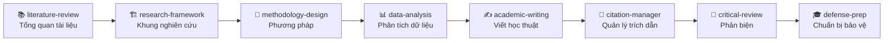

# 🎓 K3 - Bộ Kỹ Năng AI Cho Nghiên Cứu

> Khóa học và bộ công cụ giúp **người mới** dùng **AI Agent** (Claude Code) để hỗ trợ nghiên cứu khoa học: tìm tài liệu, tổng quan, phân tích dữ liệu, viết và bảo vệ luận án.
>
> **Bạn không cần biết tiếng Anh. Bạn không cần biết lập trình.** Phần lớn công việc là gõ yêu cầu bằng tiếng Việt cho AI rồi đọc, kiểm tra kết quả.

<p align="center">
  
  
  
  
</p>

---

## 🧭 1. Khóa học này là gì?

Đây là một **chương trình đào tạo có hướng dẫn** dạy nghiên cứu sinh, học viên cao học và người làm nghiên cứu cách dùng AI Agent xuyên suốt **hành trình nghiên cứu** - từ lúc còn một ý tưởng mơ hồ cho đến khi có sản phẩm hoàn chỉnh.

Cách học rất nhẹ nhàng: mỗi buổi là một file "làm theo từng bước", có sẵn prompt để chép - dán vào Claude, kèm ô "Bạn sẽ thấy" để tự kiểm.

---

## 📂 2. Trong thư mục này có gì

| Thư mục / file | Nội dung |
|---|---|
| [`bai-hoc-4-buoi/`](bai-hoc-4-buoi/) | Bài giảng làm theo từng bước. Đủ **Buổi 1**, **Buổi 2**, **Buổi 3** và **Buổi 4**. |
| [`bo-skill/`](bo-skill/) | Bộ **8 skill** nghiên cứu. Mỗi skill có `SKILL.md` + thư mục `quy-trinh/` chứa các quy trình chi tiết. |
| [`du-lieu-mau/`](du-lieu-mau/) | **Dữ liệu mẫu thực hành** (giả lập). Buổi 3 dùng bộ khảo sát CSV + template báo cáo; `tai-lieu-mau/` có thêm brief capstone portfolio (Buổi 4), cheat sheet hệ sinh thái, hướng dẫn viết ebook, mẫu outline tổng quan. |
| [`workbook/`](workbook/) | Workbook `.docx` cho học viên (Buổi 2). |
| `README.md` | File này. |

---

## 🎯 3. Học xong bạn làm được gì?

- ✅ Dựng được một **dự án luận án** với Claude Code (file `CLAUDE.md`, cây thư mục, cài skill).
- ✅ Tự chạy bộ skill nghiên cứu trong **VS Code + Claude Code**.
- ✅ Tổng quan tài liệu và viết **báo cáo có trích dẫn (APA 7), có kiểm chứng nguồn**.
- ✅ **Tự tạo một skill riêng** theo đề tài của mình.

---

## 🧰 4. Bộ 8 Skill - 8 "nghề" của AI

Mỗi skill là một gói chuyên môn mà AI nạp vào khi gặp đúng loại việc. Xem chi tiết trong `SKILL.md` của từng skill.



| # | Skill | Dùng khi nào? |
|---|---|---|
| 1 | [`literature-review`](bo-skill/literature-review/) | Tìm, lọc, tổng hợp bài báo |
| 2 | [`research-framework`](bo-skill/research-framework/) | Lý thuyết, biến, mô hình, giả thuyết |
| 3 | [`methodology-design`](bo-skill/methodology-design/) | Mẫu, thang đo, bảng hỏi, phỏng vấn |
| 4 | [`data-analysis`](bo-skill/data-analysis/) | Thống kê, kiểm định, diễn giải kết quả |
| 5 | [`academic-writing`](bo-skill/academic-writing/) | Viết và chỉnh chương luận án, bài báo |
| 6 | [`citation-manager`](bo-skill/citation-manager/) | APA, DOI, danh mục tài liệu |
| 7 | [`critical-review`](bo-skill/critical-review/) | Review, tìm điểm yếu, research gap |
| 8 | [`defense-prep`](bo-skill/defense-prep/) | Slide, câu hỏi hội đồng, luyện trả lời |

> 💡 Mỗi skill lớn còn có thư mục `quy-trinh/` chứa các quy trình chi tiết. Claude tự đọc file trong đó khi cần, theo liên kết trong `SKILL.md`.

---

## 🚦 5. Bắt đầu từ đâu?

Học lần lượt hai buổi đã có, làm tuần tự từ trên xuống trong mỗi file:

1. 🛠️ **[Buổi 1 - Thiết lập dự án luận án](bai-hoc-4-buoi/buoi-01-thiet-lap-du-an-luan-an.md)**: dựng `CLAUDE.md`, cây thư mục, cài 8 skill.
2. 📑 **[Buổi 2 - Tổng quan tài liệu](bai-hoc-4-buoi/buoi-02-lam-theo-tung-buoc.md)**: gom nguồn, tìm research gap, viết báo cáo tổng quan có trích dẫn, tự tạo skill.
3. 📊 **[Buổi 3 - Phân tích dữ liệu và báo cáo](bai-hoc-4-buoi/buoi-03-phan-tich-du-lieu-va-bao-cao.md)**: làm sạch dữ liệu khảo sát, chạy Cronbach/hồi quy/trung gian, viết báo cáo có khai báo dùng AI.
4. 🎓 **[Buổi 4 - Hệ thống hóa và portfolio](bai-hoc-4-buoi/buoi-04-he-thong-hoa-va-portfolio.md)**: lập bản đồ công cụ, dựng trang portfolio bằng vibe coding, kiểm tra an toàn, lập kế hoạch công cụ, deploy lên Vercel; phần mở rộng: chuyển PDF sang Markdown bằng MarkItDown.

---

## 🧠 6. Cách hỏi AI cho đúng - Quy tắc 5 dòng

Đừng hỏi chung chung kiểu *"Làm luận án giúp tôi"*. Hãy cung cấp đủ bối cảnh:

```text
1. Giai đoạn: tổng quan tài liệu.
2. Chủ đề: chuyển đổi số trong doanh nghiệp nhỏ và vừa Việt Nam.
3. Dữ liệu hiện có: 12 bài báo PDF và 1 danh sách DOI.
4. Kết quả mong muốn: bảng tổng hợp tài liệu và 5 research gaps.
5. Yêu cầu: viết bằng tiếng Việt, trích dẫn APA 7.
```

---

## ⚠️ 7. Nguyên tắc quan trọng (đọc kỹ)

- 🔒 **Không** đưa dữ liệu cá nhân hoặc nhạy cảm vào AI khi chưa được phép.
- 🔍 **Không** dùng AI tạo trích dẫn giả - mọi nguồn quan trọng phải kiểm tra lại bằng **DOI** hoặc trang tạp chí.
- 📝 **Khai báo việc dùng AI** theo quy định của trường và tạp chí.
- 👤 Kết quả AI chỉ là **bản nháp có cấu trúc**, không thay thế giảng viên hướng dẫn - **bạn chịu trách nhiệm** về nội dung học thuật.
- 🚫 **Không nộp** nội dung mà bạn chưa đọc, chưa hiểu hoặc chưa kiểm tra.

---

## 📥 8. Cách tải về dùng

Nếu bạn chưa quen Git:

1. Bấm nút **Code** (màu xanh) ở đầu trang.
2. Chọn **Download ZIP**.
3. Giải nén ra một thư mục.
4. Mở `README.md` (file này) và làm theo phần **Bắt đầu từ đâu**.

Nếu bạn dùng Git:

```bash
git clone <địa-chỉ-repo>.git
cd ai-agent-for-research-k3-hocvien
```

---

<p align="center"><i>Khóa K3 · 100% Tiếng Việt · Dành cho người mới</i></p>
