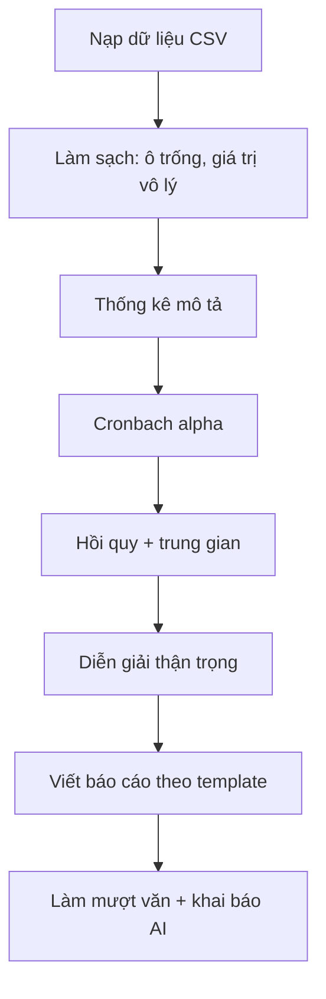
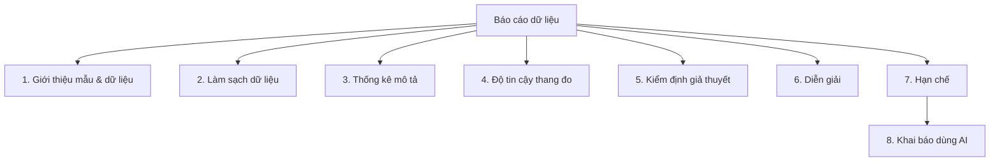
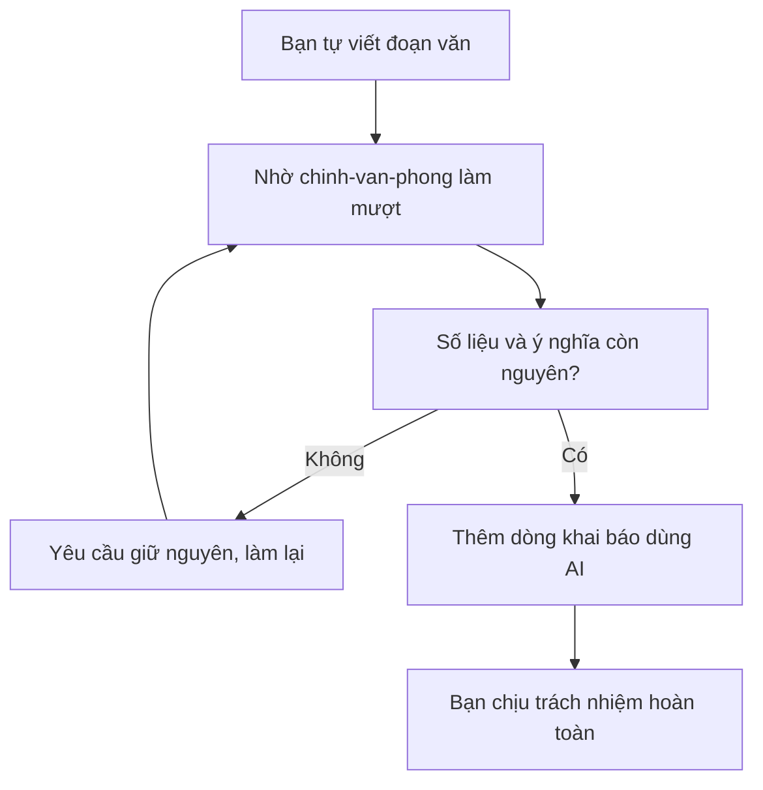

# Buổi 3: Làm sạch dữ liệu khảo sát, chạy kiểm định và viết báo cáo có khai báo dùng AI

> Cách dùng file này: mỗi phần có hai khúc. Khúc **Lý thuyết** đọc để hiểu mình sắp làm gì và vì sao, có ví von cho dễ nhớ. Khúc **Thao tác** là các bước có sẵn prompt, cứ copy dán vào Claude.
>
> Làm lần lượt, không nhảy cóc. Bước sau dùng kết quả bước trước.
>
> Trước khi bắt đầu: mở VS Code, mở đúng thư mục dự án luận án đã dựng ở buổi 1 (ví dụ `k3-research`), rồi mở panel Claude Code (biểu tượng tia sáng).
>
> Bạn **không cần biết thống kê chuyên sâu**. Việc của bạn là nhờ Claude chạy, rồi **đọc hiểu và kiểm** kết quả. Nhưng phải hiểu đủ để không nói quá những gì con số cho phép.
>
> Sáu phần, đi từ dễ tới khó:
> - Phần A: nạp bộ dữ liệu khảo sát và nhìn qua một lượt
> - Phần B: làm sạch dữ liệu và lập bảng thống kê mô tả
> - Phần C: kiểm tra độ tin cậy thang đo (Cronbach's alpha)
> - Phần D: chạy hồi quy và kiểm định vai trò trung gian
> - Phần E: viết báo cáo theo template, văn phong khách quan
> - Phần F: làm mượt văn đúng đạo đức và thêm dòng khai báo dùng AI

> ⚠️ **Cảnh báo đạo đức, đọc trước khi bắt đầu:** ở Phần F bạn sẽ làm mượt văn bằng AI. Chỉ dùng để làm rõ **tiếng nói của chính bạn**, và luôn kèm câu khai báo có dùng AI. **KHÔNG** dùng để qua mặt máy dò AI, **KHÔNG** dùng để đánh lừa hội đồng hay tạp chí. Công cụ này để **làm rõ** tiếng nói của bạn, không phải để **giả mạo** nó.

## Nhịp buổi

| Phần | Nội dung | Phút | Dạng | Bước |
|---|---|---|---|---|
| A | Nạp dữ liệu và nhìn qua | 12' | LT 4' + HV 8' | 1-3 |
| B | Làm sạch và thống kê mô tả | 24' | LT 6' + HV 18' | 4-6 |
| C | Kiểm tra thang đo (Cronbach) | 16' | LT 5' + HV 11' | 7-8 |
| D | Hồi quy và trung gian | 24' | LT 7' + HV 17' | 9-11 |
| E | Viết báo cáo theo template | 20' | LT 5' + HV 15' | 12-14 |
| F | Làm mượt văn và khai báo AI | 14' | LT 6' + HV 8' | 15-17 |
| Chốt | Rà sản phẩm và tự phản biện | 6' | HV 6' | 18 |

LT = giảng viên nói. HV = học viên tự làm. Tổng khoảng 116 phút phần lõi. Bài tập về nhà nằm cuối file.

### Toàn cảnh việc hôm nay



### Tư duy cốt lõi của buổi này

- Dữ liệu thật gần như luôn **"bẩn"**. Làm sạch một cách **trung thực và có ghi chép** là nền tảng của mọi kết quả đáng tin.
- Con số chỉ có giá trị khi được **diễn giải đúng mức**. Phân biệt rõ "có liên hệ" với "nhân quả", và không nói quá.
- Dùng AI để **làm rõ tiếng nói của mình**, không phải để giả mạo nó. Minh bạch (khai báo dùng AI) là một phần của liêm chính học thuật.

---

## PHẦN A. Nạp bộ dữ liệu khảo sát và nhìn qua một lượt

### Lý thuyết

Buổi 1 bạn dựng văn phòng nghiên cứu, buổi 2 bạn cho AI đọc cả kho tài liệu. Hôm nay có một chồng hồ sơ mới đặt lên bàn: một **bộ dữ liệu khảo sát**, tức một bảng mà mỗi dòng là một người trả lời, mỗi cột là một câu hỏi. File dạng này gọi là **CSV, tức bảng lưu dưới dạng văn bản, các ô cách nhau bằng dấu phẩy**. Excel mở được, mà Claude cũng đọc thẳng được.

Việc đầu tiên khi nhận một chồng hồ sơ lạ không phải là làm ngay, mà là **lật qua một lượt** xem nó có gì: bao nhiêu dòng, những cột nào, mỗi cột nghĩa là gì. Giống như mở một cuốn sổ mới ra là liếc mục lục trước khi đọc.

Bộ dữ liệu hôm nay là **giả lập, cố ý gài sẵn lỗi** (ô trống, giá trị nằm ngoài thang điểm) để bạn tập làm sạch. Đừng ngạc nhiên khi thấy con số vô lý, đó là bài tập chứ không phải bạn làm sai.

Đề tài của bộ dữ liệu: **Lãnh đạo số → Chia sẻ tri thức → Hiệu quả đổi mới** trong doanh nghiệp nhỏ và vừa (DNNVV). Ba khái niệm này đo bằng các câu hỏi thang điểm 1 tới 5, trong đó **Chia sẻ tri thức là biến trung gian**, tức cây cầu nối giữa Lãnh đạo số và Hiệu quả đổi mới.

### Thao tác

**Bước 1. Lấy bộ dữ liệu về thư mục dự án**

Để làm gì: có sẵn file dữ liệu và tài liệu đề bài ngay trong workspace để Claude đọc đúng.

Bộ dữ liệu nằm trong repo khóa học, thư mục `du-lieu-mau/khao-sat/`. Tải cả thư mục đó về và đặt vào thư mục dự án của bạn (cạnh `CLAUDE.md`). Trong đó có bốn file:

| File | Là gì |
|---|---|
| `khao-sat-doi-moi-dnnvv.csv` | Bộ dữ liệu chính để phân tích |
| `bang-mo-ta-du-lieu.md` | Codebook, tức bảng giải nghĩa từng cột |
| `de-bai.md` | Sáu nhiệm vụ cần làm |
| `ket-qua-mong-doi.md` | Đáp án để tự chấm (mở sau khi làm xong) |

Mở sẵn ba file đầu trong VS Code để tiện đối chiếu. **Chưa mở** `ket-qua-mong-doi.md` vội, để cuối buổi tự chấm cho khách quan.

---

**Bước 2. Kiểm tra skill data-analysis còn sẵn**

Để làm gì: chắc chắn "nghề phân tích dữ liệu" của Claude đã bật trước khi làm.

Gõ vào Claude:
```
Hãy liệt kê các skill bạn đang có và xác nhận có skill data-analysis.
```

Bạn sẽ thấy: Claude liệt kê tám skill, trong đó có `data-analysis`.

Nếu thiếu: đóng và mở lại VS Code rồi hỏi lại. Vẫn thiếu thì làm lại bước cài skill ở buổi 1.

---

**Bước 3. Nạp dữ liệu và nhìn qua một lượt**

Để làm gì: nắm bộ dữ liệu có bao nhiêu dòng, những cột nào, trước khi động vào.

Gõ vào Claude:
```
Hãy dùng skill data-analysis. Đọc file du-lieu-mau/khao-sat/khao-sat-doi-moi-dnnvv.csv, in ra 5 dòng đầu, cho biết tổng số dòng, liệt kê tên tất cả các cột và phân loại đâu là biến nhân khẩu, đâu là các item thang đo. Trả lời tiếng Việt, có bảng.
```

Bạn sẽ thấy: Claude báo **320 dòng**, liệt kê các cột nhân khẩu (`gioi_tinh`, `nhom_tuoi`, `kinh_nghiem`, `quy_mo_dn`, `nganh`) và ba nhóm item: `DL1-DL4`, `KS1-KS4`, `IP1-IP4`.

> 💡 **Mẹo:** nếu Claude trả số liệu không khớp, thường là nó chưa đọc đúng file. Nêu rõ đường dẫn `du-lieu-mau/khao-sat/khao-sat-doi-moi-dnnvv.csv`, hoặc mở file đó trong VS Code trước khi hỏi.

---

## PHẦN B. Làm sạch dữ liệu và lập bảng thống kê mô tả

### Lý thuyết

Trước khi nấu ăn, ai cũng nhặt rau, bỏ lá úa. Dữ liệu cũng vậy. **Làm sạch dữ liệu, tức tìm và xử lý các ô hỏng** trước khi tính toán, vì một con số rác lọt vào là cả kết quả sai theo.

Ba loại rác thường gặp trong khảo sát:

- **Ô trống (missing), tức người ta bỏ trống không trả lời.** Đếm xem có bao nhiêu, nằm ở đâu.
- **Giá trị vô lý (outlier), tức con số nằm ngoài khoảng cho phép.** Thang điểm chỉ từ 1 tới 5 mà xuất hiện số 0, số 7, số 9 thì chắc chắn là lỗi nhập liệu.
- **Nhãn không nhất quán**, ví dụ cột giới tính lúc ghi "Nam" lúc ghi "nam", máy coi là hai loại khác nhau.

Cách xử lý phổ biến và dễ giải thích nhất là **listwise, tức loại cả dòng nào có ô hỏng**. Đơn giản, minh bạch, ai đọc cũng tái lập được. Quan trọng là **ghi lại trung thực** đã loại bao nhiêu dòng và vì sao.

Làm sạch xong mới tới **thống kê mô tả, tức vẽ chân dung bộ dữ liệu bằng vài con số quen thuộc**: mẫu gồm bao nhiêu nam bao nhiêu nữ, tuổi ra sao, và mỗi câu hỏi trung bình được chấm mấy điểm. Chưa kiểm định gì cả, chỉ là mô tả "bộ dữ liệu này trông thế nào".

### Thao tác

**Bước 4. Kiểm tra chất lượng và làm sạch**

Để làm gì: tìm hết ô hỏng, xử lý minh bạch, biết còn bao nhiêu dòng để phân tích.

Gõ vào Claude:
```
Dùng skill data-analysis. Trên file du-lieu-mau/khao-sat/khao-sat-doi-moi-dnnvv.csv, hãy:
1) Đếm số ô trống (missing) và cho biết nằm ở cột nào.
2) Tìm giá trị ngoài thang 1 tới 5 ở các item (outlier vô lý), chỉ rõ mã phiếu và cột.
3) Kiểm tra nhãn không nhất quán ở các cột phân loại và dòng trùng lặp.
4) Đề xuất cách làm sạch theo kiểu listwise, giải thích từng loại lỗi, và cho biết còn bao nhiêu quan sát sau khi làm sạch.
Trình bày bằng bảng, tiếng Việt.
```

Bạn sẽ thấy: Claude báo **14 ô trống** và **4 giá trị ngoài thang** (R045 `DL3`=0; R110 `KS1`=0; R077 `IP2`=7; R203 `IP4`=9). Sau khi loại theo dòng, còn lại **302 quan sát**.

Nếu con số lệch nhẹ: bình thường, tùy cách bạn dặn xử lý outlier. Quan trọng là đúng quy trình. Xem quy trình chuẩn ở `data-analysis/quy-trinh/kiem-tra-du-lieu.md`.

---

**Bước 5. Bảng nhân khẩu học**

Để làm gì: biết mẫu gồm những ai, tỉ lệ ra sao.

Gõ vào Claude:
```
Trên dữ liệu đã làm sạch (302 quan sát), lập bảng thống kê mô tả cho các biến nhân khẩu (giới tính, nhóm tuổi, kinh nghiệm, quy mô doanh nghiệp, ngành), mỗi nhóm kèm tần suất và phần trăm.
```

Bạn sẽ thấy: mỗi biến nhân khẩu một bảng, có số người và phần trăm từng nhóm, cộng lại tròn 302.

---

**Bước 6. Trung bình và độ lệch chuẩn các item**

Để làm gì: xem mỗi câu hỏi được chấm quanh mức nào, dao động rộng hay hẹp.

Gõ vào Claude:
```
Tính trung bình (mean) và độ lệch chuẩn (SD) cho từng item DL1 tới IP4, và cho điểm trung bình của mỗi thang đo (DL, KS, IP). Trình bày thành bảng.
```

Bạn sẽ thấy: bảng mean và SD từng item nằm trong khoảng 1 tới 5, kèm điểm trung bình ba thang đo.

> ℹ️ **Độ lệch chuẩn (SD) là gì:** con số cho biết các câu trả lời tụm lại gần trung bình hay tản ra xa. SD nhỏ nghĩa là mọi người chấm na ná nhau; SD lớn nghĩa là ý kiến chia rẽ.

---

## PHẦN C. Kiểm tra độ tin cậy thang đo (Cronbach's alpha)

### Lý thuyết

Mỗi khái niệm ở đây (Lãnh đạo số, Chia sẻ tri thức, Hiệu quả đổi mới) không hỏi bằng một câu, mà bằng **bốn câu** cùng đo một thứ. Câu hỏi đặt ra: bốn câu đó có thật sự cùng đo **một** khái niệm không, hay mỗi câu đo một nẻo?

**Cronbach's alpha là thước đo độ ăn khớp giữa các câu trong một thang.** Ví von: bốn giám khảo cùng chấm một thí sinh. Nếu họ cho điểm gần nhau thì đáng tin (alpha cao); nếu mỗi người một phách thì thang đo có vấn đề (alpha thấp). Alpha chạy từ 0 tới 1, **thường yêu cầu từ 0.7 trở lên** là đạt.

Claude còn tính được **"alpha nếu bỏ item"**, tức thử bỏ từng câu ra xem alpha tăng hay giảm. Nếu bỏ một câu mà alpha tăng đáng kể, câu đó là "giám khảo lạc lõng", đáng cân nhắc loại.

### Thao tác

**Bước 7. Tính Cronbach's alpha cho ba thang**

Để làm gì: xác nhận cả ba thang đo đủ tin cậy để dùng cho bước sau.

Gõ vào Claude:
```
Dùng skill data-analysis. Trên dữ liệu đã làm sạch, tính Cronbach's alpha cho ba thang đo:
- Lãnh đạo số (DL): DL1, DL2, DL3, DL4
- Chia sẻ tri thức (KS): KS1, KS2, KS3, KS4
- Hiệu quả đổi mới (IP): IP1, IP2, IP3, IP4
Với mỗi thang cho biết alpha tổng và alpha nếu bỏ từng item. Nhận xét thang nào đạt độ tin cậy (ngưỡng 0.7). Trình bày thành bảng.
```

Bạn sẽ thấy: DL ≈ **0.81**, KS ≈ **0.81**, IP ≈ **0.83**. Cả ba đều đạt (≥ 0.7).

Quy trình chuẩn ở `data-analysis/quy-trinh/kiem-tra-thang-do.md`.

---

**Bước 8. Đọc hiểu kết quả alpha**

Để làm gì: tập diễn giải con số thay vì chỉ chép lại.

Gõ vào Claude:
```
Giải thích ngắn gọn cho người không chuyên: kết quả alpha vừa rồi nói lên điều gì về ba thang đo, có item nào đáng cân nhắc loại không, và vì sao.
```

Bạn sẽ thấy: một đoạn giải thích rằng ba thang đều nhất quán nội tại tốt, không có item lạc lõng cần loại.

---

## PHẦN D. Chạy hồi quy và kiểm định vai trò trung gian

### Lý thuyết

Tới đây mới là phần trả lời câu hỏi nghiên cứu: **Lãnh đạo số có đi cùng Hiệu quả đổi mới không, và Chia sẻ tri thức có phải cây cầu nối giữa hai cái đó không?**

Công cụ là **hồi quy, tức đo xem khi một biến tăng thì biến kia có xu hướng tăng theo bao nhiêu.** Kết quả cho ra một **hệ số**: hệ số dương và đủ lớn nghĩa là hai biến đi cùng chiều. Kèm theo là **p-value, tức xác suất kết quả này chỉ do may rủi.** p nhỏ (thường dưới 0.05) nghĩa là khó mà do ngẫu nhiên. Và **R bình phương, tức phần trăm biến động của kết quả được biến kia giải thích.**

Rồi tới ý hay nhất: **trung gian (mediation).** Hình dung Lãnh đạo số muốn tác động lên Hiệu quả đổi mới, nhưng đi qua một trạm trung chuyển là Chia sẻ tri thức. Ta tách tác động thành hai đường:

- **Đường trực tiếp:** Lãnh đạo số tác động thẳng lên Hiệu quả đổi mới.
- **Đường gián tiếp:** Lãnh đạo số làm tăng Chia sẻ tri thức, rồi Chia sẻ tri thức mới đẩy Hiệu quả đổi mới.

Nếu đường gián tiếp có ý nghĩa mà đường trực tiếp **vẫn còn**, ta gọi là **trung gian một phần**, tức cây cầu có gánh một phần chứ không phải tất cả. Cách kiểm chuẩn hiện nay là **bootstrap, tức máy lấy mẫu lại hàng nghìn lần để ước lượng khoảng tin cậy.** Nếu **khoảng tin cậy 95% không chứa số 0**, đường gián tiếp là thật.

> ⚠️ Một cạm bẫy phải nhớ ngay từ đây: dữ liệu này là **cắt ngang**, tức chụp một thời điểm. Nó cho thấy các biến **đi cùng nhau**, nhưng **không chứng minh cái này gây ra cái kia**.

### Thao tác

**Bước 9. Hồi quy Lãnh đạo số lên Hiệu quả đổi mới**

Để làm gì: đo tổng tác động của Lãnh đạo số lên Hiệu quả đổi mới.

Gõ vào Claude:
```
Dùng skill data-analysis. Tạo điểm trung bình mỗi thang (DL, KS, IP) từ 4 item. Chạy hồi quy tuyến tính đơn: IP phụ thuộc DL. Báo cáo hệ số chưa chuẩn hóa, beta chuẩn hóa, sai số chuẩn, t, p-value, R bình phương, và diễn giải ý nghĩa hệ số.
```

Bạn sẽ thấy: hệ số DL ≈ **0.53** (beta ≈ **0.51**), **p < 0.001**, R² ≈ **0.26**. Nghĩa là Lãnh đạo số giải thích khoảng 26% biến động của Hiệu quả đổi mới.

---

**Bước 10. Kiểm định vai trò trung gian của Chia sẻ tri thức**

Để làm gì: tách xem bao nhiêu tác động đi thẳng, bao nhiêu đi vòng qua Chia sẻ tri thức.

Gõ vào Claude:
```
Kiểm định vai trò trung gian (mediation) của KS trong quan hệ DL tới IP, dùng khoảng tin cậy bootstrap 95% (Preacher-Hayes) làm phương pháp chính.
- Đường a: hồi quy KS theo DL.
- Đường b và c': hồi quy IP theo cả DL và KS.
- So sánh tổng tác động c với tác động trực tiếp c'.
- Tính tác động gián tiếp a nhân b kèm khoảng tin cậy bootstrap 95%, và kết luận trung gian một phần hay toàn phần.
```

Bạn sẽ thấy: a (DL→KS) ≈ **0.48**; b (KS→IP) ≈ **0.32**; trực tiếp c' ≈ **0.37**; gián tiếp a×b ≈ **0.15**, khoảng tin cậy 95% **không chứa 0**. Kết luận: **trung gian một phần**, Chia sẻ tri thức gánh một phần tác động của Lãnh đạo số lên Hiệu quả đổi mới.

Quy trình chuẩn ở `data-analysis/quy-trinh/kiem-dinh-gia-thuyet.md`.

---

**Bước 11. Diễn giải thận trọng, không nói quá**

Để làm gì: viết kết luận đúng mức, không vượt quá thứ dữ liệu cắt ngang cho phép.

Gõ vào Claude:
```
Dùng skill data-analysis, quy trình dien-giai-ket-qua. Viết 3 tới 5 câu diễn giải kết quả trên. Phân biệt rõ "có liên hệ" với "nhân quả". Vì đây là dữ liệu cắt ngang, không được viết "làm tăng" hay "gây ra". Ưu tiên "có liên hệ thuận", "cho thấy".
```

Bạn sẽ thấy: một đoạn kết luận dùng "có liên hệ thuận", "diễn ra một phần gián tiếp qua", và nhắc rằng dữ liệu cắt ngang chỉ phản ánh tương quan.

> ⚠️ **Đây là chỗ dễ mất điểm nhất.** Tránh "Lãnh đạo số **làm tăng / gây ra** Hiệu quả đổi mới". Xem `data-analysis/quy-trinh/dien-giai-ket-qua.md`.

---

## PHẦN E. Viết báo cáo theo template, văn phong khách quan

### Lý thuyết

Kết quả rời rạc trong cửa sổ chat chưa phải là báo cáo. **Báo cáo là gói tất cả lại theo một khuôn quen thuộc** để người đọc (giảng viên, hội đồng) lướt một lượt là hiểu bạn làm gì, ra gì.

Bạn đã có sẵn một khuôn trong `du-lieu-mau/tai-lieu-mau/MAU_BAO_CAO_PHAN_TICH_DU_LIEU.md`, gồm **tám phần**: giới thiệu mẫu, làm sạch, thống kê mô tả, độ tin cậy, kiểm định giả thuyết, diễn giải, hạn chế, và khai báo dùng AI. Việc của bạn là nhờ Claude đổ kết quả vừa chạy vào đúng khuôn đó.



Nguyên tắc xuyên suốt: **văn phong khách quan, không nói quá.** Ưu tiên "cho thấy", "có liên hệ"; tránh "chứng minh", "khẳng định nhân quả" khi thiết kế chưa cho phép.

### Thao tác

**Bước 12. Đổ kết quả vào template báo cáo**

Để làm gì: có một báo cáo hoàn chỉnh theo đúng khuôn tám phần.

Gõ vào Claude:
```
Dùng skill data-analysis và academic-writing. Dựa trên toàn bộ kết quả đã chạy (làm sạch, mô tả, alpha, hồi quy, trung gian, diễn giải), viết một báo cáo hoàn chỉnh theo đúng cấu trúc trong du-lieu-mau/tai-lieu-mau/MAU_BAO_CAO_PHAN_TICH_DU_LIEU.md. Văn phong học thuật, khách quan, không phóng đại. Lưu thành file bao-cao-phan-tich-du-lieu.md trong thư mục dự án.
```

Bạn sẽ thấy: file `bao-cao-phan-tich-du-lieu.md` gồm đủ tám phần, các bảng đã điền số thật, phần diễn giải viết thận trọng.

---

**Bước 13. Rà lại phần hạn chế cho trung thực**

Để làm gì: nêu đúng các điểm yếu của thiết kế, vì hội đồng chắc chắn sẽ hỏi.

Gõ vào Claude:
```
Rà lại phần Hạn chế của báo cáo. Nêu trung thực ít nhất ba hạn chế của thiết kế này: dữ liệu cắt ngang, cách lấy mẫu, và đo lường bằng tự báo cáo. Với mỗi hạn chế nói rõ nó ảnh hưởng thế nào tới kết luận.
```

Bạn sẽ thấy: phần Hạn chế được viết lại đầy đủ ba điểm, mỗi điểm gắn với hệ quả cụ thể.

---

**Bước 14. Kiểm câu chữ có nói quá không**

Để làm gì: chặn những câu khẳng định vượt quá dữ liệu trước khi nộp.

Gõ vào Claude:
```
Dùng skill academic-writing, quy trình kiem-tra-hedging. Rà toàn bộ báo cáo và chỉ ra mọi câu nói quá (ví dụ dùng "chứng minh", "làm tăng", "gây ra" với dữ liệu cắt ngang). Đề xuất câu thay thế thận trọng hơn.
```

Bạn sẽ thấy: một danh sách các câu cần sửa kèm bản viết lại nhẹ giọng hơn. Sửa theo rồi lưu lại file.

---

## PHẦN F. Làm mượt văn đúng đạo đức và khai báo dùng AI

### Lý thuyết

Đoạn diễn giải bạn tự viết đôi khi còn cứng, lặp từ, đọc như văn máy. Có thể nhờ AI **làm mượt, tức viết lại cho trôi chảy hơn nhưng giữ nguyên ý và số liệu.** Skill `academic-writing` của bạn có sẵn quy trình `chinh-van-phong` làm đúng việc này, khỏi cần cài công cụ ngoài.

Nhưng đây là chỗ có **ranh giới đạo đức rõ ràng**, phải phân biệt:

**Dùng ĐÚNG:** làm mượt đoạn văn **do chính bạn viết** còn cứng; sửa cho mạch lạc, đúng giọng học thuật; giúp người không phải bản ngữ diễn đạt trôi chảy hơn ý của mình.

**Dùng SAI:** qua mặt công cụ dò AI để giấu việc đã dùng AI; đánh lừa hội đồng hay tạp chí về việc ai đã viết; biến văn do AI sinh ra thành "như người viết" để né quy định.

> ⚠️ Nguyên tắc cốt lõi: công cụ này để **làm rõ tiếng nói của bạn**, không phải để **giả mạo nó**. Nếu mục đích là qua mặt một hệ thống hay một con người, đó là dùng sai.

Và luôn đi kèm một việc: **khai báo dùng AI, tức một dòng ghi rõ bạn đã dùng công cụ AI để hỗ trợ việc gì**, còn nội dung và trách nhiệm vẫn là của bạn. Đây không phải thú tội, mà là minh bạch, một phần của liêm chính học thuật.



### Thao tác

**Bước 15. Làm mượt phần diễn giải của bạn**

Để làm gì: đoạn diễn giải đọc tự nhiên hơn mà không đổi một con số nào.

Trước tiên tự viết (hoặc dán) đoạn diễn giải của bạn, rồi gõ vào Claude:
```
Dùng skill academic-writing, quy trình chinh-van-phong. Làm cho đoạn diễn giải sau đọc tự nhiên và mạch lạc hơn. Đây là văn của tôi, tôi sẽ khai báo có dùng AI. Giữ nguyên mọi số liệu và ý nghĩa, không thêm khẳng định mới:

[dán đoạn văn của bạn]
```

Bạn sẽ thấy: đoạn văn mượt hơn nhưng **giữ nguyên số liệu và ý nghĩa**. Nếu thấy số bị đổi hay có ý mới cài vào, yêu cầu giữ nguyên và làm lại.

---

**Bước 16. Thêm dòng khai báo dùng AI**

Để làm gì: minh bạch việc đã dùng AI, đúng chuẩn liêm chính.

Mở file mẫu `du-lieu-mau/tai-lieu-mau/MAU_KHAI_BAO_AI.md` để tham khảo, rồi gõ vào Claude:
```
Dựa trên mẫu trong du-lieu-mau/tai-lieu-mau/MAU_KHAI_BAO_AI.md, viết một dòng khai báo dùng AI cho báo cáo này, ghi rõ tôi đã dùng công cụ AI để hỗ trợ làm sạch dữ liệu, chạy kiểm định và chỉnh văn phong, còn nội dung và kết luận do tôi kiểm tra và chịu trách nhiệm. Thêm vào cuối file bao-cao-phan-tich-du-lieu.md.
```

Bạn sẽ thấy: một đoạn khai báo được thêm vào cuối báo cáo, nêu rõ công cụ đã dùng và trách nhiệm thuộc về bạn.

> ℹ️ **Lưu ý:** luôn kiểm tra quy định **cụ thể** của trường hoặc tạp chí bạn nộp, vì cách diễn đạt và mức chi tiết yêu cầu có thể khác nhau.

---

**Bước 17. (Tùy chọn) Xuất báo cáo ra Word**

Để làm gì: có bản `.docx` đúng format để gửi giảng viên. Nếu buổi 2 bạn đã tạo skill xuất docx riêng, dùng lại nó ở đây.

Gõ vào Claude (thay tên skill bằng skill xuất docx bạn tạo ở buổi 2):
```
Dùng skill [tên skill xuất docx của tôi] để xuất bao-cao-phan-tich-du-lieu.md ra Word đúng format báo cáo nghiên cứu chuẩn. Xong báo tôi đường dẫn file.
```

Chưa có skill đó thì nhờ Claude xuất trực tiếp và tự áp format chuẩn (A4, Times New Roman 13, giãn dòng 1.5). Bạn sẽ thấy Claude tạo file `.docx` và báo đường dẫn.

---

## Chốt buổi

**Bước 18. Rà sản phẩm và tự phản biện**

Để làm gì: gom sản phẩm hôm nay, và tập nhìn ra điểm yếu trước khi hội đồng nhìn ra.

Gõ vào Claude:
```
Dùng skill critical-review. Chỉ ra 3 điểm yếu trong thiết kế nghiên cứu này (dữ liệu cắt ngang, cỡ mẫu, đo lường tự báo cáo) và đề xuất cách khắc phục cho từng điểm. Rồi liệt kê các file sản phẩm tôi đã tạo hôm nay.
```

Bạn sẽ thấy: một bảng ba điểm yếu kèm cách khắc phục, và danh sách sản phẩm (`bao-cao-phan-tich-du-lieu.md`, bản `.docx` nếu có).

Giờ mới mở `du-lieu-mau/khao-sat/ket-qua-mong-doi.md` ra tự chấm: đối chiếu từng con số, tự ghi "khớp / lệch nhẹ / lệch nhiều".

---

## Bài tập về nhà

**Tổng thời lượng ước tính: 90 tới 120 phút.**

### Bài 1. Chạy trọn quy trình và tự chấm (khoảng 50 phút)

Làm lại toàn bộ Phần A tới Phần D trên `du-lieu-mau/khao-sat/khao-sat-doi-moi-dnnvv.csv`, đối chiếu từng bước với `ket-qua-mong-doi.md`.

📦 Nộp: kết quả bốn nhóm (làm sạch, alpha, hồi quy, trung gian) kèm một dòng tự nhận xét "khớp / lệch nhẹ / lệch nhiều" cho từng nhóm.

### Bài 2. Báo cáo hoàn chỉnh có làm mượt văn và khai báo AI (khoảng 40 phút)

Dựa trên kết quả Bài 1, viết báo cáo theo template (Phần E), làm mượt phần diễn giải bằng `academic-writing/chinh-van-phong`, và thêm dòng khai báo AI ở cuối.

📦 Nộp: báo cáo hoàn chỉnh, phần diễn giải đã làm mượt, có dòng khai báo AI.

### Bài 3. Tự phản biện nghiên cứu của bạn (khoảng 20 phút)

Dùng `critical-review` chỉ ra ba điểm yếu và cách khắc phục, rồi **viết lại ít nhất một điểm bằng lời của chính bạn**.

📦 Nộp: bảng ba điểm yếu kèm cách khắc phục.

---

## Xong buổi 3, kiểm lại bạn đã có

Tự tay làm được:
- [ ] Nạp và làm sạch bộ dữ liệu khảo sát (biết còn 302 quan sát sau làm sạch)
- [ ] Bảng thống kê mô tả (nhân khẩu học, mean/SD các thang)
- [ ] Cronbach's alpha cho ba thang, đọc hiểu được kết quả
- [ ] Hồi quy và kiểm định trung gian, kết luận trung gian một phần
- [ ] File `bao-cao-phan-tich-du-lieu.md` theo template tám phần
- [ ] Phần diễn giải đã làm mượt bằng `chinh-van-phong`
- [ ] Một dòng **khai báo dùng AI** ở cuối báo cáo

Hiểu để dùng sau:
- [ ] Vì sao phải làm sạch dữ liệu trước, và ghi lại trung thực đã loại gì
- [ ] Phân biệt "có liên hệ" với "nhân quả", vì sao dữ liệu cắt ngang không kết luận nhân quả được
- [ ] Ranh giới dùng đúng và dùng sai công cụ làm mượt văn, và vì sao phải khai báo dùng AI

Thiếu mục nào thì làm lại đúng bước đó. Buổi sau ta gom tất cả sản phẩm của bốn buổi vào một trang portfolio để giới thiệu bản thân và đề tài.
