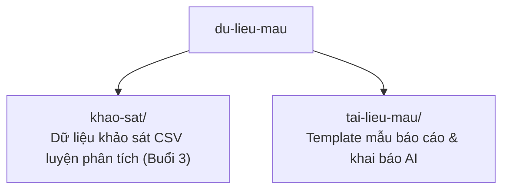

# 🗂️ Dữ Liệu Mẫu Thực Hành

> Thư mục này chứa **dữ liệu giả lập** và bài tập để bạn thực hành an toàn trong khóa học. Tất cả dữ liệu là **mô phỏng phục vụ dạy học** - không phải dữ liệu nghiên cứu thật, tên người/tổ chức/nguồn đều hư cấu, **không dùng để trích dẫn**.

> ⚠️ **Đừng đổi tên thư mục `du-lieu-mau`.** Các câu lệnh trong bài học trỏ tới đúng tên này; đổi tên sẽ làm sai đường dẫn.

## Bên trong có gì?

| Thư mục | Dùng cho buổi | Nội dung |
|---|---|---|
| [`khao-sat/`](khao-sat/) | Buổi 3 | File dữ liệu khảo sát (CSV) + bảng mô tả dữ liệu (codebook) + đề bài + kết quả mong đợi |
| [`tai-lieu-mau/`](tai-lieu-mau/) | Buổi 3 | Mẫu báo cáo phân tích dữ liệu, mẫu khai báo dùng AI |

## Chủ đề xuyên suốt

Để các bài tập nối thành một mạch, dữ liệu mẫu xoay quanh một đề tài giả lập:

> **Lãnh đạo số (Digital Leadership) → Chia sẻ tri thức (Knowledge Sharing) → Hiệu quả đổi mới (Innovation Performance)** trong doanh nghiệp nhỏ và vừa (DNNVV) tại Việt Nam.

Nhờ vậy dữ liệu bạn phân tích ở Buổi 3 và báo cáo bạn viết đều cùng một chủ đề, khớp với đề tài DNNVV bạn theo suốt khóa.
