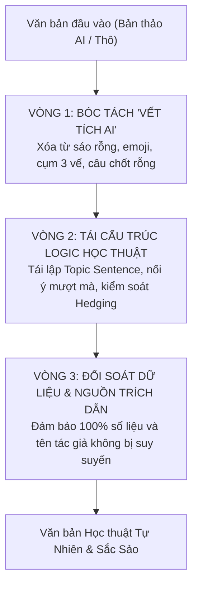

# Kỹ Năng Tinh Chỉnh Văn Phong Học Thuật Tự Nhiên (Humanizer)

## 1. Mục Tiêu & Nguyên Tắc Vận Hành

Kỹ năng này giúp **Nghiên cứu sinh, Giảng viên và Học viên cao học** rà soát và loại bỏ các "vết tích AI" (AI Writing Markers) trong bản thảo nghiên cứu (luận án, bài báo quốc tế, đề cương), biến văn bản từ dạng "robot đều đều, sáo rỗng" thành văn phong học thuật sắc sảo, tự nhiên, có cá tính của tác giả.

### 4 Nguyên Tắc Thép:
1. **Bảo toàn 100% sự thật khoa học:** Tuyệt đối không thay đổi số liệu thống kê, tên biến số, phương pháp, kết quả hay giả thuyết nghiên cứu.
2. **Bảo vệ trích dẫn nguồn:** Giữ nguyên các trích dẫn tác giả (Author-Year, DOI). Nếu một luận điểm thiếu bằng chứng, yêu cầu người dùng bổ sung nguồn chứ không tự sáng tác.
3. **Cắt bỏ hư văn, giữ lại thực chất:** Loại bỏ các câu dẫn dắt rườm rà, các cụm từ hoa mỹ rỗng tuếch, các cấu trúc ba vế gượng ép.
4. **Không phục vụ mục đích gian lận:** Luôn khuyến nghị tác giả đính kèm Bản khai báo sử dụng AI (AI Disclosure Statement) minh bạch.

---

## 2. Nhận Diện 25 Mẫu "Vết Tích AI" Trong Văn Bản Học Thuật

### Nhóm A: Làm màu thay vì khẳng định trực diện (Staging Instead of Stating)

| # | Mẫu văn phong AI | Biểu hiện thường gặp | Cách xử lý chuẩn học thuật |
|---|---|---|---|
| 1 | **Không phải X mà là Y (Not X but Y)** | *"Đây không chỉ đơn thuần là chuyển đổi số, mà là một cuộc cách mạng văn hóa..."* | Đi thẳng vào luận điểm thực tế, bỏ cấu trúc đối lập gượng gạo. |
| 2 | **Câu chốt kịch tính vụng về** | Đặt câu kết một dòng ở cuối mỗi đoạn: *"Đó mới là giá trị cốt lõi."*, *"Mọi thứ thay đổi từ đây."* | Bỏ câu cảm thán, kết đoạn bằng ý nghĩa lý luận hoặc hàm ý thực tiễn cụ thể. |
| 3 | **Châm ngôn nghe có vẻ sâu sắc** | *"Về bản chất, dữ liệu chính là dòng máu của doanh nghiệp..."* | Thay câu ví von triết lý bằng dữ liệu thực chứng hoặc trích dẫn chuyên gia. |
| 4 | **Dẫn dắt dài dòng trước khi vào ý** | *"Hãy cùng đi sâu vào...", "Có thể nói rằng...", "Điều đáng lưu ý là..."* | Cắt bỏ phần dẫn dắt, nêu ngay phát hiện hoặc lập luận chính. |
| 5 | **Tự tạo người rơm để tranh luận** | *"Nhiều người có thể nghĩ rằng mô hình này thất bại, nhưng thực tế..."* | Bỏ các giả định không có thực tế, tập trung chứng minh giả thuyết nghiên cứu. |

### Nhóm B: Nhịp điệu máy móc theo công thức (Rhythm by Rule)

| # | Mẫu văn phong AI | Biểu hiện thường gặp | Cách xử lý chuẩn học thuật |
|---|---|---|---|
| 6 | **Cụm ba vế gượng ép (Forced Triads)** | Luôn liệt kê đúng 3 từ: *"đổi mới, sáng tạo và phát triển"*, *"toàn diện, sâu sắc và bền vững"* | Chỉ nêu đúng số lượng yếu tố mà dữ liệu hoặc mô hình thực tế yêu cầu. |
| 7 | **Mở đầu câu lặp khuôn mẫu** | Liên tiếp 3 câu đều bắt đầu bằng: *"Nghiên cứu này chỉ ra... Nghiên cứu này phân tích... Nghiên cứu này kết luận..."* | Biến đổi linh hoạt chủ ngữ, kết hợp câu phức hoặc dùng liên từ chuyển ý logic. |
| 8 | **Lạm dụng dấu gạch ngang (—)** | Dùng gạch ngang vô tội vạ để chêm xen ý: *"Các chính sách — vốn dĩ rất phức tạp — nay lại càng khó khăn —"* | Dùng dấu phẩy, dấu chấm ngắt câu rõ ràng hoặc đưa vào mệnh đề phụ. |
| 9 | **Chất đống từ giảm nhẹ (Stacked Qualifiers)** | *"Kết quả có thể tiềm ẩn khả năng dường như cho thấy..."* | Giữ đúng mức độ Hedging cần thiết: *"Kết quả chỉ ra mối tương quan..."* |
| 10 | **Lạm dụng từ ghép gạch nối** | Ghép từ tiếng Anh máy móc: *"user-centric-oriented-approach"* | Dùng cấu trúc ngữ pháp chuẩn mực, dễ hiểu. |
| 11 | **Bị động mất chủ ngữ (Passive voice)** | *"Các giải pháp đã được đề xuất nhằm..."* | Nêu rõ chủ thể hành động khi cần thiết (Chính phủ, Doanh nghiệp, Tác giả). |

### Nhóm C: Phóng đại ý nghĩa & Vay mượn uy tín (Inflation & Borrowed Authority)

| # | Mẫu văn phong AI | Biểu hiện thường gặp | Cách xử lý chuẩn học thuật |
|---|---|---|---|
| 12 | **Từ vựng AI quen mặt (Overused AI Words)** | *delve into, testament to, pivotal role, multifaceted, vibrant landscape, beacon, foster, unleash...* (Tiếng Việt: *bức tranh toàn cảnh, minh chứng sống động, đóng vai trò then chốt, thấu suốt...*) | Dùng từ ngữ học thuật trung tính, chuẩn mực: *nghiên cứu, phân tích, mối quan hệ, tác động*. |
| 13 | **Thổi phồng tầm quan trọng** | *"Đánh dấu một bước ngoặt lịch sử", "Mở ra một kỷ nguyên mới"* | Trình bày khiêm tốn, đúng phạm vi mẫu nghiên cứu. |
| 14 | **Liên kết mơ hồ, vô căn cứ** | *"Có mối liên hệ mật thiết với bối cảnh chuyển đổi"* | Chỉ rõ hệ số tương quan ($r$, $\beta$) hoặc cơ chế tác động. |
| 15 | **Đuôi phân từ (-ing) hời hợt** | *"...phản ánh sự phát triển, thể hiện tiềm năng to lớn..."* | Cắt bỏ phần đuôi suy diễn, dừng ở kết quả định lượng. |
| 16 | **Văn phong tiếp thị, PR** | *"Công nghệ đột phá đỉnh cao", "Giải pháp toàn diện tối ưu"* | Khử sạch từ ngữ quảng cáo, giữ giọng văn khoa học khách quan. |
| 17 | **Dẫn nguồn vô danh (Borrowed Authority)** | *"Nhiều chuyên gia hàng đầu tin rằng...", "Các nghiên cứu uy tín chỉ ra rằng..."* | Dẫn tên tác giả và năm cụ thể: *(Nguyen et al., 2023)*. |
| 18 | **Tránh dùng động từ thực tế** | Dùng *features, serves as, boasts* thay vì *is, includes, demonstrates*. | Dùng động từ khoa học chính xác. |

### Nhóm D & E: Định dạng máy móc & Rác Chatbot

| # | Mẫu văn phong AI | Biểu hiện thường gặp | Cách xử lý chuẩn học thuật |
|---|---|---|---|
| 19 | **Bôi đậm trang trí quá đà** | Tự ý in đậm từng cụm từ trong đoạn văn khiến bài đọc lem nhem. | Bỏ in đậm tùy tiện trong đoạn văn học thuật; chỉ in đậm tiêu đề mục. |
| 20 | **Tiêu đề đính kèm Icon/Emoji** | Tự ý thêm 🚀, 💡, 📌 vào tiêu đề chương, mục luận án. | Xóa 100% emoji khỏi bài báo và luận án khoa học. |
| 21 | **Dấu ngoặc kép cong/lệch** | Trộn lẫn dấu nháy đơn, nháy kép kiểu chat. | Chuẩn hóa dấu trích dẫn đồng nhất. |
| 22 | **Rác phản hồi từ Chatbot** | *"Chào bạn! Dưới đây là phân tích theo yêu cầu...", "Hy vọng câu trả lời này giúp ích cho bạn!"* | Cắt sạch văn bản thừa của AI trước khi đưa vào tài liệu. |

---

## 3. Quy Trình 3 Vòng Tinh Chỉnh (3-Pass Editing Pipeline)

Khi nhận văn bản học thuật cần humanize, thực hiện tuần tự:



---

## 4. Cách Sử Dụng Trong Claude Code

### Cách 1: Gọi trực tiếp bằng Slash Command
```text
/humanizer

[Dán đoạn văn luận án hoặc abstract cần chỉnh sửa]
```

### Cách 2: Ra lệnh bằng ngôn ngữ tự nhiên
```text
Hãy dùng skill humanizer để viết lại phần Thảo luận (Discussion) này. Yêu cầu:
- Loại bỏ các từ ngữ sáo rỗng của AI (testament, pivotal, bức tranh toàn cảnh...).
- Khử các cấu trúc câu ba vế gượng gạo.
- Giữ nguyên 100% các con số Beta, p-value và trích dẫn APA.
- Giọng văn học thuật tự nhiên, gãy gọn, khiêm cẩn.
```

### Cách 3: Nạp giọng văn mẫu của tác giả (Voice Matching)
```text
/humanizer

Đây là đoạn văn do tôi tự viết trong bài báo trước để làm mẫu văn phong:
[Dán 1-2 đoạn văn thật của bạn]

Hãy humanize đoạn thảo luận mới dưới đây theo đúng nhịp điệu và văn phong của tôi:
[Dán đoạn văn AI cần chỉnh sửa]
```
