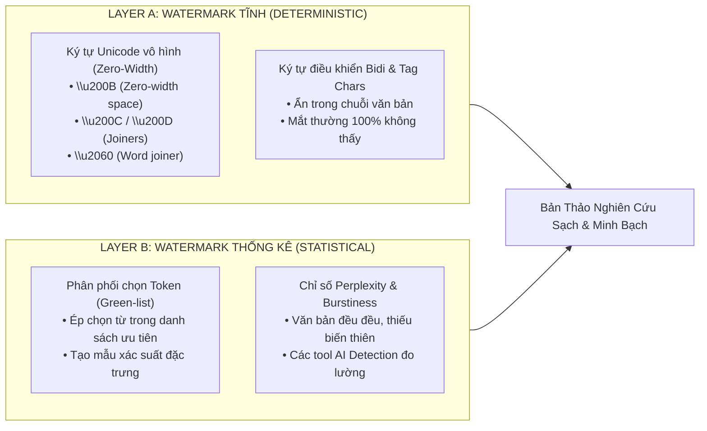

# Kỹ Năng Giải Mã & Làm Sạch AI Watermark (Watermarks Remover)

## 1. Bản Chất Khoa Học Của AI Watermark

Khi các mô hình ngôn ngữ lớn (LLM như ChatGPT, Claude, Gemini) sinh văn bản, các nhà phát triển có thể nhúng **Dấu bản quyền số (AI Provenance Marks / Watermark)** vào văn bản theo 2 cơ chế chính:



---

## 2. Vì Sao Nhà Nghiên Cứu Cần Quét & Làm Sạch Watermark?

1. **Tránh lỗi định dạng và in ấn nghiêm trọng:**
   * Các ký tự Unicode ẩn (Zero-width) khi copy vào Microsoft Word thường làm ngắt dòng tùy tiện, lỗi giãn chữ (*Justify*), hoặc lỗi tìm kiếm (*Ctrl+F* không tìm được từ khóa).
   * Khi biên dịch tài liệu sang **LaTeX** hoặc xuất sang **PDF**, các ký tự này thường gây lỗi `Unicode Character Error` khiến file không thể biên dịch.
   * Các cổng nộp luận án điện tử của Đại học có thể từ chối nhận file do lỗi mã hóa chuỗi ký tự lạ.
2. **Bảo vệ quyền tác giả và phong cách viết riêng:**
   * Tránh việc văn bản của bạn bị các thuật toán phân tích nhầm là sao chép máy móc do vướng phải các mẫu phân phối token nhân tạo.
3. **Liêm chính học thuật đi cùng sự minh bạch:**
   * Loại bỏ watermark kỹ thuật không phải để gian lận, mà để đảm bảo bản thảo có chất lượng cao nhất. Quyền minh bạch học thuật được bảo đảm bằng **Bản khai báo sử dụng AI (AI Disclosure Statement)** đã học ở Buổi 3.

---

## 3. Danh Mục Ký Tự Vô Hình Cần Quét Sạch (Layer A)

| Ký tự / Mã Unicode | Tên kỹ thuật | Nguy cơ khi nộp luận án |
|---|---|---|
| `\u200B` | Zero-Width Space (Khoảng trắng 0 độ rộng) | Gây lỗi ngắt dòng gãy chữ giữa chừng |
| `\u200C` | Zero-Width Non-Joiner | Gây lỗi gõ tiếng Việt có dấu trong Word |
| `\u200D` | Zero-Width Joiner | Gây lỗi hiển thị font Times New Roman |
| `\u2060` | Word Joiner | Gây dính chữ khi xuất file PDF |
| `\uFEFF` | Zero-Width No-Break Space (BOM ẩn) | Lỗi font đầu dòng hoặc đầu trang |
| `\u202A` – `\u202E` | Bidirectional Control Characters | Làm đảo lộn chiều đọc chữ (Trái/Phải) |
| `\u00A0` | Non-Breaking Space | Gây khoảng cách chữ không đều khi căn lề |

---

## 4. Quy Trình Làm Sạch 2 Lớp Thực Chiến

### Lớp 1: Quét sạch ký tự vô hình bằng Script hoặc Regex
Dùng đoạn mã Python tích hợp sẵn trong thư mục `demo/watermark-tool/clean_unicode_watermarks.py` để quét và loại bỏ 100% các ký tự mã hóa ẩn trong file `.md`, `.txt`, `.docx`.

### Lớp 2: Tái cấu trúc phân phối thống kê (Disrupting Statistical Watermark)
Sử dụng Claude Code để diễn đạt lại các câu văn có phân phối từ quá đều đặn, tăng chỉ số **Burstiness** (độ biến thiên chiều dài câu: câu ngắn đan xen câu dài) và sử dụng thuật ngữ chuyên ngành chuẩn xác theo đề tài.

---

## 5. Hướng Dẫn Sử Dụng Trong Claude Code

### Thao tác 1: Quét và làm sạch ký tự ẩn trong file
```text
Hãy kiểm tra file [ten-file].md trong thư mục hiện tại:
1. Quét xem có ký tự Unicode vô hình (zero-width space, bidi marks, BOM ẩn) nào không.
2. Nếu có, hãy loại bỏ sạch 100% và lưu đè lại file dưới dạng UTF-8 chuẩn.
3. Báo cáo lại số lượng ký tự ẩn đã tìm thấy và xử lý.
```

### Thao tác 2: Tái cấu trúc thống kê câu văn học thuật
```text
Dùng skill watermarks-remover kết hợp với humanizer:
- Đoạn văn sau có dấu hiệu phân phối từ nhân tạo của AI.
- Hãy viết lại đoạn văn này bằng tiếng Việt chuẩn học thuật, đa dạng hóa cấu trúc câu (kết hợp câu ngắn và câu phức), bẻ gãy các mẫu từ dự đoán trước.
- Bảo toàn 100% thuật ngữ chuyên môn và số liệu thực tế.

[Dán đoạn văn cần xử lý]
```

---

## 6. Kỷ Luật Học Thuật Bắt Buộc

> ⚠️ **LƯU Ý VỀ LIÊM CHÍNH KHOA HỌC:**
> Việc làm sạch watermark kỹ thuật giúp bản thảo của bạn tinh sạch, chuyên nghiệp và không bị lỗi công nghệ. Tuy nhiên, nếu bạn có sử dụng AI để hỗ trợ tra cứu tài liệu, lập dàn ý hay làm mượt câu chữ, **bạn luôn phải đính kèm Tuyên bố sử dụng AI (AI Disclosure Statement)** ở phần Lời cảm ơn hoặc Phụ lục của Luận án theo chuẩn mực đạo đức nghiên cứu quốc tế.
